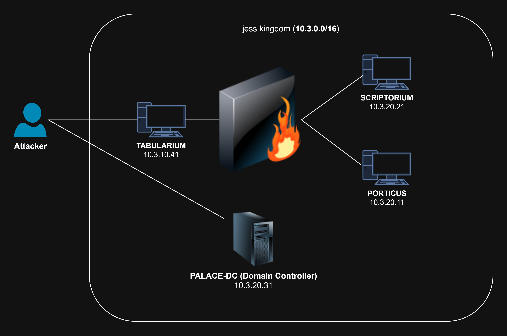
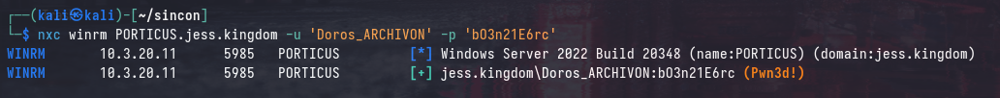
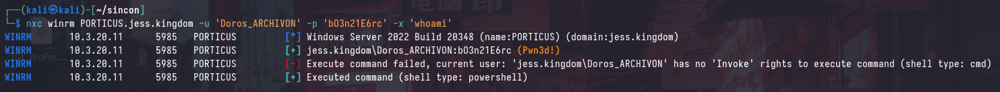
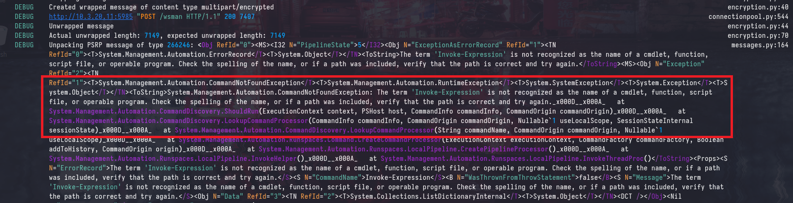
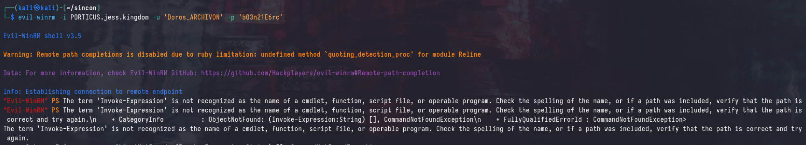

# SINCON CTF 2025: Too Much Administration

This is the second, and final part of the SINCON CTF 2025 writeup series where I covered the more "challenging" parts of the CTF. I'd highly recommend reading the first part: [SINCON 2025: All Too Relayxing](https://blog.async.sg/sincon-2025-adcs-relay.html) as it provides a lot of necessary context for this writeup.

In this writeup, I'll be covering the solve path for Flag 8 - which involved bypassing [Just Enough Administration (JEA)](https://learn.microsoft.com/en-us/powershell/scripting/security/remoting/jea/overview?view=powershell-7.5). For many participants, this was their first time encountering WinRM endpoints protected by JEA, and you'll rarely see this in engagements aside from some hardened environments. However, JEA can be a double-edged sword; if not properly configured, it opens up opportunities for abuse and privilege escalation.

## Introduction and Scenario



The current scenario is explained in more depth in the first part of the writeup, but to summarize, we have compromised `TABULARIUM` and `SCRIPTORIUM`. Additionally, we have access to a `JESS\Doros_ARCHIVON` user from a previous attack path. The next target is `PORTICUS`, which is also a `Windows Server 2022` machine.

## Enumerating WinRM

Using the `JESS\Doros_ARCHIVON` user, we can identify that we have access to the WinRM service on `PORTICUS`. Unlike the SMB protocol with `nxc`, the `(Pwn3d!)` message does not necessarily indicate that we have local administrator access.



### Failed Command Execution

However, attempting to use the `-x` option with `nxc` shows that no output is retrieved by the command.



Running the same command with `--debug` shows that the internal executor is throwing an error that `Invoke-Expression` is not found as an available commandlet.



Similarly, attempting to connect to the WinRM service using `evil-winrm` results in the same error:



These errors are occurring because the WinRM service on `PORTICUS` is configured with [Just Enough Administration (JEA)](https://learn.microsoft.com/en-us/powershell/scripting/security/remoting/jea/overview?view=powershell-7.5), which restricts the available commands and modules that can be executed by the user.

## JEA, a TLDR

[Just Enough Administration (JEA)](https://learn.microsoft.com/en-us/powershell/scripting/security/remoting/jea/overview?view=powershell-7.5) is a hardening mechanism in Windows that allows administrators to delegate specific administrative tasks to users without granting them full administrative privileges. It does this by restricting the available commands and modules that can be executed by the user, effectively creating a limited PowerShell environment.

You can view the full documetation [here](https://learn.microsoft.com/en-us/powershell/scripting/security/remoting/jea/overview?view=powershell-7.5), and I strongly recommend reading it to understand how JEA works.

According to the documentation, JEA is designed to:
1. Reduce the number of administrators on your machines 
2. Limit what users run on your machines
3. Better understand what your users are doing on your machines

If you're more familiar with Linux, JEA is similar to the concept of `sudo` with restricted commands, where users can only execute specific commands as a privileged user. 

### Role Capabilities

In JEA sessions, the available commands and modules are defined in a "role capability" file, which is a PowerShell module that specifies the commands and modules that are available to the user. Role capability files are typically stored in the `C:\Program Files\WindowsPowerShell\<ROLE>\RoleCapabilities` directory, where `<ROLE>` is the name of the role.

This file defines the commands and modules that are available to the user, as well as any parameters that can be used with those commands. COnsider the following snippet from a role capability file in the documentation:

```powershell
VisibleFunctions = 'Get-TopProcess'

FunctionDefinitions = @{
    Name        = 'Get-TopProcess'
    ScriptBlock = {
        param($Count = 10)

        Get-Process |
            Sort-Object -Property CPU -Descending |
            Microsoft.PowerShell.Utility\Select-Object -First $Count
    }
}
```